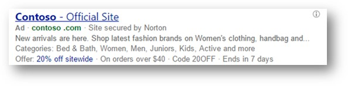

# Promotion Extensions: Highlight special offers for different occasions

Use Promotion Extensions to highlight deals for holidays and other special occasions. Let’s say you want to highlight a Summer Sale — using Promotion Extensions, you can include a promotion code, along with the offer and expiration date.

## Benefits of Promotion Extensions

- **Increase traffic volume**  with special offers highlighted in your ads, which can help grow ad engagement and boost your potential click-through rate.
- **Better informed shoppers** , thanks to highlighted promotions providing more information.
- **Increased market share**  with special offers that encourage customers to click on your ad instead of your competitors’ ads.

## Occasions available for Promotion Extensions

You can select from a preset list of occasions, which are holidays or events for which you can offer special offers or promotions.

|Occasion|Start date|End date|
|---|---|---|
|New Year's|December 1|February 28|
|Boxing Day|December 15|January 15|
|Epiphany|December 15|January 31|
|Chinese New Year|January 15|March 1|
|Valentine's Day|January 15|February 28|
|Carnival|February 1|March 31|
|Holi|February 1|March 31|
|Women's Day|February 15|March 31|
|Passover|February 15|May 1|
|Easter|March 1|April 30|
|Parent's Day|April 15|August 1|
|Labor Day|April 15|September 15|
|Rosh Hashanah|August 15|November 1|
|Diwali|September 1|December 1|
|Navratri|September 15|October 31|
|Halloween|October 1|November 15|
|Singles Day|October 15|November 30|
|Black Friday|October 15|December 15|
|Cyber Monday|October 15|December 15|
|Christmas|November 1|January 15|
|St. Nicholas Day|November 1|December 31|
|Hanukkah|November 15|January 31|
|Back to school|Any|Any|
|Mother's Day|Any|Any|
|Father's Day|Any|Any|
|Independence Day|Any|Any|
|National Day|Any|Any|
|End of Season|Any|Any|
|Winter Sale|Any|Any|
|Summer Sale|Any|Any|
|Fall Sale|Any|Any|
|Spring Sale|Any|Any|
|Ramadan|Any|Any|
|Eid al-Fitr|Any|Any|
|Eid Al Adha|Any|Any|

## Dates for Promotion Extensions

There are three different date ranges to keep in mind for Promotion Extension to deliver. For an example, you want to run a promotion for the new year. You select **New Year's** from the **Occasions** dropdown list, which means the promotion will be available during the predefined date range from December 1 through February 28. But you don't want your actual promotion to run the entire length of the predefined date range, just until the beginning of February. You can enter the optional **Displayed start date** and **Displayed end date** to set the exact days of the promotion or you can use the ad extension scheduling from **Advanced settings**. Keep in mind, that if you set your ad extension schedule past the predefined date range of the occasion, it will stop showing at the end of the predefined date range.

- **Predefined date range.**  Each occasion has a predefined date range that determines when the promotion can be shown.
- **Display start and end dates**  (optional). Once you select an occasion, you can set the display start and end dates for when the actual promotion runs.
- **Extension schedule.**  The start and end dates of when you want the extension to show.

> [!IMPORTANT]
> All extension details must adhere to our [Promotion Extension policies](https://go.microsoft.com/fwlink?LinkId=2133732).

**Ability to set up in:** All Bing markets

**Serves in**: AU, CA, DE, FR, US and UK.

## Get to know Promotion Extensions

- Without setting the promotion's optional displayed end date, a promotion is eligible to serve until the end of its predefined range. For some occasions, the predefined range is year-round.
- The promotion will not serve past the set displayed end date.
- Promotions can still serve before the displayed start date. For example, you can provide customers a promotion code for an upcoming sale.
- You can add one minimum purchase amount and/or one promotion code.
- The promotion landing page must include details of the promotion.

## Get started with Promotion Extensions

Head over to the [About ad extensions](./hlp_BA_CONC_AboutAdExtensions.md) page for instructions to:

- Add, edit, and delete ad extensions
- Associate ad extensions to campaigns and ad groups

