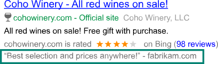

# Review Extensions: Share positive reviews

Potential customers like to know about other customers’ experiences when searching for products or services. Share positive reviews from a reputable third-party source about your website in your ads with a Review Extension. You can paraphrase or use an exact quote from the source.

Each campaign and ad group can have up to 20 Review Extensions associated with it. As with other extensions, the Review Extension won’t always show with your ads. You can add a Review Extension for free and when customers click on it, they’ll be directed to a third-party review source.

Review Extensions are different from a Seller, or Merchant rating, which is an [Automated Extension](./hlp_BA_CONC_AutomatedExtensions.md).

> [!IMPORTANT]
> All reviews and review sources must adhere to our [Review Extension policies](https://go.microsoft.com/fwlink?LinkId=746651).

**Ability to set up in:** All Bing markets

**Serves in**: All Bing markets, except China.

## Get started with Review Extensions

Head over to the [About ad extensions](./hlp_BA_CONC_AboutAdExtensions.md) page for instructions to:

- Add, edit, and delete ad extensions
- Associate ad extensions to campaigns and ad groups

 

