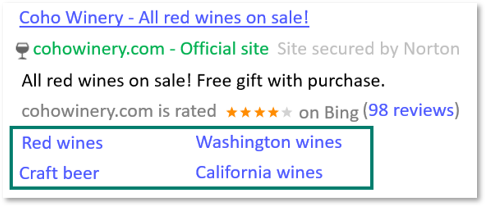

# Sitelink Extensions: Take people to specific pages on your website

Sitelink Extensions are additional links in your ads that take people to specific pages on your website. For each campaign, you can enter up to 20 Sitelinks. By default, the Sitelinks are set at the campaign level, however, you can also set sitelinks at the ad group level. Specifying sitelinks at the ad group level will override the sitelinks associated with the campaign. With Sitelinks you can:

- Analyze a specific sitelink's performance. Get granular reporting for individual sitelinks.
- Manage sitelinks more easily. Create individual sitelinks and share them across campaigns or ad groups.
- Add double the number of maximum sitelinks per campaign or ad group. Associate up to 20 Sitelink Extensions per campaign or ad group.

You can add up to two lines of descriptive text under each Sitelink Extension. These enhanced Sitelink Extensions can draw attention to your ad by increasing its size. Only high-quality ads at the top of the search results page will trigger enhanced Sitelink Extensions, so make sure you add descriptions to high performing campaigns, such as your brand term campaigns. It might take some time for new campaigns to start showing Sitelinks Extensions due to time required to build a history and quality score for the campaign.

An ad can display two to six Sitelinks or Dynamic Sitelinks with descriptions, or two to six sitelinks in a single row without descriptions, which will be determined by Microsoft Advertising. When displaying an ad, Microsoft Advertising determines which links are most relevant to the ad being displayed and includes those with your ad. However, you can influence which links are included. Links that you enter at the top of your list receive higher priority than those lower in the list. Learn more about [Sitelink Extensions policies](https://go.microsoft.com/fwlink?LinkId=746651).

**Ability to set up in:** All Bing markets

**Serves in**: All Bing markets

## Get to know Sitelink Extensions

- Performance data is available for each individual link of a sitelink extension.
- Both lines of text must be used for the new sitelinks to serve.
- The maximum character count for the headline text is 25 characters.
- Keywords in Sitelinks that have an exact match as the search query will be bolded (available in the U.S. only).
- [Dynamic URL parameters](./hlp_BA_CONC_UpgradeURL_TrackTemplateCustomParam.md) may be used to track Sitelink Extension clicks.
- Sitelink extensions may direct searchers to third-party retailers. These sitelinks must include the name of the retailer in the link text and direct searchers to the specific page where the product is being sold. For example, a sitelink which directs searchers to third-party retailer Contoso’s shoes page (contoso.com/shoes) might say, “Buy Shoes on Contoso."

## Get started with Sitelink Extensions

Head over to the [About ad extensions](./hlp_BA_CONC_AboutAdExtensions.md) page for instructions to:

- Add, edit, and delete ad extensions
- Associate ad extensions to campaigns and ad groups

 

