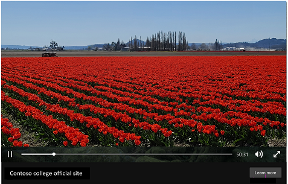

# Video Extensions: Express your brand identity

[!INCLUDE [ComingSoon](./includes/ComingSoon.md)]
Video Extensions are an interactive way to demonstrate products, services, and brand messages. They can showcase special deals, emotions, ambiance, culture, and action. Combined with other extensions, Video Extensions create a richer experience that stands out more than just images and words.

 

 

 
On desktop, when a user clicks on your thumbnail image, your video plays in a full-screen overlay above the **Display text** and **Action text**. Viewers can watch the video, and then click on the call-to-action button or the text in your ad. On mobile, the video plays in the frame with the **Display text**. The thumbnail image provides an opportunity to engage viewers and generate views. Video extensions operate best when they complement your ad with unique content rather than repeating what users can already read in the text.

 

**Ability to set up in:** All Bing markets

**Serves in**: Search networks in the United States, Canada, United Kingdom, Germany, Australia, and India

## Best practices to create a successful Video Extension

- Campaigns and ad groups associated with Video Extensions should have at least two other below-snippet decorations, such as Call Out, Structured Snippet, Filter Link, Dynamic Callouts, Dynamic Structured Snippet, etc. This allows for enough room within the ad to create space for the Video Extension thumbnail.
- Pair your video extension with a campaign or ad group that has ad descriptions of less than 82 characters (a short ad description is necessary to make space for the thumbnail in the ad).
- We don’t recommend using Action, Image, or Call extensions with campaigns/ad groups associated with Video Extensions because the video competes with them for space.
- Your video’s content and message should be distinct from the ad description and other extensions.
- The landing page of the video should allow users to act rather than only receive information about your offer.
- We recommend using captions on your video.

## Get to know Video Extensions

- Video extensions are only served on high-quality ads with relevant action type.
- The cost of a click to play a video is the same as the cost of a click to your website.
- Only the first click on an ad with a video extension is charged; all subsequent clicks by the same user on the same ad are free. For example, if a user clicks to play the video and then clicks on the **Action text** button, the advertiser will only be charged once.
- A thumbnail image is required. We recommend using an engaging image that will encourage clicks to view your video.

## Learn the elements of Video Extensions

|Extension field|Field description|
|---|---|
|Name|Internal name for your organizing/labeling purposes|
|Video|You can express your brand identity and deliver a message to interested customers. An engaging video will lead to clicks on the Action button and visits to your website.|
|Thumbnail|The thumbnail appears in the ad copy and should be engaging to encourage clicks to view the video. See thumbnail requirements below.|
|Alt text|Not displayed yet, but coming soon: Alt text is the text that appears when someone hovers over your video with their cursor, whether or not the video was rendered. It is also used by screen readers to describe the video to people with disabilities and is limited to 40 characters.|
|Display text|Limited to 25 characters, this text will be shown below the video when it is played. The display text can be a video title, short video description, brand name, or short message for the customer.|
|Action text|Limited to 25 characters, this text will be displayed on the button below the video when it plays on a PC. The action text should encourage the user to perform an action that is available at the Action final URL.|
|Action final URL|The landing page URL of the Action button on PC — in other words, the URL of the page that displays after a customer clicks the Action button.|
|Action mobile URL|Not displayed yet, but coming soon: The landing page URL on mobile. In other words, the URL of the page that displays after a customer taps the **Action text** button.|

## Video requirements

- **Length**: Must range from 6 to 120 seconds
- **File formats**: We recommend MPEG-2, MP4, or MOV. Most other formats are acceptable.
- **Aspect ratio**: Must range from 16:9 to 9:16 (e.g. 1:1 is acceptable)
- **Resolution**: As high as possible. At least 720x720 pixels recommended, at least 120x120 pixels required.
- **Maximum file size**: 10 GB
- **Source**: Videos must be uploaded from your local computer or from a publicly accessible file server such as OneDrive, FTP, or Dropbox. Indirect links to videos from sites such as YouTube, Dailymotion, Twitch, or Facebook are not allowed.

> [!NOTE]
> Make sure that the media you use meets Microsoft Advertising &nbsp;[ image, audio, and video policies.](https://go.microsoft.com/fwlink?LinkId=534455)

## Thumbnail requirements

- **Format**: JPG, JPEG, PNG, GIF (without animation)
- **Aspect ratio**: Must range from 16:9 to 9:16 (e.g. 1:1 is acceptable)
- **Resolution**: As high as possible. At least 720x720 pixels recommended; at least 128x128 pixels required.
- **Maximum file size**: 50 MB
- **Source**: Images must be uploaded from your local computer or from a publicly accessible file server such as OneDrive, FTP, or Dropbox. Indirect links to images from sites such as Facebook are not allowed.

## Get started with Video Extensions

Head over to the [About ad extensions](./hlp_BA_CONC_AboutAdExtensions.md) page for instructions to:

- Add, edit, and delete ad extensions
- Associate ad extensions to campaigns and ad groups

