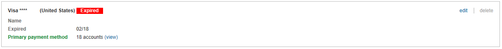

# Update your credit card expiration date

If your card expires, the card issuer (bank or other financial institution) might decline payment for your account charges. If payment is declined, your ads for the account will no longer be eligible to run unless you have [a backup payment method.](./hlp_BA_CONC_AvailablePaymentMethods.md)

To help you find it, an expired card is marked with a red label that reads "Expired" within the Payment Methods page.    

There, you can update the expiration date for the card if you want to continue to use that card, or you can use a different payment method.

> [!IMPORTANT]
> Your account might continue to accrue charges even though your card has expired. You can stop additional charges to your account by pausing your campaign on the **Campaigns** page. After you update your card or switch to a different payment method, you will need to enable the campaign so that your ads are eligible to display again. To learn how, see **Pause or enable a campaign** below.

## Update the expiration date for your card
1. [!INCLUDE [ClickBilling](./includes/ClickBilling.md)]
1. Click **Payment Methods** from the main menu.
1. Next to the card you want to update, click **Edit**.
1. Find **Expiration date** to change the month and the year.
1. Click **Save**.

> [!NOTE]
> If you do not have administrative access (Super Admin user role), you cannot edit payment methods. For more information, see [How do I give someone access to my Microsoft Advertising account?](./hlp_BA_CONC_SSUserRoles.md)

## Use a different payment method
1. [!INCLUDE [ClickBillingPaymentsTools](./includes/ClickBillingPaymentsTools.md)]
1. [!INCLUDE [SelectAccount_VR](./includes/SelectAccount_VR.md)]
1. Click the **Payment Methods** from the main menu.
1. Next to the payment method you want to use, click **Set as primary**.             or             If you need to add a new payment method, click **Add card**, add the payment method information, and then click **Set as primary**. For more information, see [Paying by credit and debit card](./hlp_BA_PROC_AddBilling.md)

## Pause or enable a campaign
1. Click the **Campaigns** page.
1. Select the check box next to the campaign.
1. Click **Edit** and then **Pause** or **Enable**.

