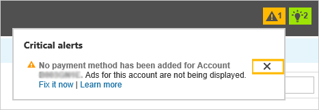

# Critical alert: No payment method has been added

If you are seeing the alert "No payment method has been added for Account ...." then you **might** still need to add a      payment method. Your ads won't run until you’ve added at least one form of payment (for example, a credit card) to your postpay account or funds to your prepay account.      To learn how to add a payment method, see  [Paying by credit and debit card](./hlp_BA_PROC_AddBilling.md).

**Already added a payment method?** Alerts don't go away unless you delete them. (Some customers prefer to keep them as a record of account activity.)  So if you've added a payment method and your ads are up and running, then you can delete the alert by clicking the X.

**Trying to add a payment method and having problems?**  See [I'm having trouble adding a credit card or debit card](./hlp_BA_CONC_TshootCreditCards.md). If those tips don't   solve your problem, then please [contact support](https://go.microsoft.com/fwlink?LinkId=398371).

