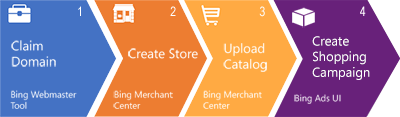

# Create product ads in a shopping campaign

Product ads, which are created using shopping campaigns, are a great way to give your ads more space on the search results page and make those ads more compelling to potential customers. Using product ads, you can enhance your ads with real-time, specific product information from your Microsoft Merchant Center store feed.

Complete each of the following steps to start using product ads.

## Verify that you own your URL on the Bing Webmaster Tools website
You must claim your domain before you can build a Microsoft Merchant Center store. If you've already added a Universal Event Tracking (UET) tag to your domain for conversion tracking and remarketing, you can use that UET tag to validate your domain. See [Verify and claim your website's URL](./hlp_BA_PROC_ClaimYourDomain.md) for more details. Otherwise, read on to learn more about domain validation via Bing Webmaster Tools.

1. Go to the Bing Webmaster Tools URL: [http://www.bing.com/toolbox/webmaster](https://go.microsoft.com/fwlink?LinkId=398306).
1. Sign in using the same Microsoft account that you use to sign in to Microsoft Advertising.
1. Click **Profile** and then fill out the **About Me**, **Contact Preference**, and **Alert Preference** sections.
1. Under **My Sites**, enter your URL and click **Add**.
1. Enter your URL info.
1. Complete one of the three options listed and then click **Verify**.             You will see the **Dashboard** page if your URL is verified.

For additional information on verifying your URL, take a look at these [detailed instructions](./hlp_BA_PROC_ClaimYourDomain.md).

> [!NOTE]
> For the following steps, make sure to sign in to Microsoft Advertising with the Microsoft account that you used to verify your URL on the Bing Webmaster Tools website. Don't use a Microsoft account yet? Learn how to [sign into Microsoft Advertising](./hlp_BA_PROC_UseWLIDv2.md).

## Create a Microsoft Merchant Center store
1. On the top menu, click **Tools** and then click ** Microsoft Merchant Center**  (or from the global menu at the top of the page, click **Tools** and then **Microsoft Merchant Center**).
1. Click **Create a store**.
1. Enter your store information.

## Upload your feed
These steps are slightly summarized. Here's [detailed information about creating and uploading your feed](./hlp_BA_CONC_BMCWhatIsCatalog.md).

1. On the top menu, click **Tools** and then click ** Microsoft Merchant Center**  (or from the global menu at the top of the page, click **Tools** and then **Microsoft Merchant Center**).
1. Click the store that you want to update.
1. Click the **Feed Management** tab.
1. If you are creating your first feed, enter your **Feed name**. If you are creating additional feeds, click **Create New Feed** and then enter your **Feed name**.
1. Submit your file. For more information, here's some [detailed information about your options](./hlp_BA_CONC_BMCWhatIsCatalog.md) on this step.

> [!NOTE]
> After creating a new feed and submitting a feed file, it can take up to 3 business days for your feed file to process.

## Create your shopping campaign
1. In Microsoft Advertising, go to **All campaigns** from the main menu on the left.
1. Click **Campaigns** from the page menu.
1. Click the create campaign button.
1. Click **Shopping campaign**. Microsoft Advertising will walk you through the remaining steps.
The final step is to create some product groups. Take a look at [this article](./hlp_BA_CONC_BSC_GetStarted.md) for more information.

If you are not yet enabled for shopping campaigns, don't worry! You can still create product ads. Follow all of the same steps in this article. When you get to this very last step, simply click **Product ad campaign** instead of **Shopping campaign**.

## What you need to know
- If you ever need to edit or make changes to your shopping campaign, such as campaign priority or product group filters, simply click on the campaign name in the left panel, then click the **Settings** tab.
- You can monitor your campaign with two reports created specifically for Shopping campaigns: the Product dimensions report and the Product partition report. Both can be created from the **Reports** page.
- **Campaign priority**  handles cases where the same product ad could be displayed from multiple campaigns, such as from your existing product ads campaign and your new shopping campaign. The ad from the campaign with the highest priority will take precedence over the same ads from other campaigns, regardless of bids. Generally, you want to ensure your shopping campaign has a higher priority than your product ads campaign. If there are multiple campaigns with different priorities targeting the same product, the campaign priority still holds true – High takes precedence over Medium, which takes precedence over Low. However, if the product gets filtered out by any business rules, like location targeting, minimum bids, etc., the campaign priority is applied to the non-filtered product. For example, let’s say you have a High and Medium campaign targeting the same product, and this product is selected to serve. But after applying location targeting, the product from the High campaign is filtered, which means the non-filtered product from the Medium campaign will serve.
Campaign priority can also be useful if you want to create campaigns around specific events, like sales or promotions, without changing bids across the campaigns.

