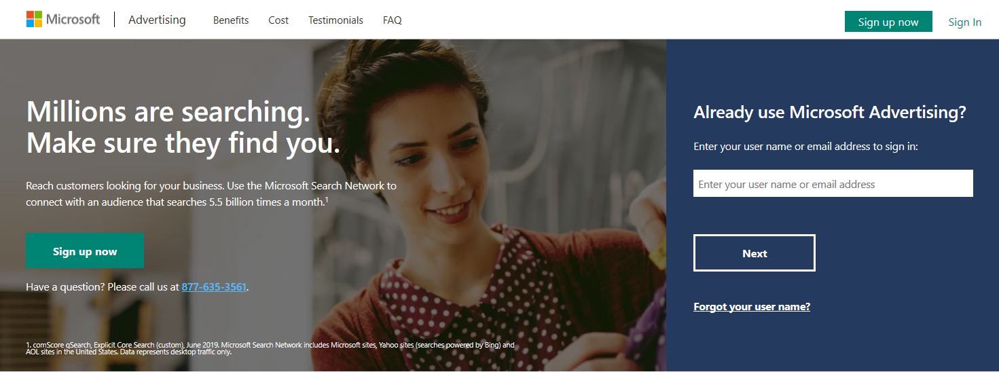
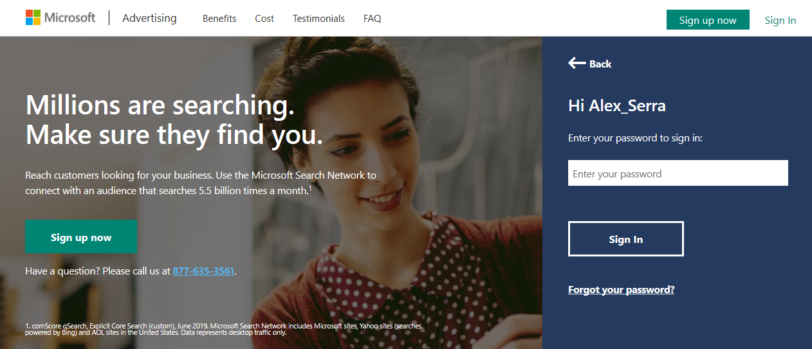

# Sign in to Microsoft Advertising

Microsoft Advertising is changing the way that you sign in. During this transition, you will use one of two ways to sign in:

- With an email address (a Microsoft account)
- With a Microsoft Advertising user name

The way you sign in depends on when you signed up for your Microsoft Advertising account and whether you have transitioned to signing in with an email address. Learn more [about the transition](./hlp_BA_CONC_MSAFAQ.md).

## Sign in with your email address
To sign in to Microsoft Advertising using your email address:

1. Go to the Microsoft Advertising sign-in page.
1. Enter your email address in the box, and click **Next**.

1. You will be prompted to enter your password in a new page.

&nbsp;

> [!NOTE]
> Because your email address can be used to sign in to other Microsoft products, we do not recommend sharing your email address with others so that they can sign in to Microsoft Advertising. For more information on how multiple users can share access, see [How do I give someone access to my Microsoft Advertising account?](./hlp_BA_CONC_SSUserRoles.md)
> If you are already signed in to another Microsoft product with the email address you use to sign in to Microsoft Advertising, you will go directly to your Microsoft Advertising account without signing in again.
> If you sign out of Microsoft Advertising, you will be signed out of any other Microsoft product that you are currently signed in to.
> You cannot use the same email address to sign in to both Microsoft Advertising and pubCenter.

## Sign in with your Microsoft Advertising user name
To sign in to Microsoft Advertising using a Microsoft Advertising user name:

1. Go to the Microsoft Advertising sign-in page.
1. Enter your Microsoft Advertising user name in the box, and then click **Next**.

1. Enter your Microsoft Advertising password in the box, and then click **Sign In**.

