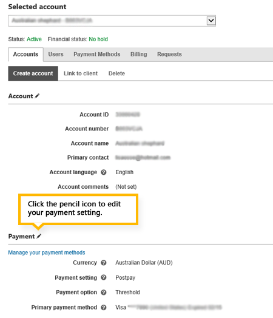

1. [!INCLUDE [ClickAccountsBillingTab](./ClickAccountsBillingTab.md)]
1. If you have multiple accounts, select the account that you want to switch from the drop-down list at the top of the page.
1. In the **Payment** section, select the pencil icon . 			If you don't see the pencil icon, you don't have the correct permissions to make this change. [Learn more](../hlp_BA_CONC_SSUserRoles.md).

1. In the **Payment setting** drop-down list, select **Switch to prepay**, and then select **Save**.
1. In the **Pay amount due** section, select your payment method, and select **Next**.
1. In the **Add funds** section, select your payment method, and enter a payment amount.
1. Optional: Select the **Make this a recurring payment** check box if you want to set up auto-recharge. [Learn more](../hlp_BA_PROC_AddFunds.md).
1. Select **Next**, read an overview of what will happen next, and then select **Submit**.

You'll see a summary letting you know that you have successfully switched to prepay.

