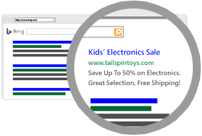

# Create and edit text ads (search ads)

Create or edit text ads (also called search ads) to run on Google and Bing. When people search for words or phrases related to your products or services, text ads display on their search results pages.

In addition to the text ads you create, we'll create text ads for you using Microsoft artificial intelligence (AI) to help target the customers you want. [Learn more about automated text ads](./hlp_DMC_CONC_AboutAutomatedAds.md).

## Create text ads in a new advertising campaign

First, [create an advertising campaign](./hlp_DMC_PROC_CampaignCreation.md). Set your campaign goal, choose if you want to run search and social ads, or if you want to run search ads only, then create text ads.

We provide suggested text for your ads, based on your website and business category. It's important to check the text and edit it, if needed, to create your ad with the best message to reach your customers.

1. **Final URL** : This is the webpage URL that potential customers go to when they click your ad. If you send a potential customer to a webpage that is tailored to what your ad highlights, such as a product page, sign-up page, or contact page, they're more likely to take action.
1. **Ad title (parts 1-3)** : The ad title is the most prominent part of your ad and serves as a link to your website. The best way to encourage customers to find and click your ad is to include keywords in your ad title that relate to the product or service you're advertising.
1. **Ad text (parts 1-2)** : The ad text appears below your ad title. Use the ad text to convince people to click your ad. What sets your product or service apart? Is it the price? Does it solve a problem or provide a benefit? Include a reason for customers to click **right now** (a call to action).
1. **Text ad preview** : The preview shows a sample ad, based on your ad elements. Use the preview to verify that the message is what you want your ad to say.
1. Click **Next** to set your advertising budget. Learn more about [how budgets work](./hlp_DMC_CONC_Budgets.md).

## Create text ads in an existing advertising campaign

1. On the **Ads** page, click a campaign.
1. Find the **Ads** tile and click **View and edit ads**.
1. On the **Create text ads** page, click **Create another ad** then edit the suggested **Final URL**, **Ad title** (parts 1-3), and **Ad text** (parts 1-2) as needed.
1. Use the preview in the right pane to verify that the message is what you want your ad to say.
1. Click **Next** to set your advertising budget. You can keep the same budget or change it. Learn more about [how budgets work](./hlp_DMC_CONC_Budgets.md).

## Edit text ads

You can edit your own text ads or edit automated text ads on the **Ads** tile.

> [!NOTE]
> If you edit an automated ad, our AI will no longer optimize the ad. If you want our AI to continue to optimize the ad, you can copy it first, then edit the duplicate ad.

1. On the **Ads** page, click a campaign.
1. Find the **Ads** tile, and click **View and edit ads**.
1. Click **Edit** next to the ad you want to edit.
1. Make any changes to the **Final URL**, **Ad title** (parts 1-3), and **Ad text** (parts 1-2).
1. Use the preview in the right pane to verify that the message is what you want your ad to say.
1. Click **Next** to set your advertising budget. You can keep the same budget or change it. Learn more about [how budgets work](./hlp_DMC_CONC_Budgets.md).

