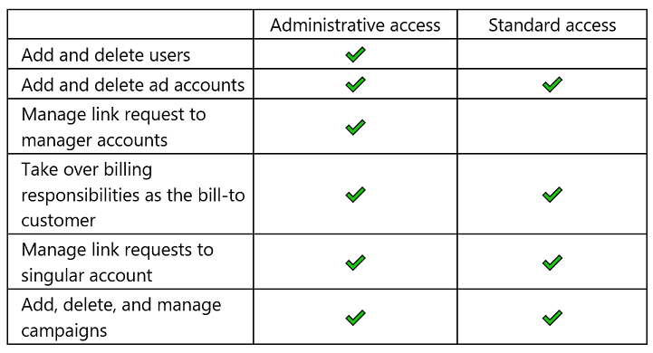
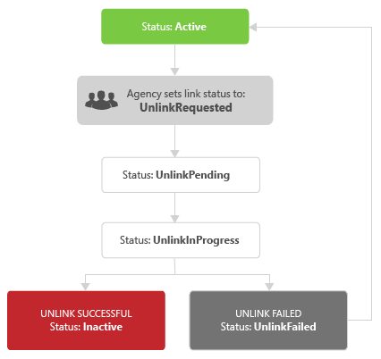

# Account Hierarchy and User Permissions
Microsoft Advertising users can use the same login credentials to access multiple accounts, potentially with different permissions on each account. An agency can setup a hierarchy of accounts to manage all users and accounts from one parent account, use one central wallet to pay for everything, and share campaign resources such as [Universal Event Tracking](universal-event-tracking.md) (UET) tags and remarketing lists across customers.

- [User Roles and Permissions](#user-roles-permissions) describes the actions available for each [user role](#user-roles), how [users are provisioned](#assign-user-roles) on an account, how you can [discover their current access rights](#get-user-roles), and how you can [act on behalf of an authenticated Microsoft Advertising user](#access-developer-token) with the Bing Ads API.  
- [Multi-User Credentials](#multi-user-credentials) describes how you can use one set of Microsoft Advertising credentials to access advertiser accounts across multiple customers, potentially with different user roles and permissions. If you already have multiple sets of login credentials you can ask support to [consolidate](#multi-user-consolidation) to one set of credentials. 
- [Account Hierarchy](#account-hierarchy) describes how you can provide access to a hierarchy of accounts for one or more users in a customer. Effectively you can manage all users and accounts from one parent account, and use one central wallet to pay for everything. Also with hierarchies, you can share campaign resources such as [Universal Event Tracking](universal-event-tracking.md) (UET) tags and remarketing lists across customers. 

> [!NOTE]
> In the context of hierarchies a [Customer](../customer-management-service/customer.md) is also known as a "Manager account". An [AdvertiserAccount](../customer-management-service/advertiseraccount.md) is referred to as an "Account" or "Advertiser account".

See [Entity Limits](entity-hierarchy-limits.md) for more information about the campaign hierarchy within an account.

## <a name="user-roles-permissions"></a>User Roles and Permissions
Your application might only need to support one Super Admin user on a known account. Even with such a relatively simple permission structure you'll want to understand the actions available for each [user role](#user-roles), how [users are provisioned](#assign-user-roles) on an account, how you can [discover their current access rights](#get-user-roles), and how you can [act on behalf of an authenticated Microsoft Advertising user](#access-developer-token) with the Bing Ads API.  

### <a name="user-roles"></a>User Roles
The user role granted by a customer's Super Admin or the Microsoft Advertising system administrator determines service availability. For example a user with the Advertiser Campaign Manager role can add and update campaigns, but cannot create or update users. Unless otherwise noted in the reference content per service operation, the following table describes at a high level the service restrictions per user role. 

> [!NOTE]
> Only Super Admin and Standard users can be set as the primary contact for an account. For more details about user roles see the [How do I give someone access to my Microsoft Advertising account?](https://help.ads.microsoft.com/#apex/3/en/52037/3-500) help topic.

|User Role|Available Services|
|-------------|-------------|
|Advertiser Campaign Manager|This role has permissions to view selected accounts and add, edit, or delete campaigns within the selected accounts. The Advertiser Campaign Manager can view payment methods, but cannot manage any billing and payment tasks.<br/><br/>Read operations for all services are available.<br/><br/>Write operations with the [Customer Management service](../customer-management-service/customer-management-service-operations.md) are generally not available. One exception is that the Advertiser Campaign Manager can update the [AutoTagType](../customer-management-service/advertiseraccount.md#autotagtype) element of an [AdvertiserAccount](../customer-management-service/advertiseraccount.md) using the [UpdateAccount](../customer-management-service/updateaccount.md) operation.|
|Aggregator|Read and write operations for all services are available, except [DeleteCustomer](../customer-management-service/deletecustomer.md).|
|Standard user|This role has permissions to manage campaigns and perform some billing activities on selected accounts. This role cannot add, edit, or delete payment methods; add or delete accounts. Standard users can link and unlink advertiser accounts, but cannot manage customer to customer level client links.<br/><br/>Standard users can manage some users in the accounts they have access to. A Standard user can invite or delete other Standard users, Advertiser Campaign Managers, and Viewers, and view information about all users in the context of the current customer. However, Standard users cannot invite or delete a Super Admin, nor can they edit a Super Admin's role.<br/><br/>Standard users in the customer that owns an unshared audience or UET tag can update their properties (other than scope) such as description and name. While the audience or UET tag is shared, a Standard user cannot update these properties. For more details, see the [Share Audiences and UET Tags](../guides/universal-event-tracking.md#hierarchy-share) technical guide.<br/><br/>Read operations for all services are available.<br/><br/>Write operations with the [Customer Billing service](../customer-billing-service/customer-billing-service-operations.md) and [Customer Management service](../customer-management-service/customer-management-service-operations.md) are generally not available. Exceptions of operations available to a Standard user are [AddInsertionOrder](../customer-billing-service/addinsertionorder.md), [UpdateInsertionOrder](../customer-billing-service/updateinsertionorder.md), and [UpdateAccount](../customer-management-service/updateaccount.md).|
|Super Admin|This role has full permissions for all accounts. A Super Admin can manage everything related to billing and payments, account details, and other users (including other Super Admins). The Super Admin can specify which accounts other users have access to. When signing up as a new customer, the first user is the Super Admin.<br/><br/>A Super Admin user in the customer that owns the audience or UET tag can update the customer account sharing scope of an audience or UET tag. Super Admin users in parent customers of the hierarchy can also update the scope. Other audience or UET tag properties (other than scope) such as description and name can only be updated by a Super Admin user in the customer that owns the audience or UET tag. Super Admin users in parent customers of the hierarchy cannot update these details. For more details, see the [Share Audiences and UET Tags](../guides/universal-event-tracking.md#hierarchy-share) technical guide.<br/><br/>Read and write operations for all services are available, except [DeleteCustomer](../customer-management-service/deletecustomer.md)|
|Viewer|This role has read-only permissions.<br/><br/>Read operations for all services are available.|

Super Admin permissions on linked customers are restricted if the link permission ([CustomerLinkPermission](../customer-management-service/customerrole.md#customerlinkpermission)) is "Standard". Their permissions are not restricted if the link permission is "Administrative". They also retain full Super Admin permissions on customers they can directly access e.g., where they signed up. 



Please also note that taken individually, a user has the same role on the [CustomerId](../customer-management-service/customerrole.md#customerid), [AccountIds](../customer-management-service/customerrole.md#accountids), and [LinkedAccountIds](../customer-management-service/customerrole.md#linkedaccountids) for a given [CustomerRole](../customer-management-service/customerrole.md); however, if a user has multiple customer roles then taken as a whole the effective permissions depend on the full set of [CustomerRole](../customer-management-service/customerrole.md) objects returned by [GetUser](../customer-management-service/getuser.md). Several examples are provided in [Get User Roles](#get-user-roles). 

### <a name="assign-user-roles"></a>Assign User Roles
When signing up for a new account in the Microsoft Advertising web application, you'll be granted the Super Admin [user role](#user-roles). A Super Admin can create new users with the Advertiser Campaign Manager, Super Admin, Standard, or Viewer role. The Aggregator role is provisioned by special request through the System Administrator. For more information, see [Aggregator Hierarchy](#aggregator-hierarchy) and contact your account manager.

Technically new users cannot be created programmatically; however, you can use the [SendUserInvitation](../customer-management-service/senduserinvitation.md) operation to invite people to sign up under an existing Microsoft Advertising account. When you invite someone to an account or set of accounts, you will also set the [user role](#user-roles). Microsoft Advertising generates an email invitation that is sent to the invitee. By clicking on the emailed link and completing the Microsoft Advertising sign up workflow, they are accepting the invitation to manage accounts with the user role that you provisioned in the [SendUserInvitation](../customer-management-service/senduserinvitation.md) request. 

> [!NOTE]
> A person can use the same login credentials when signing up for new accounts and accepting invitations to existing accounts. In either case when the same credentials are used to complete the sign up workflow, the person is considered to have [Multi-User Credentials](#multi-user-credentials). From the perspective of each Super Admin managing users in their customer scope, the user's role, account access, and contact information are unique. Any permissions the user has in the context of another customer is not taken into account when acting within the scope of the current customer. 

A Super Admin has the option to modify their users' access to different accounts and potentially modify the [user role](#user-roles) e.g., from Viewer to Standard user. To update a user's role, call the [UpdateUserRoles](../customer-management-service/updateuserroles.md) operation. 

### <a name="get-user-roles"></a>Get User Roles
To get a list of the users who can access one or more accounts of a customer, call the [GetUsersInfo](../customer-management-service/getusersinfo.md) operation. The operation returns an array of objects that contains the log in email address and identifier of each user. Then you can get the details of each user in the list, such as their role and account permissions in Microsoft Advertising, call the [GetUser](../customer-management-service/getuser.md) operation. When calling [GetUser](../customer-management-service/getuser.md) if you leave the *UserId* element nil, the response will include details for the current authenticated user as specified by the request header credentials. 

Here is an example [CustomerRoles](../customer-management-service/getuser.md#customerroles) element returned by the [GetUser](../customer-management-service/getuser.md) operation. 

```xml
<CustomerRoles xmlns:e1335="https://bingads.microsoft.com/Customer/v13/Entities" d4p1:nil="false" xmlns:d4p1="http://www.w3.org/2001/XMLSchema-instance">
  <e1335:CustomerRole>
    <e1335:RoleId>ValueHere</e1335:RoleId>
    <e1335:CustomerId>ValueHere</e1335:CustomerId>
    <e1335:AccountIds d4p1:nil="false" xmlns:a1="http://schemas.microsoft.com/2003/10/Serialization/Arrays">
      <a1:long>ValueHere</a1:long>
    </e1335:AccountIds>
    <e1335:LinkedAccountIds d4p1:nil="false" xmlns:a1="http://schemas.microsoft.com/2003/10/Serialization/Arrays">
      <a1:long>ValueHere</a1:long>
    </e1335:LinkedAccountIds>
    <e1335:CustomerLinkPermission d4p1:nil="false">ValueHere</e1335:CustomerLinkPermission>
  </e1335:CustomerRole>
</CustomerRoles>
```

Each [CustomerRole](../customer-management-service/customerrole.md#roleid) represents the permissions that a person has when accessing the corresponding account or set of accounts.  
- The [RoleId](../customer-management-service/customerrole.md#roleid) represents the [user role](#user-roles) e.g., 41 represents the Super Admin user role.  
- The [CustomerId](../customer-management-service/customerrole.md#customerid) is the identifier of the customer where the user has either signed up or has some [account hierarchy](#account-hierarchy) relationship.  
- The [AccountIds](../customer-management-service/customerrole.md#accountids) element contains identifiers of advertiser accounts that the user can access in the context of the [CustomerId](../customer-management-service/customerrole.md#customerid).  
- The [LinkedAccountIds](../customer-management-service/customerrole.md#linkedaccountids) element contains identifiers of linked advertiser accounts that the user can access in the context of the [CustomerId](../customer-management-service/customerrole.md#customerid).  
- The [CustomerLinkPermission](../customer-management-service/customerrole.md#customerlinkpermission) may limit the [user role](#user-roles) depending on the [account hierarchy](#account-hierarchy) relationship in the context of the [CustomerId](../customer-management-service/customerrole.md#customerid).  

Taken individually, a user has the same role on the [CustomerId](../customer-management-service/customerrole.md#customerid), [AccountIds](../customer-management-service/customerrole.md#accountids), and [LinkedAccountIds](../customer-management-service/customerrole.md#linkedaccountids) for a given [CustomerRole](../customer-management-service/customerrole.md); however, if a user has multiple customer roles then taken as a whole the effective permissions depend on the full set of [CustomerRole](../customer-management-service/customerrole.md) objects returned by [GetUser](../customer-management-service/getuser.md). Several examples are provided below. 

#### <a name="roles-initial-signup"></a>Roles Example for New User
If you just signed up for the first time with Microsoft Advertising and created a new account, the [GetUser](../customer-management-service/getuser.md) operation will return one [CustomerRole](../customer-management-service/customerrole.md) object. 
- The [RoleId](../customer-management-service/customerrole.md#roleid) is 41 because the first user of a new account has the Super Admin [user role](#user-roles).  
- The [CustomerId](../customer-management-service/customerrole.md#customerid) is the customer identifier provisioned when you signed up.  
- The [AccountIds](../customer-management-service/customerrole.md#accountids) element is empty because a Super Admin can always access all advertiser accounts in the customer with the [CustomerId](../customer-management-service/customerrole.md#customerid) identifier.  
- The [LinkedAccountIds](../customer-management-service/customerrole.md#linkedaccountids) element is empty because you have not yet linked to any client advertiser accounts.    
- The [CustomerLinkPermission](../customer-management-service/customerrole.md#customerlinkpermission) is empty because you can access advertiser accounts directly via the assigned [CustomerId](../customer-management-service/customerrole.md#customerid).  

```xml
<CustomerRoles xmlns:a="https://bingads.microsoft.com/Customer/v13/Entities" xmlns:i="http://www.w3.org/2001/XMLSchema-instance">
	<a:CustomerRole>
	   <a:RoleId>41</a:RoleId>
	   <a:CustomerId>999</a:CustomerId>
	   <a:AccountIds xmlns:b="http://schemas.microsoft.com/2003/10/Serialization/Arrays"/>
	   <a:LinkedAccountIds xmlns:b="http://schemas.microsoft.com/2003/10/Serialization/Arrays"/>
	   <a:CustomerLinkPermission i:nil="true"/>
	</a:CustomerRole>
 </CustomerRoles>
```

#### <a name="roles-multi-user"></a>Roles Example for Multi-User Credentials
If you accept an invitation to be a user in another customer with your existing login credentials from the previous example, you have [Multi-User Credentials](#multi-user-credentials) in Microsoft Advertising. Your login credentials directly associated with each of the customer identifiers and the [GetUser](../customer-management-service/getuser.md) operation will return two [CustomerRole](../customer-management-service/customerrole.md) objects. In this example the elements within each [CustomerRole](../customer-management-service/customerrole.md) are equivalent except for the [CustomerId](../customer-management-service/customerrole.md#customerid). The [RoleId](../customer-management-service/customerrole.md#roleid) depends on the role assigned when the Super Admin of Manager Account L1 (customer ID 111) sent you the invitation.  

```xml
<CustomerRoles xmlns:a="https://bingads.microsoft.com/Customer/v13/Entities" xmlns:i="http://www.w3.org/2001/XMLSchema-instance">
  <a:CustomerRole>
      <a:RoleId>41</a:RoleId>
      <a:CustomerId>999</a:CustomerId>
      <a:AccountIds xmlns:b="http://schemas.microsoft.com/2003/10/Serialization/Arrays"/>
      <a:LinkedAccountIds xmlns:b="http://schemas.microsoft.com/2003/10/Serialization/Arrays"/>
      <a:CustomerLinkPermission i:nil="true"/>
  </a:CustomerRole>
  <a:CustomerRole>
      <a:RoleId>41</a:RoleId>
      <a:CustomerId>111</a:CustomerId>
      <a:AccountIds xmlns:b="http://schemas.microsoft.com/2003/10/Serialization/Arrays"/>
      <a:LinkedAccountIds xmlns:b="http://schemas.microsoft.com/2003/10/Serialization/Arrays"/>
      <a:CustomerLinkPermission i:nil="true"/>
  </a:CustomerRole>
</CustomerRoles>
```

#### <a name="roles-account-hierarchy"></a>Roles Example for Account Hierarchy
Building upon the [Roles Example for Multi-User Credentials](#roles-multi-user) (although [Multi-User Credentials](#multi-user-credentials) are not required to build a hierarchy), let's say for example, one of the Super Admin users in Manager Account L1 (customer ID 111) (whether you or another Super Admin) setup an [Agency Hierachy](#agency-hierarchy) under Manager Account L1 (customer ID 111) with both customer and advertiser account client links:  
- Manager Account L1 (customer ID 111) links to Manager Account L2 (customer ID 222) with an Administrative link. 
- Manager Account L2 (customer ID 222) links to Manager Account L3 (customer ID 333) with a Standard link. 
- Manager Account L3 (customer ID 333) links to Ad Account 4A (account ID 444111) with an account level link. Ad Account 4A (account ID 444111) is directly under Manager Account L4 (customer ID 444), which is not itself included in the customer level hierarchy.  

You still have access to the original customer you signed up i.e., 999, and you are still a direct user on Manager Account L1 (customer ID 111). Now the [GetUser](../customer-management-service/getuser.md) operation will return two additional [CustomerRole](../customer-management-service/customerrole.md) objects i.e., one each for Manager Account L2 (customer ID 222) and Manager Account L3 (customer ID 333). You can access all of the [AccountIds](../customer-management-service/customerrole.md#accountids) and [LinkedAccountIds](../customer-management-service/customerrole.md#linkedaccountids) that are accessible via Manager Account L2 (customer ID 222) and 333 respectively. In this example you can access Ad Account 4A (account ID 444111) through Manager Account L3 (customer ID 333) i.e., when calling service operations that require the customer identifier, you must use Manager Account L3 (customer ID 333) to access account 444111.  

```xml
<CustomerRoles xmlns:a="https://bingads.microsoft.com/Customer/v13/Entities" xmlns:i="http://www.w3.org/2001/XMLSchema-instance">
  <a:CustomerRole>
      <a:RoleId>41</a:RoleId>
      <a:CustomerId>999</a:CustomerId>
      <a:AccountIds xmlns:b="http://schemas.microsoft.com/2003/10/Serialization/Arrays"/>
      <a:LinkedAccountIds xmlns:b="http://schemas.microsoft.com/2003/10/Serialization/Arrays"/>
      <a:CustomerLinkPermission i:nil="true"/>
  </a:CustomerRole>
  <a:CustomerRole>
      <a:RoleId>41</a:RoleId>
      <a:CustomerId>111</a:CustomerId>
      <a:AccountIds xmlns:b="http://schemas.microsoft.com/2003/10/Serialization/Arrays"/>
      <a:LinkedAccountIds xmlns:b="http://schemas.microsoft.com/2003/10/Serialization/Arrays"/>
      <a:CustomerLinkPermission i:nil="true"/>
  </a:CustomerRole>
  <a:CustomerRole>
      <a:RoleId>41</a:RoleId>
      <a:CustomerId>222</a:CustomerId>
      <a:AccountIds xmlns:b="http://schemas.microsoft.com/2003/10/Serialization/Arrays"/>
      <a:LinkedAccountIds xmlns:b="http://schemas.microsoft.com/2003/10/Serialization/Arrays"/>
      <a:CustomerLinkPermission>Administrative</a:CustomerLinkPermission>
  </a:CustomerRole>
  <a:CustomerRole>
      <a:RoleId>41</a:RoleId>
      <a:CustomerId>333</a:CustomerId>
      <a:AccountIds xmlns:b="http://schemas.microsoft.com/2003/10/Serialization/Arrays"/>
      <a:LinkedAccountIds xmlns:b="http://schemas.microsoft.com/2003/10/Serialization/Arrays">
        <b:long>444111</b:long>
      </a:LinkedAccountIds>
      <a:CustomerLinkPermission>Standard</a:CustomerLinkPermission>
  </a:CustomerRole>
</CustomerRoles>
```

The customer roles inform which customers you can access but do not always describe how you obtained the access. The [GetLinkedAccountsAndCustomersInfo](../customer-management-service/getlinkedaccountsandcustomersinfo.md) operation returns the customer and account hierarchy under the specified customer. For details and examples see [View the Hierarchy](#view-hierarchy). 

#### <a name="roles-aggregator-hierarchy"></a>Roles Example for Aggregator Hierarchy
If you just signed up for the first time with Microsoft Advertising, obtained [Aggregator](#aggregator-hierarchy) credentials, and created one new customer and advertiser account via [SignupCustomer](../customer-management-service/signupcustomer.md), the [GetUser](../customer-management-service/getuser.md) operation will return two [CustomerRole](../customer-management-service/customerrole.md) objects. The elements within each [CustomerRole](../customer-management-service/customerrole.md) are equivalent except for the [RoleId](../customer-management-service/customerrole.md#roleid). An Aggregator has two role identifiers in Microsoft Advertising i.e., 41 and 33. 
- The [RoleId](../customer-management-service/customerrole.md#roleid) in one of the [CustomerRole](../customer-management-service/customerrole.md) objects is 41 because the first user of a new account has the Super Admin [user role](#user-roles). The [RoleId](../customer-management-service/customerrole.md#roleid) in another of the [CustomerRole](../customer-management-service/customerrole.md) objects is 33 which represents the Aggregator [user role](#user-roles). 
- The [CustomerId](../customer-management-service/customerrole.md#customerid) is the customer identifier provisioned when you signed up.  
- The [AccountIds](../customer-management-service/customerrole.md#accountids) element is empty because a Super Admin can always access all advertiser accounts in the customer with the [CustomerId](../customer-management-service/customerrole.md#customerid) identifier.  
- The [LinkedAccountIds](../customer-management-service/customerrole.md#linkedaccountids) element contains the identifer of the advertiser account in the child customer that you created via [SignupCustomer](../customer-management-service/signupcustomer.md). The child customer identifier is not represented in the [CustomerRole](../customer-management-service/customerrole.md) object. You can call [GetAccount](../customer-management-service/getaccount.md) to get advertiser account details such as its' [ParentCustomerId](../customer-management-service/advertiseraccount.md#parentcustomerid). Also note that you can delete aggregatee accounts via [DeleteAccount](../customer-management-service/deleteaccount.md), but you cannot delink them via [UpdateClientLinks](../customer-management-service/updateclientlinks.md). Call the [SearchClientLinks](../customer-management-service/searchclientlinks.md) operation to help determine which accounts can be delinked.    
- The [CustomerLinkPermission](../customer-management-service/customerrole.md#customerlinkpermission) is empty because you can access advertiser accounts directly via the assigned [CustomerId](../customer-management-service/customerrole.md#customerid).  

```xml
<CustomerRoles xmlns:a="https://bingads.microsoft.com/Customer/v13/Entities" xmlns:i="http://www.w3.org/2001/XMLSchema-instance">
  <a:CustomerRole>
      <a:RoleId>33</a:RoleId>
      <a:CustomerId>111</a:CustomerId>
      <a:AccountIds i:nil="true" xmlns:b="http://schemas.microsoft.com/2003/10/Serialization/Arrays"/>
      <a:LinkedAccountIds xmlns:b="http://schemas.microsoft.com/2003/10/Serialization/Arrays">
        <b:long>111222</b:long>                  
      </a:LinkedAccountIds>
      <a:CustomerLinkPermission i:nil="true"/>
  </a:CustomerRole>
  <a:CustomerRole>
      <a:RoleId>41</a:RoleId>
      <a:CustomerId>111</a:CustomerId>
      <a:AccountIds i:nil="true" xmlns:b="http://schemas.microsoft.com/2003/10/Serialization/Arrays"/>
      <a:LinkedAccountIds xmlns:b="http://schemas.microsoft.com/2003/10/Serialization/Arrays">
        <b:long>111222</b:long>                  
      </a:LinkedAccountIds>
      <a:CustomerLinkPermission i:nil="true"/>
  </a:CustomerRole>
</CustomerRoles>
```

### <a name="access-developer-token"></a>Access and Developer Tokens
To programmatically act on behalf of a Microsoft Advertising user, you must obtain their consent. At the end of the consent workflow you can get an access token that represents the user. The access token has the same roles and access to the same accounts as the user has in the Microsoft Advertising web application. In other words, the same accounts and user role permissions available in the Microsoft Advertising web application are available to the user programmatically through the API. For information on getting an access token to act on behalf of a Microsoft Advertising user, see [Authentication with OAuth](authentication-oauth.md). 

You'll also need a developer token that uniquely identifies your application. Obtaining a developer token for API access does not grant additional permissions to any Microsoft Advertising accounts. A developer token enables programmatic access to the accounts already provisioned for a user. For information, see [Get a Developer Token](get-started.md#get-developer-token). 

> [!TIP]
> To get an access token and make your first service call using the Bing Ads API, see the [Quick Start](authentication-oauth-quick-start.md) guide.  

The AuthenticationToken and DeveloperToken headers must be set in every request via the Bing Ads API. Here is an example call to the [GetUser](../customer-management-service/getuser.md) operation. 

```xml
<soapenv:Envelope xmlns:soapenv="http://schemas.xmlsoap.org/soap/envelope/" xmlns:v13="https://bingads.microsoft.com/Customer/v13">
  <soapenv:Header>
      <v13:DeveloperToken>DeveloperTokenGoesHere</v13:DeveloperToken>
      <v13:AuthenticationToken>AccessTokenGoesHere</v13:AuthenticationToken>
  </soapenv:Header>
  <soapenv:Body>
      <v13:GetUserRequest>
        <v13:UserId xmlns:xsi="http://www.w3.org/2001/XMLSchema-instance" xsi:nil="true"/>
      </v13:GetUserRequest>
  </soapenv:Body>
</soapenv:Envelope>
```

## <a name="multi-user-credentials"></a>Multi-User Credentials
You can use one set of Microsoft Advertising multi-user credentials to access advertiser accounts across multiple customers, potentially with different user roles and permissions. 

It might help to think of "multi-user" credentials to mean "multiple user roles", since from one perspective you only login with one user name to access multipe customers with varying permissions. One person's credentials can act with multiple distinct user roles. For example, your multi-user credentials grants you access to Customer A and Customer B. However, your Viewer user role for Customer A limits you from making any changes on the accounts that Belong to Customer A. But as a Super Admin for Customer B, you have full control over that customer's accounts.  

If you already have multiple sets of login credentials you can ask support to [consolidate](#multi-user-consolidation) to one set of credentials. The user role and account access through each customer that you had before consolidation are retained. Also note, the same person's credentials can be associated with separate sets of user contact information i.e., unique [contact information](#multi-user-contactinfo) per customer. 

For more details see the Microsoft Advertising help topic [Managing your user name to access multiple accounts](https://help.ads.microsoft.com/#apex/3/en/56867/0).

### <a name="multi-user-consolidation"></a>Multi-User Consolidation
If you already login with multiple sets of credentials e.g., two email addresses, multi-user credentials can be provisioned manually. Contact support or your account manager to merge existing user names into a single user name. Another option is to have an invitation sent to you from each customer that you want to manage, and then accept each invitation using the login credentials that you want to keep. This option is available either through the Microsoft Advertising web application or the [SendUserInvitation](../customer-management-service/senduserinvitation.md) service operation. Once you accept the invitation with existing Microsoft Advertising credentials, you will have "multi-user" credentials. 

Let's consider the following user roles and permissions before multi-user consolidation. In the Microsoft Advertising web application each user must log in separately and has different permissions during each logged in session. Likewise via the API each user's access token (see [Authentication with OAuth](authentication-oauth.md)) represents permissions limited to the corresponding user and role. 

|User|Role|Permissions|
|-------------|----------------------|----------------|
|one@contoso.com|Viewer|Customer A - All Accounts|
|two@contoso.com|Super Admin|Customer B - All Accounts|
|three@contoso.com|Viewer|Customer C - Account A|
|four@contoso.com|Standard user|Customer B - All Accounts|

First please note that only one email address per customer can be consolidated, so in this example two@contoso.com and four@contoso.com cannot be consolidated together. Now let's see what happens after the top three users are consolidated under one@contoso.com. 
  * No changes for user four@contoso.com whether via the Microsoft Advertising web application, Microsoft Advertising Editor, or API. 
  * The user one@contoso.com can log in via the Microsoft Advertising web application and Microsoft Advertising Editor. The consolidated users i.e., two@contoso.com and three@contoso.com no longer have permissions to sign in via the Microsoft Advertising web application or Microsoft Advertising Editor. While signed in as one@contoso.com, you can switch context to the customer accounts with corresponding user roles that had previously been assigned to two@contoso.com and three@contoso.com. Although you can access multiple customers signed in with one user's credentials (one@contoso.com), you will need to switch from customer to customer to manage the accounts that are linked with unique user roles. Customers and their related accounts remain distinct. For more details see the Microsoft Advertising help topic [Managing your user name to access multiple accounts](https://help.ads.microsoft.com/#apex/3/en/56867/0).
  * After multi-user consolidation the access token for user one@contoso.com will represent permissions to the consolidated list (superset) of accounts. The user role in effect will depend on the customer and account identifiers specified in the service request. Access tokens for two@contoso.com and three@contoso.com will no longer be accepted i.e., error 120 - UserLoginAccessDenied will be returned. 

### <a name="multi-user-contactinfo"></a>Multi-User Contact Info
A person with multi-user credentials is represented by multiple [User](../customer-management-service/user.md) objects and corresponding user identifiers. In effect, the same person's credentials can be associated with separate sets of user contact information i.e., unique contact information per customer. 

The [GetUser](../customer-management-service/getuser.md) response can vary depending on who makes the call, even with the same user identifier. Let's say for example, that prior to consolidation the identifiers for one@contoso.com, two@contoso.com, and three@contoso.com were 123, 456, and 789 respectively. Each user identifier effectively maps a person to a specific customer e.g., identifier 123 maps one@contoso.com to the original customer that the person could access. In this example we refer to 123 as the original user identifier. 

- If the access token for one@contoso.com is used to call [GetUser](../customer-management-service/getuser.md), and the UserId is nil or UserId is set to the original user identifier (e.g., 123), the operation will return [CustomerRole](../customer-management-service/customerrole.md) objects for all customers that the user can access. 
- If the access token for one@contoso.com is used to call [GetUser](../customer-management-service/getuser.md), and the UserId is set to either 456 or 789, the operation will only return one [CustomerRole](../customer-management-service/customerrole.md) object that maps this person to a specific customer. 

The Name, Lcid, JobTitle, and ContactInfo user settings for the same person will be automatically synchronized with any updates that occur after user consolidation. The LastModifiedByUserId and LastModifiedTime are also in sync across each returned [User](../customer-management-service/user.md) object, unless you had an old username merged and have not updated any user settings since the consolidation. 

> [!NOTE]
> The TimeStamp differs from the LastModifiedTime. All TimeStamp values are unique per User and when you call [UpdateUser](../customer-management-service/updateuser.md) you must include the corresponding user's timestamps (including the address timestamp).

For example let's say you haven't updated user information for one@contoso.com since prior to consolidation with two@contoso.com and three@contoso.com. After consolidation and until the user settings are updated post-consolidation, you will continue to observe a distinct LastModifiedByUserId and LastModifiedTime within each returned [User](../customer-management-service/user.md) object.

|User Id|Contact Info Id|Permissions|LastModifiedByUserId|
|-------------|----------------------|----------------|----------------|
|123|234|Customer A - All Accounts|123|
|456|567|Customer B - All Accounts|456|
|789|890|Customer C - Account A|789|

Now let's say that one@contoso.com is acting in the context of Customer B and updates their contact information. The updated contact information as well as the same LastModifiedByUserId and LastModifiedTime are now syncrhonized across all returned [User](../customer-management-service/user.md) objects.

|User Id|Contact Info Id|Permissions|LastModifiedByUserId|
|-------------|----------------------|----------------|----------------|
|123|234|Customer A - All Accounts|456|
|456|567|Customer B - All Accounts|456|
|789|890|Customer C - Account A|456|

## <a name="account-hierarchy"></a>Account Hierarchy
Search advertising businesses typically align with one or more of the following account management models. 
- A direct advertiser builds a Bing Ads API application for its own advertising campaigns and is billed directly by Microsoft for valid ad clicks.  
- A tool provider builds a Bing Ads API application for other companies to manage their advertising campaigns, and is not billed by Microsoft. The advertiser user owns the accounts, is billed directly by Microsoft for valid ad clicks, and may pay a fee to the tool provider.  
- An agency builds a Bing Ads API application for their company to manage the campaigns of their advertising clients. The client of the agency owns the accounts, is billed directly by Microsoft for valid ad clicks, and may pay a fee to the agency.  
- An aggregator or reseller builds a Bing Ads API application to manage the campaigns of their advertising clients, and is billed directly by Microsoft for valid live clicks. The advertiser does not sign up for Microsoft Advertising credentials, and may pay a fee to the aggregator.  

Regardless of the business model, the initial sign up and [user role](#user-roles) provisioning is more or less the same. The sections below discuss additional steps needed to setup [agency](#agency-hierarchy) and [aggregator](#aggregator-hierarchy) hierarchies. 

### <a name="agency-hierarchy"></a>Agency Hierarchy
An agency builds a Bing Ads API application for their company to manage the campaigns of their advertising clients. Client links enable an agency to manage some or all aspects of an advertiser account. The client link request can limit the scope to individual client advertiser accounts or all accounts under the customer. 

> [!NOTE]
> In the context of hierarchies a [Customer](../customer-management-service/customer.md) is also known as a "Manager account". An [AdvertiserAccount](../customer-management-service/advertiseraccount.md) is referred to as an "Account" or "Advertiser account". 

There is no set limit to the amount of client accounts that can be linked to an agency; however, only 5 levels of depth are supported for manager account to manager account links. At each level (L1, L2, L3, L4, L5) a manager account could link to any number of manager accounts and ad accounts. For more information about becoming an agency, see the help article [Managing your clients as an agency on Microsoft Advertising](https://help.ads.microsoft.com/#apex/3/en/52083/3) or [Resources for agency partners](https://about.ads.microsoft.com/en-us/resources/agency-hub).  

#### <a name="clientlink"></a>Setup the Hierarchy

To setup a hierarchy to manage client accounts, the agency must send an invitation to the client, which must then be accepted by an authorized user in the client customer. To determine whether a link already exists, call the [SearchClientLinks](../customer-management-service/searchclientlinks.md) operation and check the Status element of any returned [ClientLink](../customer-management-service/clientlink.md). To search by individual account, set the predicate field to ClientAccountId and set the predicate value to the account identifier that you want to find. 

> [!NOTE]
> Only a user with Super Admin or Standard credentials can add, update, and search for client links to advertiser accounts. Only a user with Super Admin credentials can add, update, and search for client links to customers. 

If a link exists with status either Active, LinkAccepted, LinkInProgress, LinkPending, UnlinkInProgress, or UnlinkPending, the agency cannot initiate a duplicate client link.

If a client link to the specified account does not yet exist, or if the lifecycle of an existing link had ended with status of Expired, LinkCanceled, LinkDeclined, LinkFailed, or Inactive, then the agency can initiate a new client link invitation by calling the [AddClientLinks](../customer-management-service/addclientlinks.md) operation. The service transitions client link status to LinkPending immediately.

> [!IMPORTANT]
> For advertiser account client links, the agency must specify whether the client or agency will be responsible for billing by setting the [IsBillToClient](../customer-management-service/clientlink.md#isbilltoclient) element in the client link request.  

To update a client link, its [TimeStamp](../customer-management-service/clientlink.md#timestamp) element is required for validation, so you must first call the [SearchClientLinks](../customer-management-service/searchclientlinks.md) operation to get the existing [ClientLink](../customer-management-service/clientlink.md) object. Then modify the [Status](../customer-management-service/clientlink.md#status) element of the returned [ClientLink](../customer-management-service/clientlink.md), and include the updated [ClientLink](../customer-management-service/clientlink.md) object in a subsequent call to the [UpdateClientLinks](../customer-management-service/updateclientlinks.md) operation.

> [!NOTE]
> The client can accept or decline through an application built on the Bing Ads API, or through the **Accounts & Billing** tab in the Microsoft Advertising web application. 

The client can only use the [UpdateClientLinks](../customer-management-service/updateclientlinks.md) operation to update the status as LinkAccepted or LinkDeclined.
- If the client sets the status to LinkDeclined, the client link lifecycle ends. You cannot update a declined client link, and you must send a new invitation to manage the client account. 
- If the client sets the status to LinkAccepted, the status transitions to LinkInProgress. If the link process succeeds, the service updates the client link status to Active.

If the link cannot be established for example, due to a billing transition error, the service updates the client link status to LinkFailed. You cannot update a failed client link, and you must send a new invitation to manage the client account. If the client or agency does not take action within 30 days, the service sets the status to LinkExpired and the client link lifecycle ends. You cannot update an expired client link, and you must send a new invitation to manage the client account.


If the client link status is LinkPending, the agency can choose to cancel a prior link request. 

If the client link status is Active, the agency can choose to terminate the existing relationship with the client. To initiate the unlink process, the agency sets the client link status to UnlinkRequested and calls the [UpdateClientLinks](../customer-management-service/updateclientlinks.md) operation. Updating the status with UnlinkRequested effectively sets the status to UnlinkInProgress. The service transitions client link status to UnlinkPending immediately, and then waits for system resources to proceed. The state should transition quickly to UnlinkInProgress.

If the unlink process fails for example, due to a billing transition error, the client link resumes to Active status. If the unlink process succeeds the status will update to Inactive, and the client link lifecycle ends. You cannot update an inactive client link, and you must send a new invitation to manage the client account.



For code examples that show how to add and update a client link invitation, see [Client Links Code Example](code-example-client-links.md).  

#### <a name="view-hierarchy"></a>View the Hierarchy
An agency has several options to view the accounts hierarchy. 
 - The [GetUser](../customer-management-service/getuser.md) operation returns user roles per customer and linked accounts. The customer roles inform which customers you can access but do not always describe how you obtained the access. Determining the [user role](#user-roles) will make a difference between Administrative and Standard client links. For customer role examples, see [Get User Roles](#get-user-roles). 
 - The [SearchClientLinks](../customer-management-service/searchclientlinks.md) operation will give you the current status of a client link if you already have the agency and client entity identifiers. For example, you can search by managing customer ID and either client account ID or client customer ID. 
 - The [GetLinkedAccountsAndCustomersInfo](../customer-management-service/getlinkedaccountsandcustomersinfo.md) operation returns the customer and account hierarchy under the specified customer. 

Let's say for example, that an agency hierarchy was setup under Manager Account L1 (customer ID 111) with both customer and advertiser account client links:  
- Before the hierarchy was setup, four separate manager accounts had been provisioned. Manager Account L1 contains Ad Account 1A and Ad Account 1B. Manager Account L2 contains Ad Account 2A and Ad Account 2B. Manager Account L3 contains Ad Account 3A and Ad Account 3B. Manager Account L4 contains Ad Account 4A and Ad Account 4B.   
- Manager Account L1 (customer ID 111) links to Manager Account L2 (customer ID 222) with an Administrative link. 
- Manager Account L2 (customer ID 222) links to Manager Account L3 (customer ID 333) with a Standard link. 
- Manager Account L3 (customer ID 333) links to Ad Account 4A (account ID 444111) with an account level link. Ad Account 4A (account ID 444111) is directly under Manager Account L4 (customer ID 444), which is not itself included in the customer level hierarchy. In this example you can access Ad Account 4A (account ID 444111) through Manager Account L3 (customer ID 333) i.e., when calling service operations that require the customer identifier, you must use Manager Account L3 (customer ID 333) to access account 444111.  

A user with access to the full hierarchy who signs into the Microsoft Advertising web application on Manager Account L1 (customer ID 111) would have access to the following account view. 


If you search by customer ID 111 the [GetLinkedAccountsAndCustomersInfo](../customer-management-service/getlinkedaccountsandcustomersinfo.md) response includes Ad Account 1A and Ad Account 1B within [AccountsInfo](../customer-management-service/getlinkedaccountsandcustomersinfo.md#accountsinfo). Information about Manager Account L2 is returned within [CustomersInfo](../customer-management-service/getlinkedaccountsandcustomersinfo.md#customersinfo). 

```xml
<s:Envelope xmlns:s="http://schemas.xmlsoap.org/soap/envelope/">
   <s:Header>
      <h:TrackingId xmlns:h="https://bingads.microsoft.com/Customer/v13">f4f8d20a-e354-4bfc-b196-bef9d766d372</h:TrackingId>
   </s:Header>
   <s:Body>
      <GetLinkedAccountsAndCustomersInfoResponse xmlns="https://bingads.microsoft.com/Customer/v13">
         <AccountsInfo xmlns:a="https://bingads.microsoft.com/Customer/v13/Entities" xmlns:i="http://www.w3.org/2001/XMLSchema-instance">
            <a:AccountInfo>
               <a:Id>111111</a:Id>
               <a:Name>Ad Account 1A</a:Name>
               <a:Number>E101NUMB</a:Number>
               <a:AccountLifeCycleStatus>Pause</a:AccountLifeCycleStatus>
               <a:PauseReason>2</a:PauseReason>
            </a:AccountInfo>
            <a:AccountInfo>
               <a:Id>111222</a:Id>
               <a:Name>Ad Account 1B</a:Name>
               <a:Number>E102NUMB</a:Number>
               <a:AccountLifeCycleStatus>Pause</a:AccountLifeCycleStatus>
               <a:PauseReason>2</a:PauseReason>
            </a:AccountInfo>
         </AccountsInfo>
         <CustomersInfo xmlns:a="https://bingads.microsoft.com/Customer/v13/Entities" xmlns:i="http://www.w3.org/2001/XMLSchema-instance">
            <a:CustomerInfo>
               <a:Id>222</a:Id>
               <a:Name>Manager Account L2</a:Name>
            </a:CustomerInfo>
         </CustomersInfo>
      </GetLinkedAccountsAndCustomersInfoResponse>
   </s:Body>
</s:Envelope>
```

Likewise if you search by customer ID 222 the [GetLinkedAccountsAndCustomersInfo](../customer-management-service/getlinkedaccountsandcustomersinfo.md) response includes Ad Account 2A and Ad Account 2B within [AccountsInfo](../customer-management-service/getlinkedaccountsandcustomersinfo.md#accountsinfo). Information about Manager Account L3 is returned within [CustomersInfo](../customer-management-service/getlinkedaccountsandcustomersinfo.md#customersinfo). 

```xml
<s:Envelope xmlns:s="http://schemas.xmlsoap.org/soap/envelope/">
   <s:Header>
      <h:TrackingId xmlns:h="https://bingads.microsoft.com/Customer/v13">f4f8d20a-e354-4bfc-b196-bef9d766d372</h:TrackingId>
   </s:Header>
   <s:Body>
      <GetLinkedAccountsAndCustomersInfoResponse xmlns="https://bingads.microsoft.com/Customer/v13">
         <AccountsInfo xmlns:a="https://bingads.microsoft.com/Customer/v13/Entities" xmlns:i="http://www.w3.org/2001/XMLSchema-instance">
            <a:AccountInfo>
               <a:Id>222111</a:Id>
               <a:Name>Ad Account 2A</a:Name>
               <a:Number>E201NUMB</a:Number>
               <a:AccountLifeCycleStatus>Pause</a:AccountLifeCycleStatus>
               <a:PauseReason>2</a:PauseReason>
            </a:AccountInfo>
            <a:AccountInfo>
               <a:Id>222222</a:Id>
               <a:Name>Ad Account 2B</a:Name>
               <a:Number>E202NUMB</a:Number>
               <a:AccountLifeCycleStatus>Pause</a:AccountLifeCycleStatus>
               <a:PauseReason>2</a:PauseReason>
            </a:AccountInfo>
         </AccountsInfo>
         <CustomersInfo xmlns:a="https://bingads.microsoft.com/Customer/v13/Entities" xmlns:i="http://www.w3.org/2001/XMLSchema-instance">
            <a:CustomerInfo>
               <a:Id>333</a:Id>
               <a:Name>Manager Account L3</a:Name>
            </a:CustomerInfo>
         </CustomersInfo>
      </GetLinkedAccountsAndCustomersInfoResponse>
   </s:Body>
</s:Envelope>
```

Now if you search by customer ID 333 the [GetLinkedAccountsAndCustomersInfo](../customer-management-service/getlinkedaccountsandcustomersinfo.md) response includes Ad Account 3A, Ad Account 3B, and Ad Account 4A within [AccountsInfo](../customer-management-service/getlinkedaccountsandcustomersinfo.md#accountsinfo). No manager accounts are listed within [CustomersInfo](../customer-management-service/getlinkedaccountsandcustomersinfo.md#customersinfo). 

```xml
<s:Envelope xmlns:s="http://schemas.xmlsoap.org/soap/envelope/">
   <s:Header>
      <h:TrackingId xmlns:h="https://bingads.microsoft.com/Customer/v13">e9ecedcc-720d-4ba4-a3e8-9bdef148dae2</h:TrackingId>
   </s:Header>
   <s:Body>
      <GetLinkedAccountsAndCustomersInfoResponse xmlns="https://bingads.microsoft.com/Customer/v13">
         <AccountsInfo xmlns:a="https://bingads.microsoft.com/Customer/v13/Entities" xmlns:i="http://www.w3.org/2001/XMLSchema-instance">
            <a:AccountInfo>
               <a:Id>333111</a:Id>
               <a:Name>Ad Account 3A</a:Name>
               <a:Number>E301NUMB</a:Number>
               <a:AccountLifeCycleStatus>Pause</a:AccountLifeCycleStatus>
               <a:PauseReason>2</a:PauseReason>
            </a:AccountInfo>
            <a:AccountInfo>
               <a:Id>333222</a:Id>
               <a:Name>Ad Account 3B</a:Name>
               <a:Number>E302NUMB</a:Number>
               <a:AccountLifeCycleStatus>Pause</a:AccountLifeCycleStatus>
               <a:PauseReason>2</a:PauseReason>
            </a:AccountInfo>
            <a:AccountInfo>
               <a:Id>444111</a:Id>
               <a:Name>Ad Account 4A</a:Name>
               <a:Number>E401NUMB</a:Number>
               <a:AccountLifeCycleStatus>Pause</a:AccountLifeCycleStatus>
               <a:PauseReason>2</a:PauseReason>
            </a:AccountInfo>
         </AccountsInfo>
         <CustomersInfo xmlns:a="https://bingads.microsoft.com/Customer/v13/Entities" xmlns:i="http://www.w3.org/2001/XMLSchema-instance"/>
      </GetLinkedAccountsAndCustomersInfoResponse>
   </s:Body>
</s:Envelope>
```

Now if you search by customer ID 444 the [GetLinkedAccountsAndCustomersInfo](../customer-management-service/getlinkedaccountsandcustomersinfo.md) response includes Ad Account 4A and Ad Account 4B within [AccountsInfo](../customer-management-service/getlinkedaccountsandcustomersinfo.md#accountsinfo). No manager accounts are listed within [CustomersInfo](../customer-management-service/getlinkedaccountsandcustomersinfo.md#customersinfo). 

```xml
<s:Envelope xmlns:s="http://schemas.xmlsoap.org/soap/envelope/">
   <s:Header>
      <h:TrackingId xmlns:h="https://bingads.microsoft.com/Customer/v13">e5799094-dad6-45b8-983b-4ace50efd86b</h:TrackingId>
   </s:Header>
   <s:Body>
      <GetLinkedAccountsAndCustomersInfoResponse xmlns="https://bingads.microsoft.com/Customer/v13">
         <AccountsInfo xmlns:a="https://bingads.microsoft.com/Customer/v13/Entities" xmlns:i="http://www.w3.org/2001/XMLSchema-instance">
            <a:AccountInfo>
               <a:Id>444111</a:Id>
               <a:Name>Ad Account 4A</a:Name>
               <a:Number>E401NUMB</a:Number>
               <a:AccountLifeCycleStatus>Pause</a:AccountLifeCycleStatus>
               <a:PauseReason>2</a:PauseReason>
            </a:AccountInfo>
            <a:AccountInfo>
               <a:Id>444222</a:Id>
               <a:Name>Ad Account 4B</a:Name>
               <a:Number>E402NUMB</a:Number>
               <a:AccountLifeCycleStatus>Pause</a:AccountLifeCycleStatus>
               <a:PauseReason>2</a:PauseReason>
            </a:AccountInfo>
         </AccountsInfo>
         <CustomersInfo xmlns:a="https://bingads.microsoft.com/Customer/v13/Entities" xmlns:i="http://www.w3.org/2001/XMLSchema-instance"/>
      </GetLinkedAccountsAndCustomersInfoResponse>
   </s:Body>
</s:Envelope>
```

Here are some notable takeaways from the example responses above: 
- Although [GetLinkedAccountsAndCustomersInfo](../customer-management-service/getlinkedaccountsandcustomersinfo.md) appears to return a similar structure whether requested by customer ID 111 or 222, there is a notable difference. As mentioned in the scenario introduction the link from Mananger Account L1 to Manager Account L2 is an Administrative link whereas the link from Manager Account L2 to Manager Account L3 is Standard. The [GetLinkedAccountsAndCustomersInfo](../customer-management-service/getlinkedaccountsandcustomersinfo.md) response does not include details about link type i.e., Administrative or Standard. Since the link type can further refine a user's permission depending on their user role, it is included with each [CustomerRole](../customer-management-service/customerrole.md) when you call [GetUser](../customer-management-service/getuser.md). 
- When searching by customer ID 333 there is no apparent difference between Ad Account 3A, Ad Account 3B, and Ad Account 4A. As mentioned in the scenario introduction Ad Account 4A is accessible via an advertiser account client link, whereas the other accounts are directly contained by Manager Account L3. If you have a requirement to determine the direct owner of each account you can call other service operations e.g., [GetAccount](../customer-management-service/getaccount.md) or [SearchAccounts](../customer-management-service/searchaccounts.md).  
- In the current hierarchy Ad Account 4B is only available to users in Manager Account L4. Users in Manager Account L3 can be provisioned to access 3 accounts, users in Manager Account L2 can be provisioned to access 5 accounts, and users in Manager Account L1 can be provisioned to access 7 accounts. A Super Admin can choose to limit each user's access to a subset of the available accounts. 

### <a name="aggregator-hierarchy"></a>Aggregator Hierarchy
The aggregator role is offered to a limited set of partners that offer search-marketing tools and services to a large number of advertisers. The aggregator role allows partners to programmatically create new customer accounts. The aggregator is billed by invoice for all advertising costs incurred by their clients. The advertiser typically does not sign up for Microsoft Advertising credentials, and may pay a fee to the aggregator. 

An Aggregator user is provisioned in the primary customer shell. As described in [Entity Limits](entity-hierarchy-limits.md) all advertising activity is organized by customer, which can have one or more accounts. Every time [SignupCustomer](../customer-management-service/signupcustomer.md) is called by the Aggregator user, a new advertiser account is created within a new customer. 

> [!IMPORTANT] 
> The Aggregator user role is required for [SignupCustomer](../customer-management-service/signupcustomer.md). If a Super Admin user is added to the aggregator customer after your initial credentials are provisioned, by default the user can manage the data of all customers that the aggregator manages. The user won't be able to call [SignupCustomer](../customer-management-service/signupcustomer.md), but will otherwise have read and write access to the campaign data.

The [SignupCustomer](../customer-management-service/signupcustomer.md) operation requires both of the [Customer](../customer-management-service/customer.md) and [AdvertiserAccount](../customer-management-service/advertiseraccount.md) objects. The customer object includes the customer's name, the address where the customer is located, the market in which the customer operates, and the industry in which the customer participates. Although it is possible to add multiple customers with the same details, you should use unique customer names so that users can easily distinguish between customers in a user interface. The account object must specify the name of the account; the type of currency to use to settle the account; and the payment method identifier, which must be set to null. The operation generates an invoice account and sets the payment method identifier to the identifier associated with the aggregator's invoice. The billing rolls up to the aggregator's payment instrument, and aggregators are invoiced for all charges incurred by the customers they manage.

#### <a name="aggregator-signup"></a>How to Get Aggregator Credentials
To request aggregator credentials, please contact your designated account management team for details about getting the Aggregator role. If you are not currently an aggregator but would like to become one, go to the [Microsoft Advertising Partner Program](https://about.ads.microsoft.com/en-us/partners/welcome) welcome page. 

## See Also
[Customer Management Service Reference](../customer-management-service/customer-management-service-reference.md)  
[Bing Ads API Web Service Addresses](web-service-addresses.md)  

