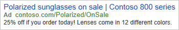

# Ad Customizer Feeds
With ad customizers, your ads can dynamically update themselves to appeal to specific customers. All it takes is uploading an ad customizer feed that tells us what information you want to insert into your ads under which circumstances.

Why use ad customizer feeds?
- Save time. Transform a single ad into hundreds of variations without having to manually update the ad.  
- More relevant ads. Customize ads based on what customers are searching for, when they're searching for it, where they are, what device they're using, and more.  
- Better results. See higher click-through and conversion rates.  

You can have 100 feeds per account (this maximum number includes all feed types) and the maximum number of feed items (rows) per account is 5 million.  

> [!NOTE]
> Feeds and feed items can only be created, retreived, updated, and deleted using the Bulk service. You can manage ads and audiences e.g., remarketing lists using either the Bulk or Campaign Management service. 

> [!TIP]
> For code examples please see the [C#](https://github.com/BingAds/BingAds-dotNet-SDK/blob/main/examples/BingAdsExamples/BingAdsExamplesLibrary/v13/BulkExpandedTextAds.cs), [Java](https://github.com/BingAds/BingAds-Java-SDK/blob/main/examples/BingAdsDesktopApp/src/main/java/com/microsoft/bingads/examples/v13/BulkExpandedTextAds.java), and [Python](https://github.com/BingAds/BingAds-Python-SDK/blob/main/examples/v13/bulk_expanded_text_ads.py) repositories on GitHub i.e., the Bulk Expanded Text Ads example shows how to create and use an ad customizer feed. 

## <a name="upload-adcustomizerfeed"></a>Upload ad customizer feeds

You can upload ad customizer feeds and feed items with the Bulk service. 
- The [Feed](../bulk-service/feed.md) record defines the name and data type of attributes that are allowed for the corresponding feed items. 
- The [Feed Item](../bulk-service/feed-item.md) record defines additional information about your products or services and under what conditions that information should be inserted into your ads. The Microsoft Advertising system attributes define under what conditions each feed item should be inserted into your ads, whereas the custom attributes define what information about your products or services you want to insert into your ads. Your ad customizer feed items can be referenced from all ads in your Microsoft Advertising account by default. Optionally you can restrict each feed item to a specific campaign or ad group.  

> [!NOTE]
> The [Feed](../bulk-service/feed.md) and [Feed Item](../bulk-service/feed-item.md) record types are used for both ad customizer feeds and page feeds. When you download feeds and feed items, be sure to check the "Sub Type" column to find out whether the data is applicable for an ad customizer feed or page feed.  

You might visualize the feed column names and field values in a table: 

|Column1_Name (DateTime)|Column2_Name (Int64)|Column3_Name (Price)|Column4_Name (String)|
|-----|-----|-----|-----|
|2020/06/22 00:00:00|8|$24.99|Contoso 700|
|2020/06/22 01:00:00|10|$24.99|Contoso 800|
|2020/06/22 02:00:00|12|$24.99|Contoso 900|

You could upload the ad customizer feed and feed items via the Bulk API as follows:

```csv
Type,Status,Id,Parent Id,Sub Type,Keyword,Match Type,Name,Audience Id,Feed Name,Custom Attributes
Format Version,,,,,,,6,,,
Feed,Active,-21,,AdCustomizerFeed,,,,,MyAdCustomizerFeedName,"[{""name"":""Column1_Name"",""feedAttributeType"":""DateTime""},{""name"":""Column2_Name"",""feedAttributeType"":""Int64""},{""name"":""Column3_Name"",""feedAttributeType"":""Price""},{""name"":""Column4_Name"",""feedAttributeType"":""String""}]"
Feed Item,Active,,-21,,lightweight sunglasses,Broad,,,,"{""Column1_Name"":""2020/06/22 00:00:00"",""Column2_Name"":8,""Column3_Name"":""$24.99"",""Column4_Name"":""Contoso 700""}"
Feed Item,Active,,-21,,lightweight sunglasses,Broad,,,,"{""Column1_Name"":""2020/06/22 01:00:00"",""Column2_Name"":10,""Column3_Name"":""$24.99"",""Column4_Name"":""Contoso 800""}"
Feed Item,Active,,-21,,lightweight sunglasses,Broad,,,,"{""Column1_Name"":""2020/06/22 02:00:00"",""Column2_Name"":12,""Column3_Name"":""$24.99"",""Column4_Name"":""Contoso 900""}"
```

## <a name="expandedtextad-examples"></a>Adding ad customizers to Expanded Text Ads

You can add ad customizers to any Expanded Text Ad field except the final URL.

The ad customizer will appear in Microsoft Advertising in the following syntax: {=FeedName.Attribute:DefaultText}. So, if your feed name is "Accessories", your attribute name is "Type", and your default text is "sunglasses", the syntax will be {=Accessories.Type:sunglasses}.

Let's say you sell sunglasses and you want to highlight specific features, depending on what a customer searches for. You would upload an ad customizer feed, feed item, and expanded text ad as follows:

```csv
Type,Status,Id,Parent Id,Sub Type,Keyword,Match Type,Name,Audience Id,Feed Name,Custom Attributes,Title Part 1,Title Part 2,Text,Text Part 2,Final Url,Path 1
Format Version,,,,,,,6,,,,,,,,,
Feed,Active,-21,,AdCustomizerFeed,,,,,MyAdCustomizerFeedName,"[{""name"":""Product"",""feedAttributeType"":""String""},{""name"":""Materials_Lightweight"",""feedAttributeType"":""String""},{""name"":""Description_Lightweight"",""feedAttributeType"":""String"",{""name"":""Finishes"",""feedAttributeType"":""Int64""},{""name"":""StartPrice"",""feedAttributeType"":""Price""}]",,,,,,
Feed Item,Active,,-21,,lightweight sunglasses,Broad,,,,"{""Product"":""Contoso 900"",""Materials_Lightweight"":""titanium or acetate"",""Description_Lightweight"":""Stylish, lightweight shades"",""Finishes"":8,""StartPrice"":""$24.99""}",,,,,,
Expanded Text Ad,Active,,AdGroupIdGoesHere,,,,,,,,The latest {=Sunglasses.Product}s,In {=Sunglasses.Materials_Lightweight},{=Sunglasses.Description_Lightweight} in {=Sunglasses.Finishes} finishes.,Starting at only {=Sunglasses.StartPrice}!,https://www.contoso.com,deals
```

In that case, the ad could look like this for a customer who searched for "lightweight sunglasses": 


Now let's say you have a remarketing list of customers who looked at a specific type of sunglasses on your website. You might have uploaded an ad customizer feed, feed item, and expanded text ad as follows:

```csv
Type,Status,Id,Parent Id,Sub Type,Keyword,Match Type,Name,Audience Id,Feed Name,Custom Attributes,Title Part 1,Title Part 2,Text,Text Part 2,Final Url,Path 1
Format Version,,,,,,,6,,,,,,,,,
Feed,Active,-21,,AdCustomizerFeed,,,,,MyAdCustomizerFeedName,"[{""name"":""Type"",""feedAttributeType"":""String""},{""name"":""Product"",""feedAttributeType"":""String""},{""name"":""Discount"",""feedAttributeType"":""String""},{""name"":""Colors"",""feedAttributeType"":""Int64""}]",,,,,,
Feed Item,Active,,-21,,lightweight sunglasses,Broad,,12345678,,"{""Type"":""Polarized"",""Product"":""Contoso 800"",""Discount"":""25% off"",""Colors"":12}",,,,,,
Expanded Text Ad,Active,,AdGroupIdGoesHere,,,,,,,,{=Sunglasses.Type} sunglasses on sale,{=Sunglasses.Product} series,{=Sunglasses.Discount} if you order today!,Lenses come in {=Sunglasses.Colors} different colors.,https://www.contoso.com/{=Sunglasses.Type},OnSale
```

> [!NOTE]
> The feed item's "Audience Id" field is set to 12345678, assuming that a remarketing list already exists with a Microsoft Advertising identifier of 12345678. 

In that case, the ad could look like this for customers who were in this remarketing list:




## See Also
[Expanded Text Ads](expanded-text-ads.md)  
[Page Feeds](page-feeds.md)  
