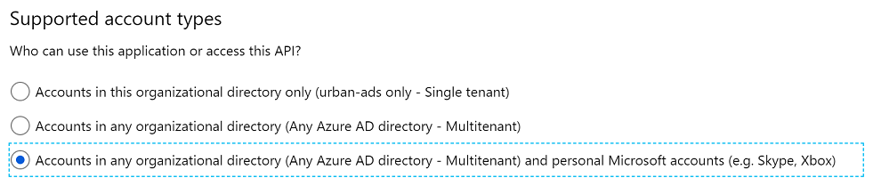

# Register an application

[!INCLUDE[request-header](./includes/mfa-required.md)]

Before your application can authenticate Microsoft Advertising users, you must register your application and get the corresponding client ID and client secret.  

1. Navigate to the Microsoft identity platform for developers in the [Azure portal - App registrations](https://go.microsoft.com/fwlink/?linkid=2083908) page. You can login using either a personal Microsoft Account or a Work or School Account.
1. Select **New registration**. 
1. When the **Register an application page** appears, enter your application's registration information: 
    - In the **Name** section, enter a meaningful application name that will be displayed to users of the app, for example `My browserless client`. 
    - In the **Supported account types** section, select **Accounts in any organizational directory and personal Microsoft accounts**. 

      

    > [!IMPORTANT]
    > You must select **Accounts in any organizational directory and personal Microsoft accounts** during the initial app registration. This setting cannot be updated later in the portal unless you modify the [application manifest](https://docs.microsoft.com/azure/active-directory/develop/reference-app-manifest) e.g., ```"signInAudience": "AzureADandPersonalMicrosoftAccount"```.  

1. Select **Register** to create the application. 
1. On the app **Overview** page, find the **Application (client) ID** value and record it for later. You will use it as the `client_id` when you [request user consent](authentication-oauth-consent.md) and [get an access token](authentication-oauth-get-tokens.md).  
1. Select the **Add a Redirect URI** link and then you should see the **Redirect URIs** page. 
   - For web applications, provide the base URL of your application. For example, http://localhost:31544 might be the URL for a web application running on your local machine. Users would use this URL to sign into a web client application.  
   - For public applications, locate the **Suggested Redirect URIs for public clients (mobile, desktop)** section. Select the **https://login.microsoftonline.com/common/oauth2/nativeclient** URI. 
   
    > [!IMPORTANT]
    > Clients running apps on services that span regions and devices such as Microsoft Azure should register a web application with client secret. You can get a refresh token on one device and refresh it on another so long as you have the same client ID and client secret. If you register a public application without a client secret, then you cannot use a refresh token across devices. A confidential token is bound to the client secret. 

1. For web applications, select **Certificates & secrets** under **Manage**. Select the **New client secret** button. Enter a value in **Description**, select any option for **Expires** and choose **Add**. Copy the client secret value before leaving the page. You will use it later as the `client_secret` to [get an access token](authentication-oauth-get-tokens.md). 

## Next steps

> [!div class="nextstepaction"]
> [Request user consent](authentication-oauth-consent.md)


## See Also
[Get started](get-started.md)
