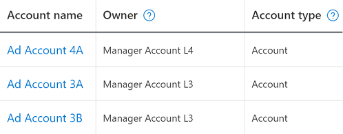
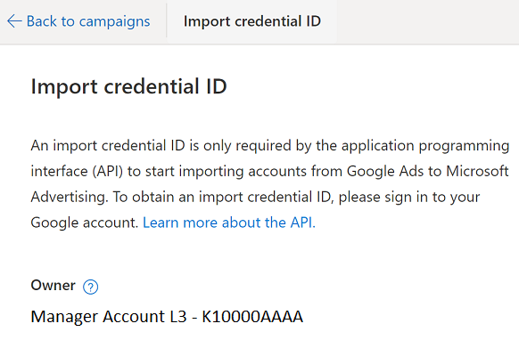

# Google Ads Import
If you already are using Google Ads to advertise on Google, you can import these campaigns into Microsoft Advertising so that you can run the same ads on Bing. This is an easy way to expand your online advertising reach.

> [!NOTE]
> This closed beta release of Google Import As A Service is available to select participants only ([GetCustomerPilotFeatures](../customer-management-service/getcustomerpilotfeatures.md) returns 734). 
> 
> The Import API documentation is subject to change. 

To import campaigns from Google Ads, [get a credential ID](#get-credentialid) to represent your Google Ads credentials, [choose the Google Ads account and campaigns](#choose-google-campaigns) that you want to import, [choose import options](#import-options) e.g., the entities that you want to import, and then [schedule the import](#import-schedule). 

You can add and delete scheduled imports, but cannot edit or update via API. A scheduled import that you added via API can be edited in the Microsoft Advertising UI. 

You can get all of your ad account's scheduled import results via API, whether an import was scheduled via API or the Microsoft Advertising UI. 

> [!NOTE]
> The API supports import from one Google Ads account to one Microsoft Advertising account. When you schedule an import job via [AddImportJobs](../campaign-management-service/addimportjobs.md) operation, then in the Microsoft Advertising UI you'll see it in the context of an ad account, and it will not be included under your manager account's scheduled imports. If you follow the [Import multiple accounts from Google Ads](https://help.ads.microsoft.com/#apex/3/en/51050/0) workflow in the context of a manager account, the import jobs and results will be returned via the [GetImportJobsByIds](../campaign-management-service/getimportjobsbyids.md) and [GetImportResults](../campaign-management-service/getimportresults.md) operations.    

## <a name="get-credentialid"></a>Get an Import credential ID

The import credential ID links your Google Ads and Microsoft Advertising user credentials. Each import credential ID is only valid for importing into ad accounts under one manager account (customer).  

1. Sign in to Microsoft Advertising and navigate to the ad account where you want to import Google Ads campaigns. You must sign in and get an import credential ID with the same user credentials that will be used later when you [schedule the import](#import-schedule) via the [AddImportJobs](../campaign-management-service/addimportjobs.md) operation.  

1. Navigate to Tools -> Setup -> Import credential ID. 

    > [!NOTE]
    > You can only get an import credential ID in the redesigned Microsoft Advertising UI. If you don't see it, look for the "Try the new Microsoft Advertising" prompt when you sign in. To use the redesigned Microsoft Advertising you must also be in the UI pilot ([GetCustomerPilotFeatures](../customer-management-service/getcustomerpilotfeatures.md) returns 522). 

1. Sign in with your Google account credentials. Be sure the Google user has access to the Google Ads account that you want to import from. 

    > [!IMPORTANT]
    > To test in the Microsoft Advertising [sandbox](sandbox.md) environment, you'll first need a Google Ads [test account](https://developers.google.com/google-ads/api/docs/first-call/overview#test_account). Otherwise you can import your production Google Ads account to production Microsoft Advertising. 

1. Copy or securely store the import credential ID. You'll need it later when you [choose Google Ads campaigns](#choose-google-campaigns) and [schedule the import](#import-schedule) via the [AddImportJobs](../campaign-management-service/addimportjobs.md) operation.  

    > [!NOTE]
    > Each import credential ID is valid only for importing into ad accounts under the same manager account (customer) by the same user. You can import any Google Ads account permitted via the Google account credentials. 
    > This does not necessarily mean that you can import into any ad accounts that you can view in your manager account's hierarchy. In case an account is linked from another manager account for example, please take note of the account "Owner" when you get the import credential ID. The same user could import the same Google Ads account to any sibling ad account that is owned by the same parent manager account.
    > If either the [Microsoft Advertising User Credentials](#microsoft-credentials), [Google Ads User Credentials](#google-credentials), or [Account Owner](#account-owner) varies or changes, then you'll need to use a different import credential ID. For details please see [Credential ID Scope](#credential-scope).  

1. Use your import credential ID in the [CredentialId](../campaign-management-service/googleimportjob.md#credentialid) element of a [GoogleImportJob](../campaign-management-service/googleimportjob.md) instance, [choose the Google Ads account and campaigns](#choose-google-campaigns) that you want to import, [choose import options](#import-options) e.g., the entities that you want to import, and then call the [AddImportJobs](../campaign-management-service/addimportjobs.md) operation to [schedule the import](#import-schedule). See the sections below for more details. 

Changing your Google account password does not invalidate the import credential ID. Revoking BingAdsImport App permissions via your Google account settings will invalidate any previous provisioned import credential IDs. 

## <a name="choose-google-campaigns"></a>Choose Google Ads Campaigns

You'll use the import credential ID and choose Google Ads campaigns via the [GoogleImportJob](../campaign-management-service/googleimportjob.md) object. 
- Set the [CredentialId](../campaign-management-service/googleimportjob.md#credentialid) element to the import credential ID that was [provisioned](#get-credentialid) in the Microsoft Advertising UI. 
- Set the [GoogleAccountId](../campaign-management-service/googleimportjob.md#googleaccountid) element to the account ID of the Google ad account that you want to import from. 
- Optionally you can set the [CampaignAdGroupIds](../campaign-management-service/googleimportjob.md#campaignadgroupids) element if you want to limit the import to specific Google Ads campaigns. 

Later when you [schedule the import](#import-schedule) you'll set the destination Microsoft Advertising ad account via the CustomerAccountId header element of the [AddImportJobs](../campaign-management-service/addimportjobs.md) operation. 

## <a name="import-options"></a>Choose Import Options

Microsoft Advertising will import most supported campaigns, ads, targets, ad extensions, and other settings by default. As needed you can exclude an entity or otherwise customize the import via the [GoogleImportOption](../campaign-management-service/googleimportoption.md) object. 

Here are some example customizations. 
- If you want the import service to delete items that have been removed from your Google Ads account, then set [DeleteRemovedEntities](../campaign-management-service/googleimportoption.md#deleteremovedentities) to true. 
- If you want to increase the Microsoft Advertising campaign budgets 25 percent higher than your Google Ads campaign budgets, then set [AdjustmentForCampaignBudgets](../campaign-management-service/googleimportoption.md#adjustmentforcampaignbudgets) to 25. 
- If you do not want to update existing campaign budgets that are already in Microsoft Advertising, set [UpdateCampaignBudgets](../campaign-management-service/googleimportoption.md#updatecampaignbudgets) to false. 
- Set [AssociatedStoreId](../campaign-management-service/googleimportoption.md#associatedstoreid) to the identifier of the Microsoft Merchant Center store that you want to associate with imported product ads and product filters. If this option is null or empty, your product ads and product filters will not be imported. 

> [!NOTE]
> Please note that the [GoogleImportOption](../campaign-management-service/googleimportoption.md) object does not include a comprehensive list of imported items. Microsoft Advertising imports all the data needed to manage your campaigns and aims to provide the best experience for you. 
> 
> There is no option to exclude future supported entities from scheduled imports. For example, you cannot choose to only import "these specific ad extension types, but no other current or future ad extension types". Let's say promotion ad extensions is not yet available in the [GoogleImportOption](../campaign-management-service/googleimportoption.md) object. Once Microsoft Advertising supports it generally e.g., via the UI, all current and future scheduled imports will include promotion ad extensions until users opt out. After "PromotionAdExtensions" is added to the list of import options, then you could explicitly set it false as needed.  

For more details about what does and doesn't get imported from Google Ads, see [What gets imported](https://help.ads.microsoft.com/#apex/3/en/50851/0). 

## <a name="import-schedule"></a>Choose the Import Schedule and Frequency

You can schedule a recurring import e.g., "Every Sunday at 4:00 PM" or you can run the import now. 

The scheduling options are:
- Now: Import once as soon as you call the [AddImportJobs](../campaign-management-service/addimportjobs.md) operation. 
- Once: Import once at the date and time you specify.
- Daily: Import once per day at the time you specify.
- Weekly: Import once per week at the time you specify.
- Monthly: Import once per month at the time you specify.

To run the import "now", you can leave the Google import job [Frequency](../campaign-management-service/googleimportjob.md#frequency) element nil or empty. For all other scheduling options, set the frequency [Type](../campaign-management-service/frequency.md#type) and [Cron](../campaign-management-service/frequency.md#cron) values. For details about supported frequency values, see the [Frequency Remarks](../campaign-management-service/frequency.md#remarks).

## <a name="import-start"></a>Start the Import

You can schedule an import or run now via the [AddImportJobs](../campaign-management-service/addimportjobs.md) operation. Be sure to set the destination Microsoft Advertising ad account via the CustomerAccountId [header](../campaign-management-service/addimportjobs.md#request-header) element.  

Updates such as pause and edit are only supported via the Microsoft Advertising UI. You can delete a scheduled import via [DeleteImportJobs](../campaign-management-service/deleteimportjobs.md), and then schedule a new import via [AddImportJobs](../campaign-management-service/addimportjobs.md) to effectively replace the deleted job. You can get previously scheduled imports via the [GetImportJobsByIds](../campaign-management-service/getimportjobsbyids.md) operation. 

## <a name="import-start"></a>Review the Import Results

Now that you've imported your campaigns from Google Ads, you can check the status of your import and review error logs. Keep in mind that not all information will be imported, but that doesn't mean it's not supported within Microsoft Advertising. So, after you import, be sure to review your campaigns to make sure everything is good to go and add the missing information back to your campaigns. 

You can get import results via the [GetImportResults](../campaign-management-service/getimportresults.md) operation. Be sure to set the [ImportType](../campaign-management-service/getimportresults.md#importtype) element to "GoogleImportJob". The operation can return multiple results for the same import job e.g., if the scheduled import already ran every week for the last 8 weeks you'll get 8 results. If an import is scheduled for a future date, then no import results will be returned for that import job. 

For more details about what does and doesn't get imported from Google Ads, see [What gets imported](https://help.ads.microsoft.com/#apex/3/en/50851/0). 

## <a name="credential-scope"></a>Credential ID Scope

Each import credential ID is valid only for importing into ad accounts under the same manager account (customer) by the same user. You can import any Google Ads account permitted via the Google account credentials. 

This does not necessarily mean that you can import into any ad accounts that you can view in your manager account's hierarchy. In case an account is linked from another manager account for example, please take note of the account "Owner" when you get the import credential ID. The same user could import the same Google Ads account to any sibling ad account that is owned by the same parent manager account.

If either the [Microsoft Advertising User Credentials](#microsoft-credentials), [Google Ads User Credentials](#google-credentials), or [Account Owner](#account-owner) varies or changes, then you'll need to use a different import credential ID.  

### <a name="microsoft-credentials"></a>Microsoft Advertising User Credentials

When you [get an Import credential ID](#get-credentialid) you will sign in to Microsoft Advertising and navigate to the ad account where you want to import Google Ads campaigns. You must sign in and get an import credential ID with the same user credentials that will be used later when you [schedule the import](#import-schedule) via the [AddImportJobs](../campaign-management-service/addimportjobs.md) operation. 

The import credential ID would be invalid if you attempt to call [AddImportJobs](../campaign-management-service/addimportjobs.md) with the access token of any other user. 

### <a name="google-credentials"></a>Google Ads User Credentials

When you [get an Import credential ID](#get-credentialid) you will sign in with your Google account credentials. Be sure the Google user has access to the Google Ads account that you want to import from. 

The import credential ID would be invalid if you make any of the following changes. 
- Access to the Google Ads account is removed in Google Ads. 
- You remove Microsoft Advertising's access for the Google user credentials e.g., via Google's [Third-party apps with account access](https://myaccount.google.com/permissions) settings. Even if you grant access again via Microsoft Advertising, a new credential ID will be required to add new import jobs. 

Please also note, changing your Google account password does not invalidate the credential ID. 

### <a name="account-owner"></a>Account Owner

Each account has an "owner" i.e., the parent customer or manager account. You can confirm the owner for each account via *Tools > Accounts > Accounts summary*. In the example below, "Manager Account L4" is the owner of "Ad Account 4A" and "Manager Account L3" is the owner of both "Ad Account 3A" and "Ad Account 3B". If you don't see the "Owner" you can add this detail by modifying the set of columns displayed. 



You can use the same import credential ID to import any account under the same manager account. In the example above if we navigate to "Ad Account 3A" and request a credential ID, it can be used for import into both "Ad Account 3A" and "Ad Account 3B" (the owner of both accounts is "Manager Account L3"). This credential ID cannot be used to add an import job for "Ad Account 4A". Likewise, if we navigate to "Ad Account 4A" and request a credential ID, it can only be used for imports into "Ad Account 4A". Having said that, if new accounts are later added under "Manager Account L4", we could use the same import credential ID already provisioned. 

How can you confirm the owner for accounts that you can access? When you [get an Import credential ID](#get-credentialid) you will sign in to Microsoft Advertising and navigate to the ad account where you want to import Google Ads campaigns. Whether you own the account directly or have linked access as an agency, you'll see the owner identified below the "Owner" label as shown here. 



To clarify how the owner could also be identified programatically e.g., via the [SearchAccounts](../customer-management-service/searchaccounts.md) operation, please take note of the account [ParentCustomerId](../customer-management-service/advertiseraccount.md#parentcustomerid). This is the ID of the manager account that owns the ad account. 

```xml
<s:Envelope xmlns:s="http://schemas.xmlsoap.org/soap/envelope/">
  <s:Header xmlns="https://bingads.microsoft.com/Customer/v13">
    <TrackingId d3p1:nil="false" xmlns:d3p1="http://www.w3.org/2001/XMLSchema-instance">ValueHere</TrackingId>
  </s:Header>
  <s:Body>
    <SearchAccountsResponse xmlns="https://bingads.microsoft.com/Customer/v13">
      <Accounts xmlns:e377="https://bingads.microsoft.com/Customer/v13/Entities" d4p1:nil="false" xmlns:d4p1="http://www.w3.org/2001/XMLSchema-instance">
        <e377:AdvertiserAccount>
          . . . 
          <e377:Id d4p1:nil="false">AdAccountIdHere</e377:Id>
          . . . 
          <e377:ParentCustomerId>ManagerAccountIdHere</e377:ParentCustomerId>
          . . . 
        </e377:AdvertiserAccount>
      </Accounts>
    </SearchAccountsResponse>
  </s:Body>
</s:Envelope>
```

For more information about the accounts that a user can access, see [Get Your Account and Customer IDs](get-started.md#get-ids). 

## See Also
[Bing Ads API Web Service Addresses](web-service-addresses.md)  
