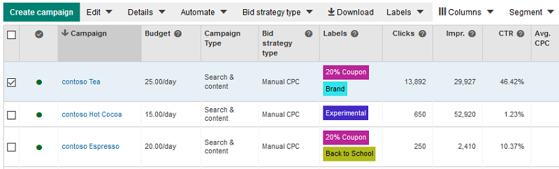

# Labels
Labels let you organize campaigns, ad groups, ads, and keywords into groups based on whatever is important to you. You can then filter and run reports on your labels to get the data that is most meaningful to you.

With labels, you could:
* Run a report to compare "Holiday 2019" and "Holiday 2020" performance, across campaigns, ad groups, ads, and keywords.
* Run a report to compare ads and keywords that include brand names against ads and keywords that use generic terms.
* Quickly filter and view performance for keywords labeled "Suggested by Microsoft Advertising."
* Create an automated rule to change bids on keywords labeled "CPA bidding."

The important thing is that it's all up to you. You decide what your labels mean and how to apply them to your campaigns, ad groups, ads, and keywords.



## <a name="bulkservice"></a>Managing Labels with the Bulk Service
You can use the [Bulk Service](../bulk-service/bulk-service-reference.md) i.e., [Bulk Download and Upload](bulk-download-upload.md) to create, get, update, and delete both labels and label associations. 

The following Bulk records are available for managing labels and label associations. 

- [Label](../bulk-service/label.md)  
- [Campaign Label](../bulk-service/campaign-label.md)  
- [Ad Group Label](../bulk-service/ad-group-label.md)  
- [Keyword Label](../bulk-service/keyword-label.md)  
- [App Install Ad Label](../bulk-service/app-install-ad-label.md)  
- [Dynamic Search Ad Label](../bulk-service/dynamic-search-ad-label.md)  
- [Expanded Text Ad Label](../bulk-service/expanded-text-ad-label.md)  
- [Product Ad Label](../bulk-service/product-ad-label.md)  
- [Text Ad Label](../bulk-service/text-ad-label.md)  

For example, the following Bulk CSV example would apply a label to the campaign, ad group, keyword, and expanded text ad if the valid *Id* and *Parent Id* are provided. 

```csv
Type,Status,Id,Parent Id,Campaign,Ad Group,Client Id,Modified Time,Name,Description,Label,Color
Format Version,,,,,,,,6,,,
Label,Active,-22,,,,ClientIdGoesHere,,,Label Description,Label Name 7/27/2017 6:50:54 PM,#FFFFFF
Campaign Label,Active,-22,-111,,,ClientIdGoesHere,,,,,
Ad Group Label,Active,-22,-1111,,,ClientIdGoesHere,,,,,
Expanded Text Ad Label,Active,-22,-11112,,,ClientIdGoesHere,,,,,
Keyword Label,Active,-22,-11113,,,ClientIdGoesHere,,,,,
```

## <a name="campaignservice"></a>Managing Labels with the Campaign Management Service
You can use the [Campaign Management Service](../campaign-management-service/campaign-management-service-reference.md) to create, get, update, and delete both labels and label associations. 

You can add, delete, get, and update labels ([Label](../campaign-management-service/label.md) objects) with the corresponding operations.
- [AddLabels](../campaign-management-service/addlabels.md)  
- [DeleteLabels](../campaign-management-service/deletelabels.md)  
- [GetLabelsByIds](../campaign-management-service/getlabelsbyids.md)  
- [UpdateLabels](../campaign-management-service/updatelabels.md)  

You can set, get, and delete label associations ([LabelAssociation](../campaign-management-service/labelassociation.md) objects) with the corresponding operations.
- [DeleteLabelAssociations](../campaign-management-service/deletelabelassociations.md)  
- [GetLabelAssociationsByEntityIds](../campaign-management-service/getlabelassociationsbyentityids.md)  
- [GetLabelAssociationsByLabelIds](../campaign-management-service/getlabelassociationsbylabelids.md)  
- [SetLabelAssociations](../campaign-management-service/setlabelassociations.md)  


