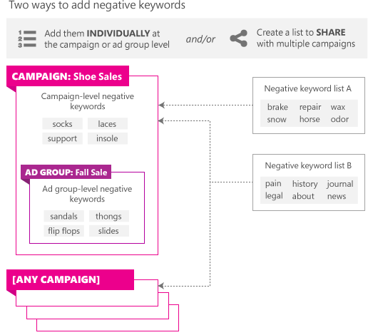

# Negative Keywords
A *negative keyword* is a specific word or phrase that helps to prevent your ad from being displayed to customers who are unlikely to click your ad. You can use negative keywords to prevent your ad from being displayed if the user's search query contains one of your negative keywords. The following types of comparisons are used to determine whether a negative keyword applies to the search query.

|Match Type|Description|
|--------------|---------------|
|Exact match|A match is prevented if all the words in the negative keyword exactly match the user's query.|
|Phrase match|Phrase match is the default match type. A match is prevented if all the words in the negative keyword are present somewhere in the user's query and are in the same order. For example, if your ad group contains "small red shoes" as a keyword and "sandals" as a negative keyword, searching for "small red sandals" would prevent a match because the query string contains the negative keyword, "sandals".|

For more information on when to use negative keywords see the Microsoft Advertising help article, [Learn about using negative keywords to get to the right customers](https://help.ads.microsoft.com/apex/index/3/en-us/51014).

You can [assign negative keywords](#assignednegativekeywords) to an individual campaign or ad group. If you specify negative keywords at both campaign and ad group levels, both sets of negative keywords will be in effect for the corresponding ad group. Negative keywords can also be added and deleted from a [shared negative keyword list](#sharednegativekeywordlists). The negative keyword list can be shared or associated with multiple campaigns. The negative keyword lists associated with a campaign are also effectively applied to all ad groups in the campaign. For example all negative keywords shown in the diagram below are applied to the Fall Sale ad group either directly or through inheritance from the campaign level associations. For other ad groups (not pictured) within the Shoe Sales campaign, the negative keywords sandals, thongs, flip flops, slides would not be in effect, unless those ad group also have the same negative keywords at ad group level.

For negative keyword limits per entity, please see [Negative Keywords](entity-hierarchy-limits.md#negativekeywords).

For code examples that show how to associate negative keywords and negative keyword lists with a campaign using the Campaign Management service, see [Negative Keywords Code Example](code-example-negative-keywords.md).

## Assigned Negative Keywords
You may choose to assign a set of negative keywords to an individual campaign or ad group. An assigned set of negative keywords cannot be shared with other campaigns or ad groups. You can manage an assigned set of negative keywords with the [AddNegativeKeywordsToEntities](../campaign-management-service/addnegativekeywordstoentities.md), [DeleteNegativeKeywordsFromEntities](../campaign-management-service/deletenegativekeywordsfromentities.md), and [GetNegativeKeywordsByEntityIds](../campaign-management-service/getnegativekeywordsbyentityids.md) operations.

A [NegativeKeyword](../campaign-management-service/negativekeyword.md) cannot be updated. To make an update, for example to change the match type of an existing negative keyword you must first pass the existing [NegativeKeyword](../campaign-management-service/negativekeyword.md) to [DeleteNegativeKeywordsFromEntities](../campaign-management-service/deletenegativekeywordsfromentities.md), and then call [AddNegativeKeywordsToEntities](../campaign-management-service/addnegativekeywordstoentities.md) with the desired match type for a new [NegativeKeyword](../campaign-management-service/negativekeyword.md) instance.

## Shared Negative Keyword Lists
Negative keywords can be added and deleted from a shared negative keyword list. The negative keyword list can be shared or associated with multiple campaigns. With a shared negative keyword list, you can apply entire lists of negative keywords to multiple campaigns and make changes across campaigns by editing a single list.

> [!NOTE]
> Negative keyword lists cannot be associated with an ad group. An ad group can be assigned its own exclusive set of negative keywords. In addition to an exclusive set of negative keywords that can be assigned to a campaign, each campaign can be associated with one negative keyword list.

To create a negative keyword list, call the [AddSharedEntity](../campaign-management-service/addsharedentity.md) operation and pass a [NegativeKeywordList](../campaign-management-service/negativekeywordlist.md), which inherits from both [SharedList](../campaign-management-service/sharedlist.md) and [SharedEntity](../campaign-management-service/sharedentity.md). You can create up to 20 negative keyword lists per account and share or associate them with any campaign in the same account. You can get existing negative keyword lists by calling the [GetSharedEntitiesByAccountId](../campaign-management-service/getsharedentitiesbyaccountid.md) operation. You can update the name of the negative keyword list by calling the [UpdateSharedEntities](../campaign-management-service/updatesharedentities.md) operation. You can delete the negative keyword list by calling the [DeleteSharedEntities](../campaign-management-service/deletesharedentities.md) operation.

To add negative keywords to a negative keyword list, call the [AddListItemsToSharedList](../campaign-management-service/addlistitemstosharedlist.md) operation and pass a list of [NegativeKeyword](../campaign-management-service/negativekeyword.md), which inherits from [SharedListItem](../campaign-management-service/sharedlistitem.md). You can add up to 5,000 negative keywords to each negative keyword list. You can get negative keywords within a specified list by calling the [GetListItemsBySharedList](../campaign-management-service/getlistitemsbysharedlist.md) operation. Negative keywords can be removed from a list by calling the [DeleteListItemsFromSharedList](../campaign-management-service/deletelistitemsfromsharedlist.md) operation.

A [NegativeKeyword](../campaign-management-service/negativekeyword.md) cannot be updated. To make an update, for example to change the match type of an existing negative keyword you must first pass the existing [NegativeKeyword](../campaign-management-service/negativekeyword.md) to [DeleteListItemsFromSharedList](../campaign-management-service/deletelistitemsfromsharedlist.md), and then call [AddListItemsToSharedList](../campaign-management-service/addlistitemstosharedlist.md) with the desired match type for a new [NegativeKeyword](../campaign-management-service/negativekeyword.md) instance.

To associate a negative keyword list with a campaign, specify an array of [SharedEntityAssociation](../campaign-management-service/sharedentityassociation.md) with the [SetSharedEntityAssociations](../campaign-management-service/setsharedentityassociations.md) service operation. Each [SharedEntityAssociation](../campaign-management-service/sharedentityassociation.md) should include the type of entity (currently only Campaign is supported for negative keyword lists), campaign identifier, and negative keyword list identifier. You can get the associations by entity identifier or negative keyword list identifier by calling the respective [GetSharedEntityAssociationsByEntityIds](../campaign-management-service/getsharedentityassociationsbyentityids.md) and [GetSharedEntityAssociationsBySharedEntityIds](../campaign-management-service/getsharedentityassociationsbysharedentityids.md) operations. You can remove the association between the campaign and negative keyword list by calling the [DeleteSharedEntityAssociations](../campaign-management-service/deletesharedentityassociations.md) operation.

## Find Conflicts between Your Negative Keywords and Keywords
The reporting service provides a negative-keyword conflict report that lists the negative keywords that you also specify as keywords. Specifying a negative keyword that is also a keyword negates the keyword. For more information, see the [NegativeKeywordConflictReportRequest](../reporting-service/negativekeywordconflictreportrequest.md).

## See Also
[Bing Ads API Web Service Addresses](web-service-addresses.md)

