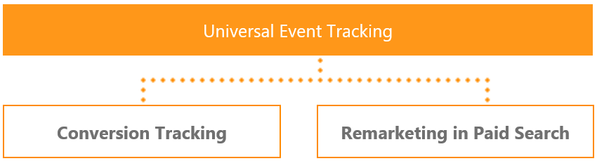

# Universal Event Tracking
UET is a powerful Microsoft Advertising tool. You just need to create one single UET tag and then add it to your website once. This tag records what customers do on your website then Microsoft Advertising starts collecting that data allowing you to track conversions (like purchases or leads) or target audiences using remarketing lists. UET is a prerequisite for conversion tracking and remarketing in paid search.



There are a few steps to get this set up. You will need to:
* Create a [UET tag](#uet) once in Microsoft Advertising
* Add the UET tag tracking code to every page of your website
* Depending on what you want to do, either set up [conversion tracking](#conversiongoals) or leverage [audiences](#audience) e.g., [remarketing in paid search](#remarketinglist).

For details please see these API overview sections below:
- [Universal Event Tracking APIs](#uet)
- [Conversion Goal APIs](#conversiongoals)
- [Audience APIs](#audience)

## <a name="uet"></a>Universal Event Tracking APIs

Before you can track conversions or target audiences using a remarketing list, you need to create a UET tag in Microsoft Advertising (web application or API) and then add the UET tag tracking code to every page of your website. This section describes how you can setup UET tags using the Bing Ads API. For information about setting up UET tags using the Microsoft Advertising web application, see [How do I create a UET tag?](https://help.ads.microsoft.com/#apex/3/en/56682/2-500) and [FAQ: Universal Event Tracking](https://help.ads.microsoft.com/#apex/3/en/53056/2). 

> [!NOTE]
> For each of the operations described in this section, you must specify the customer identifier in the *CustomerId* header element. 

1. First you should call the [GetUetTagsByIds](../campaign-management-service/getuettagsbyids.md) operation to check whether a tag has already been created. You can leave the *TagIds* element null or empty to request all UET tags available for the customer.
2. You can use one UET tag with all of your conversion goals and remarketing lists. Before you create multiple UET tags, see [Reasons for creating more than one UET tag](https://help.ads.microsoft.com/#apex/3/en/56685/2). If you do not already have a UET tag that can be used, or if you need another UET tag, call the [AddUetTags](../campaign-management-service/adduettags.md) service operation to create a new UET tag. If the call is successful, the tracking script that you should add to your website is included in a corresponding [UetTag](../campaign-management-service/uettag.md) within the response message. Later as needed you can update the name and description of a [UetTag](../campaign-management-service/uettag.md) with the [UpdateUetTags](../campaign-management-service/updateuettags.md) operation.

After you retrieve the tracking script from the [AddUetTags](../campaign-management-service/adduettags.md) or [GetUetTagsByIds](../campaign-management-service/getuettagsbyids.md) operation, the next step is to add the UET tag tracking code to your website. We recommend that you, or your website administrator, add it to your entire website in either the head or body sections. If your website has a site-wide layout page, then that is the best place to add it because you add it once and it is included on all pages. For more information, see [How do I add the UET tag to my website?](https://help.ads.microsoft.com/#apex/3/en/56688/2-500) 

Depending on what you want to do, either set up [conversion tracking](#conversiongoals) or [audiences](#audience).

## <a name="conversiongoals"></a>Conversion Goal APIs

One of the biggest value propositions of UET is that it lets you install one tag on your website to track multiple types of conversions. Once the UET tag tracking code is added to your website, Microsoft Advertising can log page visits and any custom events such as subscribing to a newsletter or downloading a document. 

However, not all actions are created equal. You probably have a subset of actions that you consider more important to a successful advertising campaigns. These may include making purchases, filling out a lead form or watching a video. This is where conversion goals can help. Conversion goals allow you to specify which actions (recorded by UET) to count as conversions. For more information about Conversion Goals, see [What are conversion goals and goal types?](https://help.ads.microsoft.com/#apex/3/en/56709/2-500).

### <a name="conversiongoals-campaign"></a>Conversion Goal Campaign Management APIs

There are five types of conversion goals. The [ConversionGoal](../campaign-management-service/conversiongoal.md) is the base class from which all goals are derived. 
- [AppInstallGoal](../campaign-management-service/appinstallgoal.md)
- [DurationGoal](../campaign-management-service/durationgoal.md)
- [EventGoal](../campaign-management-service/eventgoal.md)
- [InStoreTransactionGoal](../campaign-management-service/instoretransactiongoal.md)
- [OfflineConversionGoal](../campaign-management-service/offlineconversiongoal.md)
- [PagesViewedPerVisitGoal](../campaign-management-service/pagesviewedpervisitgoal.md)
- [UrlGoal](../campaign-management-service/urlgoal.md)

The following operations are available for managing conversion goals.

- [AddConversionGoals](../campaign-management-service/addconversiongoals.md)
- [GetConversionGoalsByIds](../campaign-management-service/getconversiongoalsbyids.md)
- [GetConversionGoalsByTagIds](../campaign-management-service/getconversiongoalsbytagids.md)
- [UpdateConversionGoals](../campaign-management-service/updateconversiongoals.md)


## <a name="audience"></a>Audience APIs
Improve your return on investment by optimizing your campaigns for specific audiences, which are groups of people who have something in common relating to your campaign.

### <a name="audience-types"></a>Audience Types

Microsoft Advertising supports several audience types. 
- [Combined List](#combinedlist)
- [Custom Audience](#customaudience)
- [Customer List](#customerlist)
- [In-Market Audience](#inmarketaudience)
- [Product Audience](#productaudience)
- [Remarketing List](#remarketinglist)
- [Similar Remarketing List](#similarremarketinglist)

#### <a name="combinedlist"></a>Combined List
A combined list is an audience created from a combination of multiple existing audiences. 

> [!NOTE]
> Combined lists are available for customers in the feature pilot ([GetCustomerPilotFeatures](../customer-management-service/getcustomerpilotfeatures.md) returns 618).   

You can combine custom audiences, customer lists, product audiences, similar audiences, and remarketing lists. You cannot include other combined lists or in-market audiences in a combined list.  

You can create a maximum of 1,000 combined lists per ad account, and up to 5,000 per customer. Each list can include up to 100 combination rules or sets of logical conditions, and each combination rule can contain up to 100 audience IDs.

With some restrictions described below, you can combine audiences using these logical operators:

- OR: This will include customers who are in any of these audience lists. 
- AND: This will include only customers who are in every single one of these audience lists.  
- NOT: This will exclude customers who are in any of these audience lists. 

Evaluation of the logical expression determines who will be added to the combined list. Multiple combinations are always combined with an AND function. This means that a customer must meet all of the criteria of each combination in order to appear in this custom combination audience list. 

A combined list must include at least one audience using the OR or AND operators. A combined list cannot use only the NOT operator. In that case you should use audience exclusions instead. 

Custom audiences and customer lists cannot be combined with other audience types. 

Similar audiences cannot be combined via the AND or NOT operators. Similar audiences can only be used in a single OR condition. In other words, there can only be one audience set that contains similar audiences, and that set must use the OR operator. 

Duplicate audiences are allowed, although the same audience ID cannot be combined via both the AND and NOT operator. 

#### <a name="customaudience"></a>Custom Audiences
A custom audience is generated by using your own customer data to create richer user segments. You can use custom audiences in conjunction with your remarketing lists, usually through your data management provider (DMP). When your DMP connects to our custom audience feature, you can then import your custom audiences into Microsoft Advertising for search remarketing. You can use custom audiences separately from remarketing, with no UET required. Only first-party audience data (your customer data that you collected from your own website or apps, for example) is allowed for targeting on the Microsoft Advertising network. For more information, see [About custom audiences](https://help.ads.microsoft.com/#apex/3/en/56849/0).

> [!NOTE]
> You can delete but cannot add a custom audience using the Bing Ads API. Having said that, you can add and delete custom audience associations and exclusions.

At a glance:
* Uses your data. Custom audiences allow you to use the audience data you already have.
* Creates richer audiences. Create richer audience segments using more of your customer data.
* Works like remarketing. Custom audiences can be associated to campaigns and ad groups as target and bid, bid only, or as an exclusion.

To get started with custom audiences, your DMP must:

* Integrate our custom audience APIs into their platform.
* Agree to our data sharing and privacy policy.

Depending on the provider, they'll have their own enablement steps within their software. Be sure to contact your DMP for details on how to enable this feature.

Once the integration has been completed, your custom audiences will appear in the Audiences section of the Shared Library in the Microsoft Advertising web application. You can also download custom audiences via Bulk and Campaign Management APIs as described below.

#### <a name="customerlist"></a>Customer List
A customer list is a set of customer contact information that you have compiled to enable customer match. 

> [!NOTE]
> Customer lists are available for customers in the feature pilot ([GetCustomerPilotFeatures](../customer-management-service/getcustomerpilotfeatures.md) returns 579).   	
> 	
> Customer lists are available via the [Bulk API](#audience-bulk), but not yet available via the [Campaign Management API](#audience-campaign). 

> [!IMPORTANT]
> Before you can upload customer list data via Bulk API, you must first create one customer list audience and accept the terms and conditions in the Microsoft Advertising UI. The initial customer list doesn't need to contain any customer data, but you must click I ACCEPT. 
> 
> By clicking "I accept" you (1) agree that you are able to lawfully disclose audience details, which is personal data, to Microsoft and (2) accept the Customer Match Terms, the Microsoft Advertising Agreement, and the Microsoft Advertising policies. Microsoft will use the data that you upload in accordance with the [Customer Match Terms](https://go.microsoft.com/fwlink/?linkid=2106709).  

Each list can include multiple Email and CRMID items. 
- Include the [Customer List](../bulk-service/customer-list.md) record in the Bulk upload file and set its [Action Type](../bulk-service/customer-list.md#actiontype) field to "Add", "Remove", or "Replace". 
- Include one or more [Customer List Item](../bulk-service/customer-list-item.md) records in the same Bulk upload file and set the [Parent Id](../bulk-service/customer-list-item.md#parentid), [Sub Type](../bulk-service/customer-list-item.md#subtype), and [Text](../bulk-service/customer-list-item.md#text) fields. 

You can add or update a [Customer List](../bulk-service/customer-list.md) record without any [Customer List Item](../bulk-service/customer-list-item.md) records in the same Bulk upload file; however, you cannot upload any [Customer List Item](../bulk-service/customer-list-item.md) records without the accompanying parent [Customer List](../bulk-service/customer-list.md) record. 

After 48 hours, check the Audience Size fields e.g., [Audience Search Size](../bulk-service/customer-list.md#audiencesearchsize) to see how many of these customers we matched on the Bing Network. At that point, your ads can start showing for this new audience.

#### <a name="inmarketaudience"></a>In-Market Audiences
In-market audiences are curated lists of customers who have shown purchase intent signals within a particular category, including searches and clicks on Bing and page views on Microsoft services. Microsoft Advertising supplies the curated list of potential customers, unlike remarketing in paid search, where the advertiser creates the list. You can target and modify bids for these audiences by associating in-market audience lists with campaigns and ad groups, similar to what you do with remarketing lists. For more information, see [About in-market audiences](https://help.ads.microsoft.com/#apex/3/en/56851/0).

> [!NOTE]
> You cannot add, update, or delete an in-market audience using the Bing Ads API. Having said that, you can add and delete in-market audience associations and exclusions.

> [!NOTE]
> Not everyone has this feature yet. If you don't, don't worry. It's coming soon.

#### <a name="productaudience"></a>Product Audiences
Product audiences are dynamic remarketing lists that pair customers with specific products based on the products they have looked at, considered, or already purchased on your website. You can use product audiences in both search campaigns and audience campaigns. For more information, see [About product audiences](https://help.ads.microsoft.com/#apex/3/en/56910/0). 

#### <a name="remarketinglist"></a>Remarketing Lists
Remarketing in Paid Search lets you improve your return on investment by optimizing your campaigns for specific audiences, which are the people who have visited your website before. When you create remarketing lists, you specify what user actions on your website qualify them to be part of the remarketing lists. 

When users perform qualifying actions, they are added to the remarketing lists within minutes. If the remarketing list minimum size of 1,000 (minimum cookie pool) is met and you have associated the remarketing list with a campaign or ad group and set a specific bid amount, the ad delivery engine will start serving remarketed ads to those users on the Microsoft Advertising Network. For more information about Remarketing in Paid Search, see [Reach your audience](https://help.ads.microsoft.com/#apex/3/en/n5022/1) and [FAQ: Remarketing](https://help.ads.microsoft.com/#apex/3/en/56727/1).  

After you have set up [Universal Event Tracking (UET)](#uet), you can use the Bing Ads API to create remarketing lists and associate them with campaigns or ad groups. 

#### <a name="similarremarketinglist"></a>Similar Remarketing Lists
Microsoft Advertising will automatically generate similar audiences for remarketing lists if you are a pilot participant. You cannot create or edit the similar audience for a remarketing list. Having said that, you can add and delete similar remarketing list associations and exclusions. If you delete the source remarketing list, then the similar audience will also be deleted. If a similar audience is associated with a campaign or ad group, then you cannot delete the source remarketing list.

> [!NOTE]
> Microsoft Advertising will automatically generate similar audiences for remarketing lists for pilot participants i.e., [GetCustomerPilotFeatures](../customer-management-service/getcustomerpilotfeatures.md) returns feature identifier 317.  

### <a name="audience-bulk"></a>Audience Bulk APIs
With the Bulk service you can use the following record types to download and upload audiences:

- [Combined List](../bulk-service/combined-list.md)
- [Custom Audience](../bulk-service/custom-audience.md)
- [Customer List](../bulk-service/customer-list.md)
- [In Market Audience](../bulk-service/in-market-audience.md)
- [Product Audience](../bulk-service/product-audience.md) 
- [Remarketing List](../bulk-service/remarketing-list.md)   
- [Similar Remarketing List](../bulk-service/similar-remarketing-list.md)   

> [!NOTE]
> With custom audiences, only update of the Name and Description are supported. You can delete but cannot add a custom audience using the Bing Ads API. Having said that, you can add and delete custom audience associations and exclusions.
> 
> You cannot add, update, or delete an in-market audience using the Bing Ads API. Having said that, you can add and delete in-market audience associations and exclusions.
> 
> Microsoft Advertising will automatically generate similar audiences for remarketing lists if you are a pilot participant. You cannot create or edit the similar audience for a remarketing list. Having said that, you can add and delete similar remarketing list associations and exclusions. If you delete the source remarketing list, then the similar audience will also be deleted. If a similar audience is associated with a campaign or ad group, then you cannot delete the source remarketing list.

With the Bulk service you can use the following record types to download and upload audience associations:

- [Ad Group Combined List Association](../bulk-service/ad-group-combined-list-association.md)
- [Ad Group Custom Audience Association](../bulk-service/ad-group-custom-audience-association.md)
- [Ad Group Customer List Association](../bulk-service/ad-group-customer-list-association.md)
- [Ad Group In Market Audience Association](../bulk-service/ad-group-in-market-audience-association.md)
- [Ad Group Negative Combined List Association](../bulk-service/ad-group-negative-combined-list-association.md)
- [Ad Group Negative Custom Audience Association](../bulk-service/ad-group-negative-custom-audience-association.md)
- [Ad Group Negative Customer List Association](../bulk-service/ad-group-negative-customer-list-association.md)
- [Ad Group Negative In Market Audience Association](../bulk-service/ad-group-negative-in-market-audience-association.md)
- [Ad Group Negative Product Audience Association](../bulk-service/ad-group-negative-product-audience-association.md)
- [Ad Group Negative Remarketing List Association](../bulk-service/ad-group-negative-remarketing-list-association.md)
- [Ad Group Negative Similar Remarketing List Association](../bulk-service/ad-group-negative-similar-remarketing-list-association.md)
- [Ad Group Product Audience Association](../bulk-service/ad-group-product-audience-association.md)
- [Ad Group Remarketing List Association](../bulk-service/ad-group-remarketing-list-association.md)
- [Ad Group Similar Remarketing List Association](../bulk-service/ad-group-similar-remarketing-list-association.md)
- [Campaign Combined List Association](../bulk-service/campaign-combined-list-association.md)
- [Campaign Custom Audience Association](../bulk-service/campaign-custom-audience-association.md)
- [Campaign Customer List Association](../bulk-service/campaign-customer-list-association.md)
- [Campaign In Market Audience Association](../bulk-service/campaign-in-market-audience-association.md)
- [Campaign Negative Combined List Association](../bulk-service/campaign-negative-combined-list-association.md)
- [Campaign Negative Custom Audience Association](../bulk-service/campaign-negative-custom-audience-association.md)
- [Campaign Negative Customer List Association](../bulk-service/campaign-negative-customer-list-association.md)
- [Campaign Negative In Market Audience Association](../bulk-service/campaign-negative-in-market-audience-association.md)
- [Campaign Negative Product Audience Association](../bulk-service/campaign-negative-product-audience-association.md)
- [Campaign Negative Remarketing List Association](../bulk-service/campaign-negative-remarketing-list-association.md)
- [Campaign Negative Similar Remarketing List Association](../bulk-service/campaign-negative-similar-remarketing-list-association.md)
- [Campaign Product Audience Association](../bulk-service/campaign-product-audience-association.md)
- [Campaign Remarketing List Association](../bulk-service/campaign-remarketing-list-association.md)
- [Campaign Similar Remarketing List Association](../bulk-service/campaign-similar-remarketing-list-association.md)

> [!NOTE]
> Audience targets cannot be set both campaign and ad group level. If you set any biddable campaign level audience criteria, then you cannot set any biddable ad group level audience criteria. Audience exclusions can be set at both campaign and ad group level. Microsoft Advertising applies a union of both campaign and ad group level exclusions.

By default ads in a campaign and ad group can show to everyone, but the bid adjustment will apply to people included in the audience. If you only want the ads to show to people included in the audience, you'll want to set the "target and bid" target setting. You can use the *Target Setting* field in the [Campaign](../bulk-service/campaign.md#targetsetting) or [Ad Group](../bulk-service/ad-group.md#targetsetting) record to determine the target setting that is applicable for all audiences (i.e., combined lists, custom audiences, in-market audiences, product audiences, remarketing lists, and similar audiences for remarketing lists) that are associated with the campaign or ad group. Each audience can be associated with multiple campaigns and ad groups, and each target setting is applied independently for delivery. 

### <a name="audience-campaign"></a>Audience Campaign Management APIs
The [CombinedList](../campaign-management-service/combinedlist.md), [CustomAudience](../campaign-management-service/customaudience.md), [InMarketAudience](../campaign-management-service/inmarketaudience.md), [ProductAudience](../campaign-management-service/productaudience.md), [RemarketingList](../campaign-management-service/remarketinglist.md), and [SimilarRemarketingList](../campaign-management-service/similarremarketinglist.md) objects all derive from the [Audience](../campaign-management-service/audience.md) base class. If you are using the Campaign Management service you can add, get, update, or delete the audience with the respective [AddAudiences](../campaign-management-service/addaudiences.md), [GetAudiencesByIds](../campaign-management-service/getaudiencesbyids.md), [UpdateAudiences](../campaign-management-service/updateaudiences.md), and [DeleteAudiences](../campaign-management-service/deleteaudiences.md) operations.

> [!NOTE]
> With custom audiences, only update of the Name and Description are supported. You can delete but cannot add a custom audience using the Bing Ads API. Having said that, you can add and delete custom audience associations and exclusions.
> 
> You cannot add, update, or delete an in-market audience using the Bing Ads API. Having said that, you can add and delete in-market audience associations and exclusions.
> 
> Microsoft Advertising will automatically generate similar audiences for remarketing lists for pilot participants i.e., [GetCustomerPilotFeatures](../customer-management-service/getcustomerpilotfeatures.md) returns feature identifier 317. You cannot create or edit the similar audience for a remarketing list. Having said that, you can add and delete similar remarketing list associations and exclusions. If you delete the source remarketing list, then the similar audience will also be deleted. If a similar audience is associated with a campaign or ad group, then you cannot delete the source remarketing list.

To add, get, update, or delete the association between your audience and campaign, use the [BiddableCampaignCriterion](../campaign-management-service/biddablecampaigncriterion.md) object with the respective [AddCampaignCriterions](../campaign-management-service/addcampaigncriterions.md), [GetCampaignCriterionsByIds](../campaign-management-service/getcampaigncriterionsbyids.md), [UpdateCampaignCriterions](../campaign-management-service/updatecampaigncriterions.md), and [DeleteCampaignCriterions](../campaign-management-service/deletecampaigncriterions.md) operations. You can use the [NegativeCampaignCriterion](../campaign-management-service/negativecampaigncriterion.md) object with the same operations to set audience exclusions. 

To add, get, update, or delete the association between your audience and ad group, use the [BiddableAdGroupCriterion](../campaign-management-service/biddableadgroupcriterion.md) object with the respective [AddAdGroupCriterions](../campaign-management-service/addadgroupcriterions.md), [GetAdGroupCriterionsByIds](../campaign-management-service/getadgroupcriterionsbyids.md), [UpdateAdGroupCriterions](../campaign-management-service/updateadgroupcriterions.md), and [DeleteAdGroupCriterions](../campaign-management-service/deleteadgroupcriterions.md) operations. You can use the [NegativeAdGroupCriterion](../campaign-management-service/negativeadgroupcriterion.md) object with the same operations to set audience exclusions. 

> [!NOTE]
> Audience targets cannot be set both campaign and ad group level. If you set any biddable campaign level audience criteria, then you cannot set any biddable ad group level audience criteria. Audience exclusions can be set at both campaign and ad group level. Microsoft Advertising applies a union of both campaign and ad group level exclusions.

By default ads in a campaign and ad group can show to everyone, but the bid adjustment will apply to people included in the audience. If you only want the ads to show to people included in the audience, you'll want to set the "target and bid" target setting. You can use the *Settings* element of the [Campaign](../campaign-management-service/campaign.md) or [AdGroup](../campaign-management-service/adgroup.md) object to determine the target setting that is applicable for all audiences (i.e., combined lists, custom audiences, in-market audiences, product audiences, remarketing lists, and similar audiences for remarketing lists) that are associated with the campaign or ad group. Each audience can be associated with multiple campaigns and ad groups, and each target setting is applied independently for delivery. 

## <a name="hierarchy-share"></a>Share Audiences and UET Tags
Once enabled for both the customer [hierarchy](account-hierarchy-permissions.md#account-hierarchy) and shared UET tags and audiences features you can share UET tags and remarketing lists with other customers. 

Shared UET tags and audiences can only be managed via the Campaign Management API. Although you can add, get, update, and delete audiences with the Bulk API, you cannot use the Bulk API to manage any aspects of sharing audiences in a customer hierarchy. 

Here are some rules for audience associations that depend on a UET Tag. 
- Only UET tags and remarketing lists can be shared, but product audiences can also use a shared UET tag. Conversion goals that depend on UET can also use a shared UET tag.  
- A UET Tag can only be shared at the customer level, also known as the manager account level. You cannot share a UET Tag with any specific advertiser account. 
- You can update the scope from account to customer, but once you set a customer level scope you cannot restrict the audience scope to individual accounts. For example, in the Microsoft Advertising web application if you choose "Shared with selected manager accounts and advertiser accounts", the "Only used by Ad Account Foo (Bar)" option will no longer be available. 
- You can share UET tags and audiences with a subset of your hierarchy. For example, let's say that you have a hierarchy top to bottom from Manager Account L1 to Manager Account L2 to Manager Account L3. You can choose to share the UET tag and audience owned by Manager Account L1 with Manager Account L3 only, and you are not required to share with the intermediary Manager Account L2. Later if Manager Account L4 is added to the hierarchy below Manager Account L3, the UET tag and audience are not automatically shared. If that is your goal, you would need to share the UET tag and audience with Manager Account L4 explicitly.  
- An audience can only be shared by the same set of accounts that already share the associated UET Tag. For example, if the audiences uses a UET Tag that is only shared by Manager Account L1, Manager Account L2, and Manager Account L3, then you cannot share the audience with Manager Account L4 or with any of the advertiser accounts that it contains. 
- Only a Super Admin user in the customer that owns the audience can delete it. 
- A Super Admin user in the customer that owns the audience or UET tag can update the customer account sharing scope of an audience or UET tag. Super Admin users in parent customers of the hierarchy can also update the scope. For example if a remarketing list is owned by Manager Account L2, any Super Admin user on both Manager Account L1 and Manager Account L2 can update the scope.  
- Other audience or UET tag properties (other than scope) such as description and name can only be updated by a Super Admin user in the customer that owns the audience or UET tag. Super Admin users in parent customers of the hierarchy cannot update these details. For example if a remarketing list is owned by Manager Account L2, only the Super Admin user on Manager Account L2 can update the name and description. 
- When the audience or UET tag is not shared in a hierarchy, a Standard user in the customer that owns the audience or UET tag can update audience or UET tag properties (other than scope) such as description and name. While the audience or UET tag is shared, a Standard user cannot update these properties. 

### <a name="view-customershare"></a>Customer Share Examples
Let's look at a few example SOAP objects returned when you retrieve UET tags and remarketing lists via [GetUetTagsByIds](../campaign-management-service/getuettagsbyids.md) and [GetAudiencesByIds](../campaign-management-service/getaudiencesbyids.md). Let's build upon the hierarchy example from the [Account Hierarchy](account-hierarchy-permissions.md#view-hierarchy) guide.  

Let's say for example, that an agency hierarchy was setup under Manager Account L1 (customer ID 111) with both customer and advertiser account client links:  
- Before the hierarchy was setup, four separate manager accounts had been provisioned. Manager Account L1 contains Ad Account 1A and Ad Account 1B. Manager Account L2 contains Ad Account 2A and Ad Account 2B. Manager Account L3 contains Ad Account 3A and Ad Account 3B. Manager Account L4 contains Ad Account 4A and Ad Account 4B.   
- Manager Account L1 (customer ID 111) links to Manager Account L2 (customer ID 222) with an Administrative link. 
- Manager Account L2 (customer ID 222) links to Manager Account L3 (customer ID 333) with a Standard link. 
- Manager Account L3 (customer ID 333) links to Ad Account 4A (account ID 444111) with an account level link. Ad Account 4A (account ID 444111) is directly under Manager Account L4 (customer ID 444), which is not itself included in the customer level hierarchy. In this example you can access Ad Account 4A (account ID 444111) through Manager Account L3 (customer ID 333) i.e., when calling service operations that require the customer identifier, you must use Manager Account L3 (customer ID 333) to access account 444111.  

Note, if a customer is not enabled for shared UET tags and audiences, or if an audience type cannot be shared e.g., [SimilarRemarketingList](../campaign-management-service/similarremarketinglist.md), the [CustomerShare](../campaign-management-service/customershare.md) object will be nil when you get the UET tag or audience. 

```xml
<CustomerShare i:nil="true"/>
```

In this example scenario, all of the customers in the hierarchy are enabled for shared UET tags and audiences. Let's say Manager Account L1 (customer ID 111) has just created one UET tag and one remarketing list (which depends on the same UET tag) and does not yet share them with any customers in the hierarchy. When the [UetTag](../campaign-management-service/uettag.md) and [RemarketingList](../campaign-management-service/remarketinglist.md) objects are retrieved, only the [OwnerCustomerId](../campaign-management-service/customershare.md#ownercustomerid) will be set in the [CustomerShare](../campaign-management-service/customershare.md) object i.e., the customer where the UET tag or remarketing list was created. 

```xml
<CustomerShare>
    <CustomerAccountShares/>
    <OwnerCustomerId>111</OwnerCustomerId>
</CustomerShare>
```

Next, let's say Manager Account L1 (customer ID 111) shares only the UET tag with Manager Account L2 (customer ID 222) and Manager Account L3 (customer ID 333). The remarketing list uses the shared UET tag but itself is not yet shared. 
- For each customer that shares the UET tag, a [CustomerAccountShare](../campaign-management-service/customeraccountshare.md) object is included within the UET tag's [CustomerShare](../campaign-management-service/customershare.md). 
- The [Associations](../campaign-management-service/customeraccountshare.md#associations) element is nil when customers can access the UET tag but have not yet used it e.g., Manager Account L2 (customer ID 222) and Manager Account L3 (customer ID 333). 
- A [CustomerAccountShare](../campaign-management-service/customeraccountshare.md) is also included for the owner. The [Associations](../campaign-management-service/customeraccountshare.md#associations) element includes one [CustomerAccountShareAssociation](../campaign-management-service/customeraccountshareassociation.md) object with [UsageType](../campaign-management-service/customeraccountshareassociation.md#usagetype) set to UETTagAssociateToRemarketingList. 

```xml
<s:Envelope xmlns:s="http://schemas.xmlsoap.org/soap/envelope/">
   <s:Header>
      <h:TrackingId xmlns:h="https://bingads.microsoft.com/CampaignManagement/v13">d79e5bc6-2b90-440b-9fd0-4b2b39d6f79e</h:TrackingId>
   </s:Header>
   <s:Body>
      <GetUetTagsByIdsResponse xmlns="https://bingads.microsoft.com/CampaignManagement/v13">
         <UetTags xmlns:i="http://www.w3.org/2001/XMLSchema-instance">            
            <UetTag>
               <CustomerShare>
                    <CustomerAccountShares>
                        <CustomerAccountShare>
                            <AccountId i:nil="true"/>
                            <Associations/>
                            <CustomerId>333</CustomerId>
                        </CustomerAccountShare>
                        <CustomerAccountShare>
                            <AccountId i:nil="true"/>
                            <Associations/>
                            <CustomerId>222</CustomerId>
                        </CustomerAccountShare>
                        <CustomerAccountShare>
                            <AccountId i:nil="true"/>
                            <Associations>
                                <CustomerAccountShareAssociation>
                                    <AssociationCount>1</AssociationCount>
                                    <UsageType>UETTagAssociateToRemarketingList</UsageType>
                                </CustomerAccountShareAssociation>
                            </Associations>
                            <CustomerId>111</CustomerId>
                        </CustomerAccountShare>
                    </CustomerAccountShares>
                    <OwnerCustomerId>111</OwnerCustomerId>
                </CustomerShare>
               <!--Removed some elements for brevity-->
            </UetTag>
         </UetTags>
         <PartialErrors xmlns:i="http://www.w3.org/2001/XMLSchema-instance"/>
      </GetUetTagsByIdsResponse>
   </s:Body>
</s:Envelope>
```

Finally, let's say Manager Account L1 (customer ID 111) shares the remarketing list with Manager Account L3 (customer ID 333) and Ad Account 2A (account ID 222111). As mentioned in the scenario introduction above, Ad Account 2A (account ID 222111) is directly under Manager Account L2 (customer ID 222). In this example let's also assume the remarketing list is associated with one ad group under Ad Account 2A (account ID 222111). 
- For each customer or advertiser account subset that shares the remarketing list, a [CustomerAccountShare](../campaign-management-service/customeraccountshare.md) object is included within the UET tag's [CustomerShare](../campaign-management-service/customershare.md). 
- The [Associations](../campaign-management-service/customeraccountshare.md#associations) element is nil when customers can access the remarketing list but have not yet used it e.g., Ad Account 2A (account ID 222111). 
- Since Manager Account L3 (customer ID 333) has associated the remarketing list with one ad group, the [Associations](../campaign-management-service/customeraccountshare.md#associations) element includes one [CustomerAccountShareAssociation](../campaign-management-service/customeraccountshareassociation.md) object with [UsageType](../campaign-management-service/customeraccountshareassociation.md#usagetype) set to RemarketingListAssociateToAdGroup. 
- One [CustomerAccountShare](../campaign-management-service/customeraccountshare.md) object is also included for the owner. 

```xml
<s:Envelope xmlns:s="http://schemas.xmlsoap.org/soap/envelope/">
   <s:Header>
      <h:TrackingId xmlns:h="https://bingads.microsoft.com/CampaignManagement/v13">d0751178-2049-4afa-8171-435c55effdf3</h:TrackingId>
   </s:Header>
   <s:Body>
      <GetAudiencesByIdsResponse xmlns="https://bingads.microsoft.com/CampaignManagement/v13">
         <Audiences xmlns:i="http://www.w3.org/2001/XMLSchema-instance">            
            <Audience i:type="RemarketingList">
               <!--Removed some elements for brevity-->
               <CustomerShare>
                  <CustomerAccountShares>
                     <CustomerAccountShare>
                        <AccountId>222111</AccountId>
                        <Associations/>
                        <CustomerId i:nil="true"/>
                     </CustomerAccountShare>
                     <CustomerAccountShare>
                        <AccountId i:nil="true"/>
                        <Associations>
                           <CustomerAccountShareAssociation>
                              <AssociationCount>1</AssociationCount>
                              <UsageType>RemarketingListAssociateToAdGroup</UsageType>
                           </CustomerAccountShareAssociation>
                        </Associations>
                        <CustomerId>333</CustomerId>
                     </CustomerAccountShare>
                     <CustomerAccountShare>
                        <AccountId i:nil="true"/>
                        <Associations/>
                        <CustomerId>111</CustomerId>
                     </CustomerAccountShare>
                  </CustomerAccountShares>
                  <OwnerCustomerId>111</OwnerCustomerId>
               </CustomerShare>
               <!--Removed some elements for brevity-->
            </Audience>
         </Audiences>
         <PartialErrors xmlns:i="http://www.w3.org/2001/XMLSchema-instance"/>
      </GetAudiencesByIdsResponse>
   </s:Body>
</s:Envelope>
```

## See Also

[Bing Ads API Web Service Addresses](web-service-addresses.md)  
[FAQ: Universal Event Tracking](https://help.ads.microsoft.com/#apex/3/en/53056/2)  
[FAQ: Remarketing](https://help.ads.microsoft.com/#apex/3/en/56727/1)  
