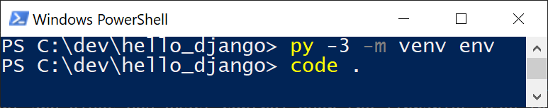
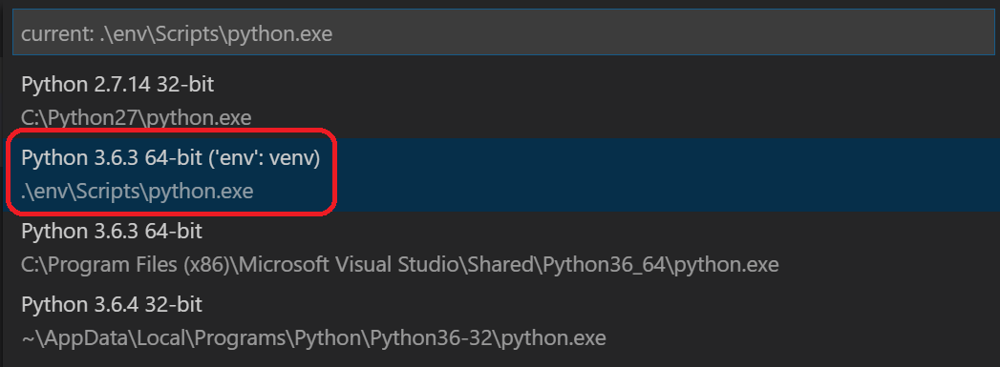
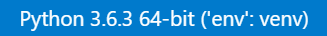
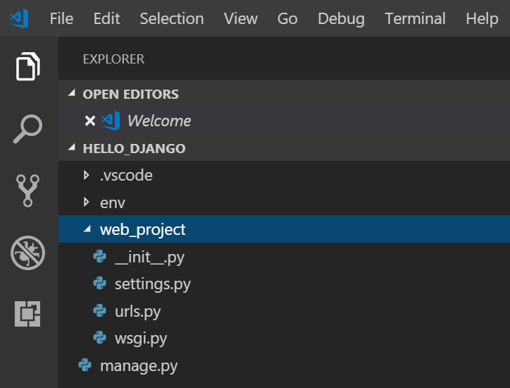
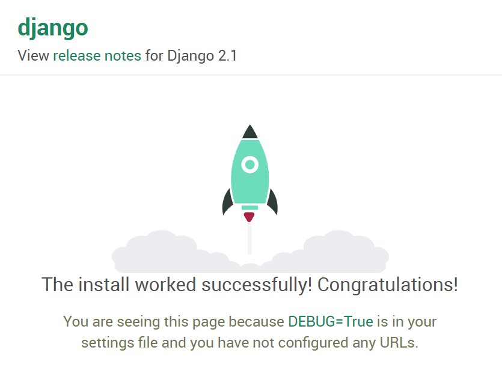
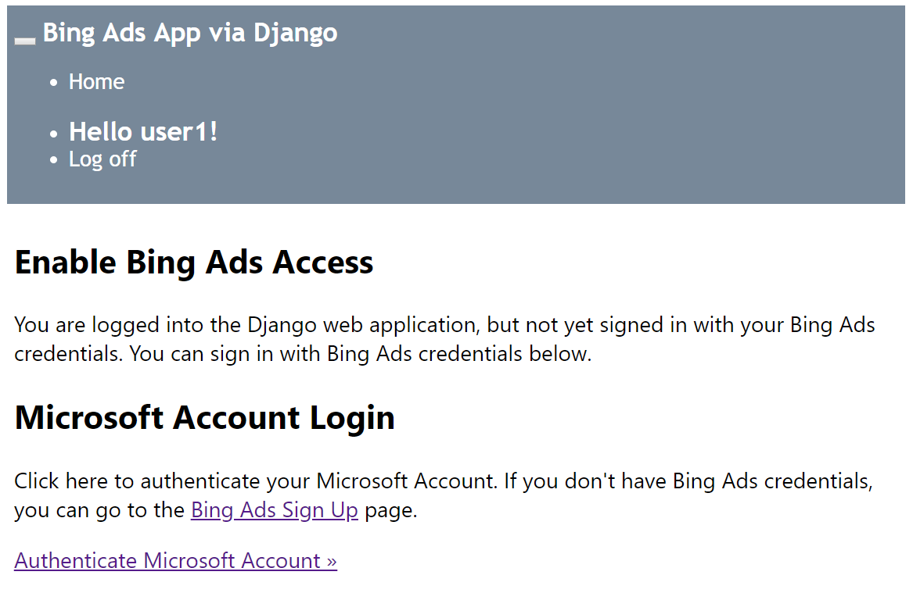

# Walkthrough: Bing Ads API Web Application in Python
This tutorial explores how to get started running a Microsoft Advertising web application using the [Bing Ads Python SDK](client-libraries.md), the [Visual Studio Code](https://code.visualstudio.com/) IDE, and the [Django](https://www.djangoproject.com/) web framework. 

This tutorial does not explore various details about Django itself, such as working with data models and creating an administrative interface. For guidance on those aspects, refer to the [Django documentation](https://docs.djangoproject.com/en/2.1/intro/tutorial01/). For more details about how to work with Django in the VS Code terminal, editor, and debugger see [Use Django in Visual Studio Code](https://code.visualstudio.com/docs/python/tutorial-django). This tutorial borrows heavily from the setup instructions in [Use Django in Visual Studio Code](https://code.visualstudio.com/docs/python/tutorial-django). 

## <a name="webapp"></a>Example Web Application Overview
By the end of this tutorial you will have a web application running on http://localhost that will authenticate your Microsoft Advertising user credentials and display your user and accounts info. You can then add multiple web application users, who can enable access for your application to use their Microsoft Advertising credentials. This web application provides a one to one mapping of a web application user e.g. ContosoUser to a Microsoft Advertising user. For information about how to modify the data model, please see [Django documentation](https://docs.djangoproject.com/) for more information. If your web application user enables access to their Microsoft Advertising accounts with a Microsoft account, a refresh token is stored in the SQL Lite database on your web server.

## <a name="requirements"></a>Prerequisites
You will need to have [Visual Studio Code](https://code.visualstudio.com/) installed to follow this tutorial. To run the Django web app, you can use Visual Studio Community or Visual Studio Professional; however, the setup steps will vary from those in this tutorial. 

You will need to have Python 3 installed from [python.org](https://www.python.org/downloads/); typically use the **Download Python 3.7.0** button that appears first on the page (or whatever is the latest version). On Windows, make sure the location of your Python interpreter is included in your PATH environment variable. You can check this by running `path` at the command prompt. If the Python interpreter's folder isn't included, open Windows Settings, search for "environment", select **Edit environment variables for your account**, then edit the **Path** variable to include that folder.

You will need to [install](get-started-python.md#installation) the [Bing Ads Python SDK](client-libraries.md), and this tutorial will walk you through the installation.

You will need the [Django web framework](https://www.djangoproject.com/) installed to deploy the application locally, and this tutorial will walk you through the installation.

You will need at least one user with Microsoft Advertising credentials and a [developer token](get-started.md#get-developer-token). 

You will need to register an application and take note of the client ID (registered application ID) and client secret (registered password). You'll need to register a web app (not native) for this example. You will be asked to register one or more redirect URLs, and for this tutorial you should register *http://localhost/callback*. You should instead use *https* when deployed to a production server. For more details about registering an application and the authorization code grant flow, see [Authentication with OAuth](authentication-oauth.md). 

This tutorial was developed on Windows. Although Windows is not required to run the sample, some of the steps below will vary if you use another operating system e.g., Linux or MacOS. 

## Create a project environment for Django

In this section you create a virtual environment in which Django is installed. Using a virtual environment avoids installing Django into a global Python environment and gives you exact control over the libraries used in an application. 

1. On your file system, create a project folder for this tutorial, such as `hello_django`.

1. In the `hello_django` folder, open Powershell or your favorite script shell and use the following command to create a virtual environment named `env` based on your current interpreter:

    ```bash
    py -3 -m venv env
    ```

1. Open the `hello_django` project folder in VS Code by running `code .`, or by running VS Code and using the **File** > **Open Folder** command.

      

1. In VS Code, open the Command Palette (**View** > **Command Palette** or `Ctrl+Shift+P`). Then select the **Python: Select Interpreter** command.

1. The command presents a list of available interpreters that VS Code can locate automatically. Your list will vary; if you don't see the desired interpreter, see [Configuring Python environments](https://code.visualstudio.com/docs/python/environments). From the list, select the virtual environment in your project folder that starts with `./env` or `.\env`:

    

1. Run **Terminal: New Terminal** (``Ctrl+Shift+ ` ``) from the Command Palette, which creates a terminal and automatically activates the virtual environment by running its activation script.

    > [!NOTE]
    > On Windows, if your default terminal type is PowerShell, you may see an error that it cannot run activate.ps1 because running scripts is disabled on the system. The error should provide a link for information on how to allow scripts. Otherwise, use **Terminal: Select Default Shell** to set your preferred default.

    The selected environment appears at the lower left corner of the VS Code status bar. Notice the **(venv)** indicator that tells you that you're using a virtual environment:

    

1. Install Django in the virtual environment via pip in the VS Code Terminal:

    ```bash
    python -m pip install django
    ```

1. Install the Bing Ads Python SDK in the virtual environment via pip in the VS Code Terminal:

    ```bash
    python -m pip install bingads
    ```

You now have an self-contained virtual environment ready for writing Django and Microsoft Advertising code. 

## Create and run a Django app

In Django terminology, a "Django project" is composed of several site-level configuration files along with one or more "apps" that you deploy to a web host to create a full web application. A Django project can contain multiple apps, each of which typically has an independent function in the project, and the same app can be in multiple Django projects. An app, for its part, is just a Python package that follows certain conventions that Django expects.

To create a Django app, then, it's necessary to first create the Django project to serve as the container for the app, then create the app itself. For both purposes you use the Django administrative utility, `django-admin`, which is installed when you install the Django package.

### Create the Django project

1. In the VS Code Terminal where your virtual environment is activated, run the following command:

    ```bash
    django-admin startproject web_project .
    ```

    This `startproject` command assumes (by use of `.` at the end) that the current folder is your project folder, and creates the following within it:

    - `manage.py`: The Django command-line administrative utility for the project. You run administrative commands for the project using `python manage.py <command> [options]`.

    - A subfolder named `web_project`, which contains the following files:
        - `__init__.py`: an empty file that tells Python that this folder is a Python package.
        - `wsgi.py`: an entry point for WSGI-compatible web servers to serve your project. You typically leave this file as-is as it provides the hooks for production web servers.
        - `settings.py`: contains settings for Django project, which you modify in the course of developing a web app.
        - `urls.py`: contains a table of contents for the Django project, which you also modify in the course of development.

        

1. To verify the Django project, make sure your virtual environment is activated, then start Django's development server using the command `python manage.py runserver`. The server runs on the default port 8000, and you see output like the following in the VS Code terminal output window:

    ```output
    Performing system checks...

    System check identified no issues (0 silenced).
    
    You have 15 unapplied migration(s). Your project may not work properly until you apply the migrations for app(s): admin, auth, contenttypes, sessions.
    Run 'python manage.py migrate' to apply them.
    October 18, 2018 - 05:38:23
    Django version 2.1.2, using settings 'web_project.settings'
    Starting development server at http://127.0.0.1:8000/
    Quit the server with CTRL-BREAK.
    ```

    When you run the server the first time, it creates a default SQLite database in the file `db.sqlite3`, which is generally intended for development purposes but can be used in production for low-volume web apps. Also, Django's built-in web server is intended *only* for local development purposes. When you deploy to a web host, however, Django uses the host's web server instead. The `wsgi.py` module in the Django project takes care of hooking into the production servers.

    If you want to use a different port than the default 8000, simply specify the port number on the command line, such as `python manage.py runserver 5000`.

1. `Ctrl+click` the `http://127.0.0.1:8000/` URL in the VS Code terminal output window to open your default browser to that address. If Django is installed correctly and the project is valid, you see the default page shown below. The VS Code Output window also shows the server log.

    

1. When you're done, close the browser window and stop the server in VS Code using `Ctrl+C` as indicated in the VS Code terminal output window.

### Create A Django app for Microsoft Advertising

1. In the VS Code Terminal with your virtual environment activated, run the administrative utility's `startapp` command in your project folder (where `manage.py` resides):

    ```bash
    python manage.py startapp app
    ```

    The command creates a folder called `app` that contains a number of code files and one subfolder. Of these, you frequently work with `views.py` (that contains the functions that define pages in your web app) and `models.py` (that contains classes defining your data objects). The `migrations` folder is used by Django's administrative utility to manage database versions as discussed later in this tutorial. There are also the files `apps.py` (app configuration), `admin.py` (for creating an administrative interface), and `tests.py` (for unit tests), which are not covered here.

1. Within `app/settings.py` add the following code and set your own *CLIENT_ID*, *CLIENT_SECRET*, *DEVELOPER_TOKEN*, and *ENVIRONMENT* values. 
    ```python
    """
    Bing Ads API settings
    Edit with your credentials.
    """
    
    REDIRECTION_URI = "http://localhost:8000/callback"
    CLIENT_ID = "ClientIdGoesHere" # Your registered App ID
    CLIENT_SECRET="ClientSecretGoesHere" # Your registered App Password
    DEVELOPER_TOKEN = "DeveloperTokenGoesHere" # Your production developer token
    ENVIRONMENT = 'production'
    API_VERSION=13
    ```

1. Within `app/settings.py` add `app` to the list of installed apps.
    ```python
        INSTALLED_APPS = [
        'django.contrib.admin',
        'django.contrib.auth',
        'django.contrib.contenttypes',
        'django.contrib.sessions',
        'django.contrib.messages',
        'django.contrib.staticfiles',
        'app',
    ]
    ```

1. In the VS Code Terminal create the `app/static/app` and `app/templates/app` folders:

    ```bash
    (env) PS C:\dev\hello_django> mkdir app/static/app
    (env) PS C:\dev\hello_django> mkdir app/templates/app 
    ```

1. Within the `app/static/app` folders create a new file named *site.css* and add the following contents.

    ```css
    .message {
        font-weight: 600;
        color: blue;
    }
    
    .message_list th,td {
        text-align: left;
        padding-right: 15px;
    }
    
    .navbar {
        background-color: lightslategray;
        font-size: 1em;
        font-family: 'Trebuchet MS', 'Lucida Sans Unicode', 'Lucida Grande', 'Lucida Sans', Arial, sans-serif;
        color: white;
        padding: 8px 5px 8px 5px;
    }
    
    .navbar a {
        text-decoration: none;
        color: inherit;
    }
    
    .navbar-brand {
        font-size: 1.2em;
        font-weight: 600;
    }
    
    .navbar-item {
        font-variant: small-caps;
        margin-left: 30px;
    }
    
    .body-content {
        padding: 5px;
        font-family:'Segoe UI', Tahoma, Geneva, Verdana, sans-serif;
    }
    
    input[name=message] {
        width: 80%;
    }
    ```

1. Within the `app/templates/app` folder create a file, `index.html` with the contents below.

    ```html
    
    
    
    <div class="jumbotron">
        <section id="errors">
            <h1>Errors occurred in your last request to Bing Ads API.</h1>
            <table class="message_list">
                <tr>
                    <th>Code</th>
                    <th>ErrorCode</th>
                    <th>Message</th>
                </tr>
                
                <tr>
                    <td>{{ error.Code }}</td> 
                    <td>{{ error.ErrorCode }}</td> 
                    <td>{{ error.Message }}</td> 
                </tr>
                
            </table> 
        </section>
    </div>
    
    
    
    <div class="jumbotron">
        <section id="enabled">
            <h1>Your credentials have access to Microsoft Advertising.</h1>
            <table class="message_list">
                <tr>
                    <th>Id</th>
                    <th>UserName</th>
                    <th>First Name</th>
                    <th>Last Name</th>
                </tr>
                <tr>
                    <td>{{ bingadsuser.Id }}</td> 
                    <td>{{ bingadsuser.UserName }}</td> 
                    <td>{{ bingadsuser.Name.FirstName }}</td> 
                    <td>{{ bingadsuser.Name.LastName }}</td> 
                </tr>
            </table>  
        </section>
    </div>
    <div class="jumbotron">
        <section id="revoke">
            <p class="lead">Click here to revoke access for this app to your Microsoft Advertising accounts. You will then be able to login with a different Microsoft Advertising user. </p>
            <form id="revokeForm" action="/revoke" method="post" class="navbar-left">
                
                <p><a href="javascript:document.getElementById('revokeForm').submit()" class="btn btn-primary btn-large">Delete Refresh Token</a></p>
            </form>
        </section>
    </div>
    <div class="jumbotron">
        <section id="accounts">        
            <h1>Account Details</h1>
            <table class="message_list">
                <thead>
                <tr>
                    <th>Id</th>
                    <th>Name</th> 
                </tr>
                </thead>
                <tbody>
                
                <tr>
                    <td>{{ account.Id }}</td>
                    <td>{{ account.Name }}</td> 
                </tr>
                
                </tbody>
            </table> 
        </section>
    </div>
    
    <div class="jumbotron">
        <section id="enable">
            <h1>Enable Microsoft Advertising Access</h1>
            <p class="lead">
                You are logged into the Django web application, but not yet signed in with your Microsoft Advertising credentials. 
                You can sign in with Microsoft Advertising credentials below.
            </p>
        </section>
    </div>
    <div>
        <div class="col-md-6">
            <section id="socialLoginForm">
                <h1>Microsoft Account Login</h1>
                <p class="lead">
                    Click here to authenticate your Microsoft Account. 
                    If you don't have Microsoft Advertising credentials, you can go to the 
                    <a href="https://ads.microsoft.com/customer/Signup.aspx">Microsoft Advertising Sign Up</a> page.
                </p>
                <p><a href="/callback" class="btn btn-primary btn-large">Authenticate Microsoft Account &raquo;</a></p>
            </section>
        </div>    
    </div>
    
    
    <div class="jumbotron">
        <div class="col-md-6">
            <section id="socialLoginForm">
                <h1>Microsoft Advertising Example Web Application</h1>
                <p class="lead">
                    Before you can provide your Microsoft Advertising user credentials and access Microsoft Advertising data, 
                    you must <a href="">login</a> to the Django web application.
                </p>
                <p class="lead">Use your site's Django admin portal to add web app users.</p>
                <p><a href="/admin" class="btn btn-primary btn-large">Django Admin &raquo;</a></p>
            </section>
        </div>    
    </div>
    
    <div>
        <div class="col-md-4">
            <h2>Get Started Using Python with Bing Ads API</h2>
            <p>The Bing Ads Python Software Development Kit (SDK) simplifies workflows such as OAuth authentication and report file parsing.</p>
            <p><a class="btn btn-default" href="https://docs.microsoft.com/advertising/guides/get-started-python">Learn more &raquo;</a></p>
        </div>
        <div class="col-md-4">
            <h2>Django</h2>
            <p>Django is a free web framework for building Web sites and Web applications using HTML, CSS and JavaScript.</p>
            <p><a class="btn btn-default" href="https://www.djangoproject.com/">Learn more &raquo;</a></p>
        </div>
        <div class="col-md-4">
            <h2>Microsoft Azure</h2>
            <p>You can publish your web app to Microsoft Azure. Find out how you can host your application with a free trial today.</p>
            <p><a class="btn btn-default" href="https://azure.microsoft.com">Learn more &raquo;</a></p>
        </div>
    </div>
    
    
    
    <link rel="stylesheet" type="text/css" href=""/>
    
    ```

1. Within the `app/templates/app` folder create a file, `layout.html` with the contents below.

    ```html
    <!DOCTYPE html>
    <html>
    <head>
        <meta charset="utf-8" />
        <meta name="viewport" content="width=device-width, initial-scale=1.0">
        <title>{{ title }} - My Django Application</title>
        
        <link rel="stylesheet" type="text/css" href=""/>
        <script src=""></script>
    </head>
    <body>
        <div class="navbar navbar-inverse navbar-fixed-top">
            <div class="container">
                <div class="navbar-header">
                    <button type="button" class="navbar-toggle" data-toggle="collapse" data-target=".navbar-collapse">
                        <span class="icon-bar"></span>
                        <span class="icon-bar"></span>
                        <span class="icon-bar"></span>
                    </button>
                    <a href="/" class="navbar-brand">Microsoft Advertising App via Django</a>
                </div>
                <div class="navbar-collapse collapse">
                    <ul class="nav navbar-nav">
                        <li><a href="">Home</a></li>
                    </ul>
                    
                </div>
            </div>
        </div>
        <div class="container body-content">
    
            <hr/>
            <footer>
                <p>&copy; {{ year }} - My Django Application</p>
            </footer>
        </div>
    
    </body>
    </html>
    ```

1. Within the `app/templates/app` folder create a file, `login.html` with the contents below.

    ```html
    
    
    <h2>{{ title }}</h2>
    <div class="row">
        <div class="col-md-8">
            <section id="loginForm">
                <form action="." method="post" class="form-horizontal">
                    
                    <h4>Use a local account to log in.</h4>
                    <hr />
                    <div class="form-group">
                        <label for="id_username" class="col-md-2 control-label">User name</label>
                        <div class="col-md-10">
                            {{ form.username }}
                        </div>
                    </div>
                    <div class="form-group">
                        <label for="id_password" class="col-md-2 control-label">Password</label>
                        <div class="col-md-10">
                            {{ form.password }}
                        </div>
                    </div>
                    <div class="form-group">
                        <div class="col-md-offset-2 col-md-10">
                            <input type="hidden" name="next" value="/" />
                            <input type="submit" value="Log in" class="btn btn-default" />
                        </div>
                    </div>
                    
                    <p class="validation-summary-errors">Please enter a correct user name and password.</p>
                    
                </form>
            </section>
        </div>
    </div>
    
    
    
    <link rel="stylesheet" type="text/css" href=""/>
    
    ```

1. Within the `app/templates/app` folder create a file, `loginpartial.html` with the contents below.

    ```html
    
    <form id="logoutForm" action="/applogout" method="post" class="navbar-right">
        
        <ul class="nav navbar-nav navbar-right">
            <li><span class="navbar-brand">Hello {{ user.username }}!</span></li>
            <li><a href="javascript:document.getElementById('logoutForm').submit()">Log off</a></li>
        </ul>
    </form>
    
    <ul class="nav navbar-nav navbar-right">
        <li><a href="">Log in</a></li>
    </ul>
    
    ```

1. Within the `app` folder create a file, `forms.py` with the contents below.

    ```python
    from django import forms
    from django.contrib.auth.forms import AuthenticationForm
    from django.utils.translation import ugettext_lazy as _
    
    class BootstrapAuthenticationForm(AuthenticationForm):
        """Authentication form which uses boostrap CSS."""
        username = forms.CharField(max_length=254,
                                   widget=forms.TextInput({
                                       'class': 'form-control',
                                       'placeholder': 'User name'}))
        password = forms.CharField(label=_("Password"),
                                   widget=forms.PasswordInput({
                                       'class': 'form-control',
                                       'placeholder':'Password'}))
    ```

1. Modify `app/models.py` to match the following code. 

    ```python
    from django.db import models
    from django.contrib.auth.models import User
    
    # In this web app a Microsoft Advertising user maps a Django web user to a refresh token.
    
    class BingAdsUser(models.Model):
        user = models.OneToOneField(User, on_delete=models.PROTECT)
        refresh_token = models.CharField(max_length=200)
    
        # def __unicode__(self):              # __unicode__ on Python 2
        #     return self.refresh_token
        def __str__(self):              # __str__ on Python 3
            return self.refresh_token
    ```

1. Modify `app/views.py` to match the following code. 

    ```python
    from django.http import HttpRequest, HttpResponse
    from django.shortcuts import render
    from django.template.loader import get_template, render_to_string
    from web_project import settings
    from datetime import datetime
    from django.shortcuts import redirect
    from django.contrib.auth import authenticate, login, logout, get_user_model
    from django.contrib.auth.models import User
    from app.models import BingAdsUser
    from bingads import *
    
    # import logging
    # logging.basicConfig(level=logging.INFO)
    # logging.getLogger('suds.client').setLevel(logging.DEBUG)
    # logging.getLogger('suds.transport').setLevel(logging.DEBUG)
    
    authorization_data = AuthorizationData(
        account_id=None, 
        customer_id=None, 
        developer_token=None, 
        authentication=None)
    
    customer_service=None
    
    def home(request):
        """
        If an authenticated user returns to this page after logging in, the appropriate 
        context is provided to index.html for rendering the page. 
        """
        assert isinstance(request, HttpRequest)
        
        # If the Django user has a refresh token stored, 
        # try to use it to get Microsoft Advertising data.
        if user_has_refresh_token(request.user.username):
            return redirect('/callback')
        else:
            return render(
                request,
                'app/index.html'
            )
    
    def callback(request):
        """Handles OAuth authorization, either via callback or direct refresh request."""
        assert isinstance(request, HttpRequest)
    
        authentication = OAuthWebAuthCodeGrant(
            client_id=settings.CLIENT_ID,
            client_secret=settings.CLIENT_SECRET, 
            redirection_uri=settings.REDIRECTION_URI,
            env=settings.ENVIRONMENT)
    
        return authorize_bing_ads_user(request, authentication)
    
    def authorize_bing_ads_user(request, authentication):
        assert isinstance(request, HttpRequest)
        
        global customer_service
        bingadsuser = None
    
        try:
            Users = get_user_model()
            user = User.objects.get(username=request.user.username)
        except User.DoesNotExist:
            return render(
                request,
                'app/index.html'
            )
             
        try:
            bingadsuser = user.bingadsuser
        except BingAdsUser.DoesNotExist:
            bingadsuser = BingAdsUser()
            bingadsuser.user = user
            pass
        
        try:
            # If we have a refresh token let's refresh the access token.
            if(bingadsuser is not None and bingadsuser.refresh_token != ""):
                authentication.request_oauth_tokens_by_refresh_token(bingadsuser.refresh_token)
                bingadsuser.refresh_token = authentication.oauth_tokens.refresh_token
    
            # If the current HTTP request is a callback from the Microsoft Account authorization server,
            # use the current request url containing authorization code to request new access and refresh tokens.
            elif (request.GET.get('code') is not None):
                authentication.request_oauth_tokens_by_response_uri(response_uri = request.get_full_path()) 
                bingadsuser.refresh_token = authentication.oauth_tokens.refresh_token
        except OAuthTokenRequestException:
            bingadsuser.refresh_token = ""  
        
        user.save()
        bingadsuser.save()
    
        # If there is no refresh token saved and no callback from the authorization server, 
        # then connect to the authorization server and request user consent.
        if (bingadsuser.refresh_token == ""):
            return redirect(authentication.get_authorization_endpoint())
        
        set_session_data(request, authentication)
        
        # At this point even if the user has valid Django web application credentials, 
        # we don't know whether they have access to Microsoft Advertising.
        # Let's test to see if they can call Bing Ads API service operations. 
    
        bing_ads_user = None
        accounts=[]
        errors=[]
    
        try:
            bing_ads_user = get_user(None)
            accounts = search_accounts_by_user_id(bing_ads_user.Id)['AdvertiserAccount']
        except WebFault as ex:
            errors=get_webfault_errors(ex)
            pass
    
        context = {
            'bingadsuser': bing_ads_user,
            'accounts': accounts,
            'errors': errors,
        }
        return render(
            request,
            'app/index.html',
            context
        )
    
    def revoke(request):
        """Deletes the refresh token for the user authenticated in the current session."""
        assert isinstance(request, HttpRequest)
    
        try:
            Users = get_user_model()
            user = User.objects.get(username=request.user.username)
            bingadsuser = user.bingadsuser
            if(bingadsuser is not None):
                bingadsuser.refresh_token = ""
                bingadsuser.save()
        except User.DoesNotExist:
            pass
        except BingAdsUser.DoesNotExist:
            pass
    
        clear_session_data(request)
    
        return render(
            request,
            'app/index.html'
        )
    
    def user_has_active_session(request):
        try:
            return True if request.session['is_authenticated'] else False 
        except KeyError:
            return False
    
    def user_has_refresh_token(username):
        try:
            Users = get_user_model()
            user = User.objects.get(username=username)
            bingadsuser = user.bingadsuser
            if(bingadsuser is not None and bingadsuser.refresh_token != ""):
                return True
        except User.DoesNotExist:
            return False
        except BingAdsUser.DoesNotExist:
            return False
    
    def set_session_data(request, authentication):
        global authorization_data
        global customer_service
        
        try:
            request.session['is_authenticated'] = True
    
            authorization_data.authentication = authentication
            authorization_data.developer_token = settings.DEVELOPER_TOKEN
            
            customer_service = ServiceClient(
                service='CustomerManagementService', 
                version=settings.API_VERSION,
                authorization_data=authorization_data,
                environment=settings.ENVIRONMENT
            )
    
        except KeyError:
            pass
        return None   
    
    def clear_session_data(request):
        global authorization_data
        global customer_service
    
        request.session['is_authenticated'] = False
    
        authorization_data = AuthorizationData(account_id=None, customer_id=None, developer_token=None, authentication=None)
        customer_service = None
    
    def applogout(request):
        logout(request)
        clear_session_data(request)
        return redirect('/')
    
    def get_user(user_id):
        ''' 
        Gets a Microsoft Advertising User object by the specified user ID.
        
        :param user_id: The Microsoft Advertising user identifier.
        :type user_id: long
        :return: The Microsoft Advertising user.
        :rtype: User
        '''
        global customer_service
    
        return customer_service.GetUser(UserId = user_id).User
    
    def search_accounts_by_user_id(user_id):
        ''' 
        Search for account details by UserId.
        
        :param user_id: The Microsoft Advertising user identifier.
        :type user_id: long
        :return: List of accounts that the user can manage.
        :rtype: Dictionary of AdvertiserAccount
        '''
    
        predicates={
            'Predicate': [
                {
                    'Field': 'UserId',
                    'Operator': 'Equals',
                    'Value': user_id,
                },
            ]
        }
    
        accounts=[]
    
        page_index = 0
        PAGE_SIZE=100
        found_last_page = False
    
        while (not found_last_page):
            paging=set_elements_to_none(customer_service.factory.create('ns5:Paging'))
            paging.Index=page_index
            paging.Size=PAGE_SIZE
            search_accounts_response = customer_service.SearchAccounts(
                PageInfo=paging,
                Predicates=predicates
            )
            
            if search_accounts_response is not None and hasattr(search_accounts_response, 'AdvertiserAccount'):
                accounts.extend(search_accounts_response['AdvertiserAccount'])
                found_last_page = PAGE_SIZE > len(search_accounts_response['AdvertiserAccount'])
                page_index += 1
            else:
                found_last_page=True
        
        return {
            'AdvertiserAccount': accounts
        }
    
    def set_elements_to_none(suds_object):
        for (element) in suds_object:
            suds_object.__setitem__(element[0], None)
        return suds_object
    
    def get_webfault_errors(ex):
        errors=[]
    
        if not hasattr(ex.fault, "detail"):
            raise Exception("Unknown WebFault")
    
        error_attribute_sets = (
            ["ApiFault", "OperationErrors", "OperationError"],
            ["AdApiFaultDetail", "Errors", "AdApiError"],
            ["ApiFaultDetail", "BatchErrors", "BatchError"],
            ["ApiFaultDetail", "OperationErrors", "OperationError"],
            ["EditorialApiFaultDetail", "BatchErrors", "BatchError"],
            ["EditorialApiFaultDetail", "EditorialErrors", "EditorialError"],
            ["EditorialApiFaultDetail", "OperationErrors", "OperationError"],
        )
    
        for error_attribute_set in error_attribute_sets:
            errors = get_api_errors(ex.fault.detail, error_attribute_set)
            if errors is not None:
                return errors
    
        return None
    
    def get_api_errors(error_detail, error_attribute_set):
        api_errors = error_detail
        for field in error_attribute_set:
            api_errors = getattr(api_errors, field, None)
        if api_errors is None:
            return None
        
        errors=[]
        if type(api_errors) == list:
            for api_error in api_errors:
                errors.append(api_error)
        else:
            errors.append(api_errors)
        return errors
    ```

1. Replace the contents of `web_project/urls.py` with the contents below. The `urls.py` file is where you specify patterns to route different URLs to their appropriate views. For example the code below maps the root URL of the app (`""`) to the `home` function that you just added to `app/views.py`:

    ```python
    from django.contrib import admin
    from django.urls import path
    from app import views as app_views
    from django.contrib.auth import views as auth_views
    from datetime import datetime
    from django.conf.urls import include, url
    from app.forms import BootstrapAuthenticationForm
    from django.contrib.auth.views import HttpResponseRedirect
    
    from django.contrib import admin
    admin.autodiscover()
    
    urlpatterns = [
        url(r'^applogout', app_views.applogout, name='applogout'),
        url(r'^callback', app_views.callback, name='callback'),
        url(r'^revoke', app_views.revoke, name='revoke'),
        url(r'^$', app_views.home, name='home'),
        url(r'^login/$',
            auth_views.LoginView.as_view(
                template_name='app/login.html', 
                authentication_form=BootstrapAuthenticationForm,
                extra_context= {
                    'title':'Log in',
                    'year':datetime.now().year,
                }
            ),
            name='login'),
        url(r'^logout$',
            auth_views.LogoutView.as_view(),
            {
                'next_page': '/',
            },
            name='logout'),
    
        url(r'^admin/', admin.site.urls),
    ]
    ```

1. Save all modified files with `Ctrl+K S`.

1. Run `python manage.py makemigrations` to generate scripts in the migrations folder that migrate the database from its current state to the new state.

1. Run `python manage.py migrate` to apply the scripts to the actual database. The migration scripts effectively record all the incremental changes you make to your data models (`models.py`) over time. By applying the migrations, Django updates the database to match your models. Because each incremental change has its own script, Django can automatically migrate any previous version of a database (including a new database) to the current version. As a result, you need concern yourself only with your models in models.py, never with the underlying database schema or the migration scripts. You let Django do that part!

1. Create a superuser account in the app by opening a Terminal in VS Code for your virtual environment, then running the command `python manage.py createsuperuser --username=<username> --email=<email>`, replacing `<username>` and `<email>`, of course, with your personal information. When you run the command, Django prompts you to enter and confirm your password.

    > [!IMPORTANT]
    > Be sure to remember your username and password combination. These are the credentials you use to authenticate in the admin portal of the web app.

1. In the VS Code Terminal, again with the virtual environment activated, run the development server with `python manage.py runserver` and open a browser to `http://127.0.0.1:8000/` to see a page that renders "Hello, Django".

1. In the web browser go to `http://127.0.0.1:8000/admin/` and create a new Django web user under *Users*. This is distinct from your Microsoft Advertising user credentials, so that multiple Microsoft Advertising users could login to your app separately. 

    

1. Login with the new user (not the super admin) and you should see the option to authenticate with a Microsoft account. 

    

1. After you click **Authenticate Microsoft Account** you will be prompted to grant your own web app permissions to manage your Microsoft Advertising accounts. If you consent, and if you have access to Microsoft Advertising accounts, then you should be redirected to a view of your account name(s) and ID(s). 

## See Also
[Get Started Using Python with Bing Ads API](get-started-python.md)  

