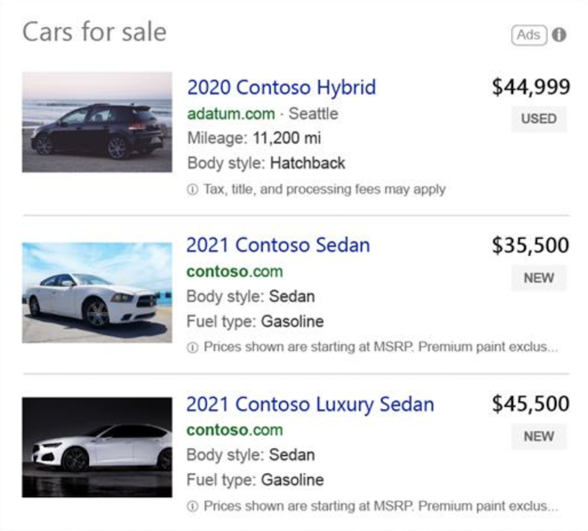

# Automotive ads

> [!NOTE]
> This feature is currently available in an open beta for the US and UK.

Showcase real-time inventory of new and used cars to nearby shoppers who are in the comparison and transaction stages of their decision journey. Your ads are dynamically created to feature vehicle photos, special prices, and other details. From third-party sites and auto dealers displaying their new and used inventory to automotive manufacturers advertising their new models, Automotive Ads drive performance.

  

## The benefits of using Automotive ads

- Customized ads. Simply submit and schedule your feed and based on the attributes you provide in the feed file, we’ll create relevant, personalized ads.
- Improved return on ad spend. See more volume, increased click-through rates (CTR), and lower cost per click (CPC) rates.
- Save time with automation. With no keywords required, the ads are created by feed files that use Microsoft AI automation and are fully equipped for bulk upload.

## Creating Automotive ads with business data feeds

Once you have your campaign(s) set up, you can upload and schedule your feed.

A dynamic feed file is a spreadsheet that contains attributes. This file tells Microsoft Advertising the information you want inserted in your ads and under which condition each attribute should be inserted. Some attributes will be featured in the ad itself.

Note that if you’d like to target specific campaigns or ad groups, you should fill out the Target ad group and Target campaign (see “Optional attributes”); otherwise, we will apply your feed to every campaign in your account.

Your feed file should be tab-delimited plain text with any of the following extensions: CSV, TSV, XLSX, or ZIP.
