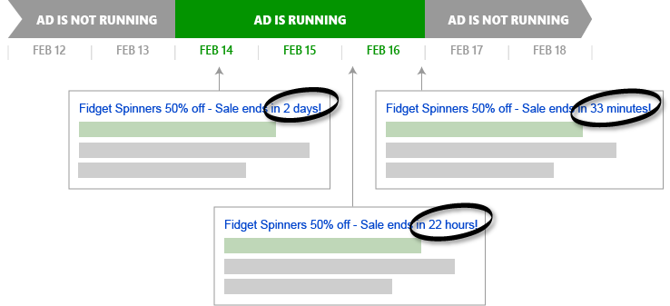

# Expanded Text Ads
The expanded text ad format works seamlessly on mobile, tablet and desktop devices so you can focus more on crafting your longer ad copy and optimizing your ad text to better engage your customers before they click your ad.

## Bulk API for Expanded Text Ads
The [Expanded Text Ad](~/bulk-service/expanded-text-ad.md) Bulk record is available for managing expanded text ads i.e., you can upload or download data in this format.

## Campaign Management API for Expanded Text Ads
The [ExpandedTextAd](~/campaign-management-service/expandedtextad.md) object is derived from the [Ad](~/campaign-management-service/ad.md) base class and can be managed with any of the existing ad operations e.g. [AddAds](~/campaign-management-service/addads.md), [DeleteAds](~/campaign-management-service/deleteads.md), [GetAdsByAdGroupId](~/campaign-management-service/getadsbyadgroupid.md), and [UpdateAds](~/campaign-management-service/updateads.md). 

## Countdowns for Expanded Text Ads
Countdown customizers let you easily add a countdown ? by day, hour, and then minute ? to an event in your Expanded Text Ad. The countdown, which automatically updates as the event draws nearer, is eye-catching and gives potential customers greater incentive to click your ad.

Let's say you're going to have a big online sale for 3 days from February 14 through 16 (ending at midnight as soon as February 17th begins). With the countdown syntax, you could set the ad's Title Part 2 like this: "Sale ends in {=countdown("2018/02/17 00:00:00","en-us",3)}!". Here's when your ad would run and examples of how it would look:

After an ad's countdown ends, the ad will stop running but will retain the status *Active*. You can make the ad start running again by either:  
-  Updating the ad's Countdown ends date to a point in the future, or
-  Removing the ad's countdown syntax entirely.

Let's break down the countdown requirements and options. All countdown options and parameters are case-insensitive.

-  **Ad Component** - You can set a countdown function in the expanded text ad's Path 1, Path 2, Title Part 1, Title Part 2, or Text. Where you want the countdown to appear, begin with a *{* (known as a left brace or a left curly bracket) and end with a *}* (known as a right brace or a right curly bracket). All of the remaining countdown components will be enclosed between these brackets.   
 
    > [!NOTE]
    > Regardless of the total length of all unsubstituted countdown parameters, the final displayed countdown will always use between 7 and 12 characters out of the total characters available per component. The number of characters used varies by [Countdown Languages](../guides/ad-languages.md#countdownlanguage). For example if the title part 2 is set to *"Sale ends in {=countdown("2018/02/17 00:00:00","en-us",3)}!"* the unsubstituted character count of the countdown function (*{=countdown("2018/02/17 00:00:00","en-us",3)}*) is 46; however, only 10 characters will be used from the total of 30 available substituted characters for the title part 2 component. In this example *Sale ends in !* uses up 14 characters, so you could use up to an additional 6 characters (10 + 14 + 6 = 30).  

-  **Function** - Immediately after the left curly bracket you must set either the *=countdown()* or *=global_countdown()* function. The *=countdown()* function counts down to a time that is adjusted to the local time zone of the search user. The *=global_countdown()* function counts down to a set time that is based on the time zone of your Bing Ads account. All of the remaining countdown components will be enclosed between the left and right function parentheses.
-  **Countdown End Date and Time** - The first function parameter is used to specify the date and the time you want the countdown to count down to. When this date and time is reached, the ad will stop running. For example to end the countdown on February 17 set the countdown end date parameter to *"2018/02/17 00:00:00"*. The format of the date must be *yyyy/mm/dd/* and the format of the time (if included) must be based on the 24 hour clock. The time is optional and if you do not specify the time, it will default to midnight (*00:00:00*) at the very beginning of the date you specified.  

    > [!NOTE]
    > This parameter must be surrounded by double quotation marks. You will need to use the escape character e.g. *myExpandedTextAd.TitlePart2 = "Sale ends in {=countdown(\\"2018/02/17 00:00:00\\",\\"en-us\\",3)}!";*  

-  **Countdown Language** - The second function parameter is used to specify the language that the countdown will be displayed, for example *"en-us"*. This language can differ from the ad language that you defined for your ad group or campaign. For a list of possible language values, see [Countdown Languages](../guides/ad-languages.md#countdownlanguage). If not specified, the default countdown language will be set to *en-us* (English). 

    > [!NOTE]
    > This parameter must be surrounded by double quotation marks. You will need to use the escape character e.g. *myExpandedTextAd.TitlePart2 = "Sale ends in {=countdown(\\"2018/02/17 00:00:00\\",\\"en-us\\",3)}!";*  

-  **Countdown Days Before** - The third function parameter is used to specify how many days before the Countdown End Date and Time you want this ad to start running e.g., *3* (the maximum is 999). If not specified, the default will be set to *5* and the countdown will start five days before your Countdown End Date and Time.  

