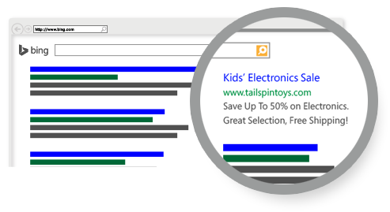
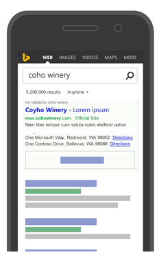

# Bing Ads API Overview
Bing Ads is a pay-per-click (PPC) advertising platform used to display ads based on the keywords used in a user's search query.  For advertisers placing a large number of ads or developers building advertising tools, the Bing Ads API provides a programmatic interface to Bing Ads. Using the Bing Ads API is the most efficient way to manage many large campaigns or to integrate your marketing with other in-house systems. The Bing Ads API also supports multiple customer accounts making it easy for ad agencies to manage campaigns for many clients. Some organizations may choose a hybrid approach; using the web UI for most tasks but automating reporting or campaign optimization with the API.

## Who should use the Bing Ads API
You should consider using the Bing Ads API if your business model resembles the following:

-   You are a direct advertiser managing your own ad spend and you want to integrate our PPC marketing with your internal inventory management or conversion tracking systems. For more information, see [Management Model for Direct Advertisers](../guides/management-model-direct-advertisers.md).  
-   You are a tools vendor developing advertising management solutions for advertisers or agencies. For more information, see [Management Model for Tool Providers](../guides/management-model-tool-providers.md).  
-   You are an advertising agency and manage ad campaigns for many clients. For more information, see [Management Model for Agencies](../guides/management-model-agencies.md).  
-   You are a reseller and want to build Bing Ads applications to manage the campaigns of your advertising clients. For more information, see [Management Model for Resellers](../guides/management-model-resellers.md).  
For [Customer Accounts](../guides/customer-accounts.md), you should use the [Customer Management](../customer-management-service/customer-management-service-reference.md) service.  

## Where your ads will appear
When you advertise using Bing Ads, your search ads can appear on the search results page on websites throughout the world. These sites can include Bing, AOL, and Yahoo owned and operated sites as well as Bing, AOL, and Yahoo syndicated search partner sites. (Syndicated search partner sites are sites that use Bing and Yahoo search results.) For more information, see [About ad distribution](https://help.bingads.microsoft.com/#apex/3/en/50871/0). 

Your ads can appear on search results page when a customer does a search on Bing. Where you ad appears on search results pages is determined by the keywords you use to associate your ads. For example, Sarah owns a toy store and wants to create ads for kids' electronics. She might include keywords like "walkie-talkies", "electronic pets", and "kids' music players" so her ads could be more relevant to customers' searches, and show above or next to the search results.

To see where Bing Ads is available and whether your ads will run, please see [Where does Bing Ads show your ads?](https://help.bingads.microsoft.com/#apex/3/en/50873/0) You can also set your ads to the languages your customers speak, which will influence where your ads will appear. For example, if Sarah wants her ads to be in German, her ads can appear not only in Germany but Austria and Switzerland as well. For more information, see [Ad Languages](../guides/ad-languages.md).

## Enrich your ad layout
You can extend the ad layout to be more visually appealing and feature rich using [Ad Extensions](#adextensions).

### Ad Extensions
With ad extensions, you can decorate ads with additional information that helps customers find relevant information about your products and services. For example, you can include deep links into your website to quickly direct your customers to relevant promotional or technical information that may help increase conversions. Bing Ads offers the following popular ad extension types. For more information please see [Ad Extensions](../guides/ad-extensions.md) and [Bing Ads Web UI Help - What are ad extensions?](http://help.bingads.microsoft.com/#apex/3/en/51001/1).

### Bing Shopping Campaigns
A Bing Shopping campaign enables you to advertise the products from your Bing Merchant Center store product catalog. Product ads from a Bing Shopping campaign include details about the product, an image, and optional promotional text. After you [create a product catalog](http://help.bingads.microsoft.com/#apex/3/en/51105/1), you can then submit the catalog feed using the [Bing Ads Content API](../../../shopping-content/index.md) or [FTP](http://help.bingads.microsoft.com/#apex/3/en/51086/1). For more information, please see [Product Ads](../guides/product-ads.md).

## Show ads to your target audience
Your ads can appear specifically for customers on the go, who use their smartphones and tablets to search and browse the Internet. Or you can create ads that appear on both desktops and smartphones but prioritize where you want the ads to appear more often.

You can show your ads to customers in specific locations, like cities or countries. For example, Sarah wants only local customers to see her ads. She can set your ads to appear to customers within a 20-mile radius around her shop by using radius targeting.

You can also setup your ads to display to users of a certain age group or gender, or to display at a certain day and time of the week. For more information about showing ads to your target audience, see [Show Ads to Your Target Audience](../guides/show-ads-target-audience.md).

## Optimize your campaigns
You will want to optimize your campaign budget and keyword bids for a competitive advantage. The Bing Ads API [Ad Insight](../ad-insight-service/ad-insight-service-reference.md) service uses historical performance, web page data, and demographic data to provide data and bid suggestions that you may find helpful as you optimize your campaigns over time. For more information, see [Budget and Bid Opportunities](../guides/budget-bid-opportunities.md).

Once your campaigns are up and running, you?ll want to monitor their performance using the Bing Ads Reporting service. Bing Ads can generate reports to track ad delivery, budget, and targeting. Each report type aggregates data at a different level and provides different [Report Attributes and Performance Statistics](../guides/report-attributes-performance-statistics.md). For example, You would use the account and campaign performance reports to monitor click and spend data to ensure that you are optimizing your budget, and you would use the ad and keyword performance reports to identify ads and keywords that are performing well in terms of click-through rate and conversions. For more information, see [Reports](../guides/reports.md).

## Join the developer community
The [Bing Ads Developer Center](https://developers.bingads.microsoft.com) aggregates valuable resources for the Bing Ads developer community, including links to getting started, account management, service health dashboard, code samples, support, and feature announcements.

The [blog](https://blogs.msdn.microsoft.com/bing_ads_api/) contains technical information about upcoming features not currently in the API documentation; issues that API customers are facing and clarification and/or a solution to those issues; updates about Sandbox availability; and information about when a version of the service is going to sunset.

The [forum](https://social.msdn.microsoft.com/forums/en-us/home?forum=BingAds) provides a way for the developer community to ask and answer questions about developing solutions with Bing Ads APIs, to showcase innovations, and to generate and maintain content through community participation. Microsoft monitors the forums and replies to questions that the community has not yet answered.

If you are not finding the information you need to solve your problem in the developer forum, please contact [Bing Ads Support](https://advertise.bingads.microsoft.com/en-us/bing-ads-support). To resolve the issue efficiently, please provide support with the details requested in [Engaging Support](../guides/handle-service-errors-exceptions.md#contact-support).

## Next steps and navigating the content

|Topic|Description|
|---------|---------------|
|[Entity Hierarchy and Limits](../guides/entity-hierarchy-limits.md)|Refer to this guide for a high level view of system limits for Bing Ads entities.|
|[FAQ](../guides/faq.md)|This article contains answers to some frequently asked questions about the Bing Ads API.|
|[Get Started With the Bing Ads API](../guides/get-started.md)|To use the API, you?ll first need a Bing Ads developer token and valid user credentials. Learn how to get developer credentials and how to write your first application for example, in C#, Java, PHP, or Python.|
|[Sandbox](../guides/sandbox.md)|You may test your application in the Bing Ads sandbox environment before deploying it to the production environment.|
|[Client Libraries](../guides/client-libraries.md)|You can develop Bing Ads applications with any programming language that supports web services. The Bing Ads Software Development Kits (SDK) enhance the experience of developing Bing Ads applications with .NET, Java, and Python languages.|
|[Code Examples](../guides/code-examples.md)|Jump start your development by viewing or using the examples provided in C#, Java, PHP, and Python.|
|[Technical Guides](../guides/technical-guides.md)|Learn about how to integrate core advertising solutions using Bing Ads services.|
|[API Reference](../guides/reference.md)|Browse programming elements such as service operations, data objects, and value sets for each Bing Ads web service.|
|[Release Notes](../guides/release-notes.md)|Stay informed about the changes to the Bing Ads services for each release.|
