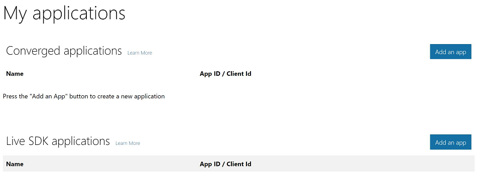
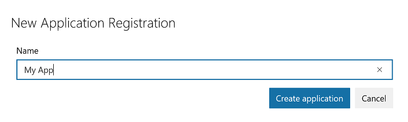
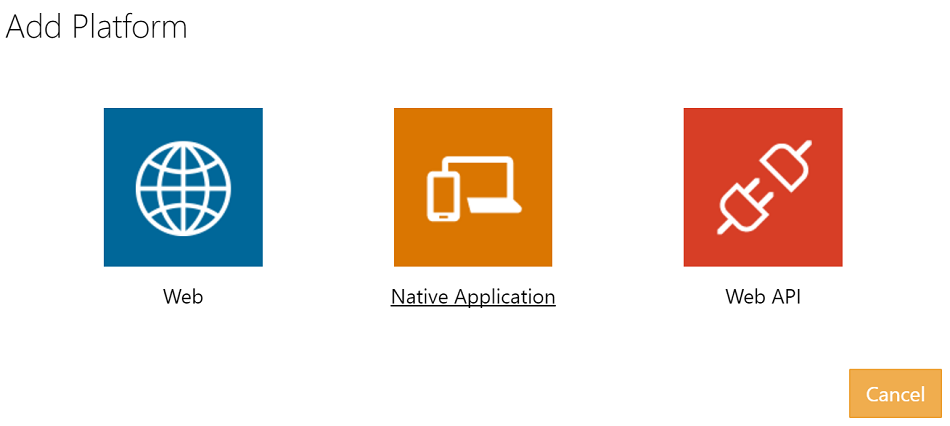
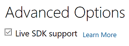

# Authentication with OAuth
Bing Ads implements the implicit and authorization grant flows of the [OAuth 2.0](http://tools.ietf.org/html/rfc6749) protocol to enable authentication of Microsoft Accounts that are linked to Bing Ads accounts. You should authenticate for Bing Ads production services with a Microsoft Account, instead of providing the Bing Ads username and password set. To authenticate with a Microsoft Account in sandbox, please see [Get Sandbox Access](sandbox.md#access).

> [!IMPORTANT]
> The UserName and Password header elements are deprecated in favor of the AuthenticationToken header i.e., [Authentication with OAuth](authentication-oauth.md). As of August 1st, 2018, all Bing Ads API Version 11 service calls with managed UserName and Password credentials will return an error. Bing Ads API Version 12 already does not accept the managed user credentials. In a future version of the API, the UserName and Password header elements will be removed from the service definitions.
> 
> The *DeveloperToken* header element is always required. For information on how to get a *DeveloperToken*, see [Get Started With the Bing Ads API](get-started.md).

A [Microsoft Account](https://account.microsoft.com/account) is an email address and password alias that an advertiser and other users may use to manage multiple services, including Bing Ads. Advertisers may associate a Microsoft Account with a Bing Ads account by [signing up](https://bingads.microsoft.com) or being invited to [manage](customer-accounts.md#managingusers) an existing Bing Ads account. Advertisers must use their Microsoft Account to grant your application access to manage their Bing Ads accounts. When the user successfully provides consent, your application is able to obtain an access token that it can then use to authenticate on behalf of the user.

> [!TIP]
> To take advantage of advanced security, users should turn on [two-step verification](https://support.microsoft.com/en-us/help/12408/microsoft-account-about-two-step-verification) within their Microsoft account [Security settings](https://account.live.com/proofs/Manage). Opting in for two-step verification ensures the user is prompted for a security code when they sign in on a device not previously designated as trusted by the user. The Microsoft Account authentication service provisions and verifies the security code after your application connects to the authorization endpoint, and before user consent is requested for your application to manage their Bing Ads accounts.

At a high level you should complete the following steps to authenticate a Microsoft Account with Bing Ads using OAuth.

1. [Register](#registerapplication) your application.

2. Request user consent for your application to manage their Bing Ads accounts, by initiating either the [Implicit Grant Flow](#implicit) or [Authorization Code Grant Flow](#authorizationcode).

   > [!IMPORTANT]
   > You must provide consent at least once through the web application consent flow. For repeat or long term authentication, you should follow the [authorization code grant flow](#authorizationcode) for obtaining an access token and refresh token. Thereafter you can use the latest refresh token to request new access and refresh tokens without any further user interaction. You should expect to request user consent again for example, if the Microsoft Account owner went through account recovery, changed their password, or otherwise removed permissions for your application to authenticate on their behalf. 
   > 
   > Users can revoke your application's access to their accounts at [https://account.live.com/consent/Manage](https://account.live.com/consent/Manage).

3. Complete either the [Implicit Grant Flow](#implicit) or [Authorization Code Grant Flow](#authorizationcode) to obtain an access token that can be used to authenticate with Bing Ads services.

4. For each API call to Bing Ads, use the returned access token as the *AuthenticationToken* element within the Bing Ads service [Service Request Header](get-started.md#where-to-use). For more information, see [Managing OAuth Tokens](#managingoauthtokens).


## <a name="registerapplication"></a>Registering Your Application
Before you can manage authentication for users of your Bing Ads application, you must register your application and get the corresponding client ID and client secret.

1. Go to [https://apps.dev.microsoft.com/](https://apps.dev.microsoft.com/) (or [apps.dev.microsoft-int.com/#/appList](https://apps.dev.microsoft-int.com/#/appList) for apps that target the [sandbox](sandbox.md) environment), and login with your Microsoft Account credentials when prompted.

   > [!NOTE]
   > You may use any of your Microsoft accounts to manage authentication for your application. Using a Microsoft Account which is linked to your Bing Ads user credentials is optional for managing your application.

2. Within **My applications**, click **Add an app**.

   
    
   If you have previously registered Live SDK applications, then you will also see an option to add another Live SDK application. In that case we recommend adding all new apps under **Converged applications**. At this time you are not required to migrate app registrations. When migration away from **Live SDK applications** is required in the future, we will announce it well in advance.

3. Provide the application name and click **Create**. Do not check the box for "Guided Setup".

   

4. Click **Add Platform** and choose *Web* if you want to register a web application, and otherwise select *Native Application*. 

   
    
   If you register a native app you should ignore the provided redirect URI and instead use *https://login.live.com/oauth20_desktop.srf* as the redirect URI. If you register a web app, then you must also provide your exact redirect URI (including for example the *https* prefix). Clients running apps on services that span regions and devices such as Microsoft Azure should register a Web app with client secret.

5. Under **Advanced Options**, check the box for **Live SDK support**.

   

6. Save your changes and take note of your *Application Id*. You will use it as the CLIENT_ID in the OAuth grant flow. Also take note of your *Password* and redirect URI if you registered a web application. The passsword will be used as the CLIENT_SECRET in the OAuth grant flow.

## <a name="managingoauthtokens"></a>Managing OAuth Tokens
Once you have registered your application you can manage the access token for a Microsoft Account user already linked or registered with Bing Ads. For one time or short term access to manage a user's accounts, see [Implicit Grant Flow](#implicit). The access token is short lived and will expire in minutes or hours as determined by the authentication service. Additionally, the Microsoft Account user may change their password or remove permissions for your application to authenticate on their behalf. For repeat or long term access to manage a user's accounts, see [Authorization Code Grant Flow](#authorizationcode).

> [!IMPORTANT]
> For apps that target the [sandbox](sandbox.md) environment, use *login.live-int.com* instead of *login.live.com*.

> [!TIP]
> For details about how to get access and refresh tokens using the Bing Ads SDKs, see [Authentication With the SDKs](sdk-authentication.md#oauth).

### <a name="implicit"></a>Implicit Grant Flow
For one time or short term authentication, you should follow the implicit grant flow for obtaining an access token. This is a standard OAuth 2.0 flow and is defined in detail in the [Implicit Grant section of the OAuth 2.0 spec](http://tools.ietf.org/html/rfc6749#section-4.2).

> [!IMPORTANT]
> For web applications, do not use implicit grant flow and instead use a client secret with the [Authorization Code Grant Flow](#authorizationcode).

1. Request user consent through a web browser control. Connect to the authorization endpoint, by using a URL in the following format. Replace CLIENT_ID with the value configured in [Registering Your Application](#registerapplication).

   ```http
   https://login.live.com/oauth20_authorize.srf?client_id=CLIENT_ID&scope=bingads.manage&response_type=token&redirect_uri=https://login.live.com/oauth20_desktop.srf&state=ClientStateGoesHere
   ```
   > [!NOTE]
   > The scope parameter should be set to *bingads.manage* and the response type set to *token*.
   > 
   > For a native application, use *https://login.live.com/oauth20_desktop.srf* as the redirect URI.
   >
   > It is recommended that you specify a non guessable *state* request parameter to help prevent cross site request forgery (CSRF). Be sure to verify that the authorization server returns the same value before proceeding to use any values from the response. 

2. The user will be prompted through the Microsoft Account authorization web browser control to grant permissions for your application to manage their Bing Ads accounts.

3. The authorization service calls back to your application with the redirection URI, which includes an access token if the user authorized your application to manage their Bing Ads accounts. For example the callback URI includes an access token as follows if the user granted permissions for your application to manage their Bing Ads accounts: *https://login.live.com/oauth20_desktop.srf'vv=1550&lc=1033#access_token=ACCESS_TOKEN&state=ClientStateGoesHere*.

   > [!NOTE]
   > If the user denied your application permissions to manage their Bing Ads accounts, the callback URI includes an error and error description field as follows: *https://login.live.com/oauth20_desktop.srf'vv=1550&lc=1033#error=ERROR&error_description=ERROR_DESCRIPTION&state=ClientStateGoesHere*.

4. Use the returned access token as the *AuthenticationToken* element within Bing Ads service [Service Request Header](get-started.md#where-to-use).

### <a name="authorizationcode"></a>Authorization Code Grant Flow
For repeat or long term authentication, you should follow the authorization code grant flow for obtaining an access token. This is a standard OAuth 2.0 flow and is defined in detail in the [Authorization Code Grant section of the OAuth 2.0 spec](http://tools.ietf.org/html/rfc6749#section-4.1).

1. Request user consent through a web browser control. Connect to the authorization endpoint, by using a URL in the following format. Replace CLIENT_ID with the value configured in [Registering Your Application](#registerapplication).

   ```http
   https://login.live.com/oauth20_authorize.srf?client_id=CLIENT_ID&scope=bingads.manage&response_type=code&redirect_uri=REDIRECTURI&state=ClientStateGoesHere
   ```
   > [!NOTE]
   > The scope parameter should be set to *bingads.manage* and the response type set to *code*.
   > 
   > If you registered a native application, use *https://login.live.com/oauth20_desktop.srf* as the redirect URI. If you registered a web application, use the redirect URI you specified in [Registering Your Application](#registerapplication).
   >
   > It is recommended that you specify a non guessable *state* request parameter to help prevent cross site request forgery (CSRF). Be sure to verify that the authorization server returns the same value before proceeding to use any values from the response. 

2. The user will be prompted through the Microsoft Account authorization web browser control to grant permissions for your application to manage their Bing Ads accounts.

3. The authorization service calls back to your application with the redirection URI, which includes an authorization code if the user authorized your application to manage their Bing Ads accounts. For example the callback URI includes an authorization code as follows if the user granted permissions for your application to manage their Bing Ads accounts: *https://login.live.com/oauth20_desktop.srf?code=CodeGoesHere&state=ClientStateGoesHere*.

   > [!NOTE]
   > If the user granted your application permissions to manage their Bing Ads accounts, you should use the code right away in the next step. The short duration of the authorization code, approximately 5 minutes, is subject to change.
   > 
   > If the user denied your application permissions to manage their Bing Ads accounts, the callback URI includes an error and error description field as follows: *REDIRECTURI?error=access_denied&error_description=ERROR_DESCRIPTION&state=ClientStateGoesHere*.

4. Use the authorization code to request the access token and refresh token. The body of the request must include the request parameters and the Content-Type header must be set to *application/x-www-form-urlencoded*. Set the code parameter to the value of the authorization code retrieved in the previous step, and the grant type set to *authorization_code*. The *redirect_uri* must exactly match the redirect URI used to obtain the authorization code. Be sure to encode the redirect URL. If you registered a web application, include the *client_secret* parameter and set it to the value provisioned in [Registering Your Application](#registerapplication). The following shows an example POST request for a desktop app. 

    ```http
    POST https://login.live.com/oauth20_token.srf HTTP/1.1
    Accept: application/json
    Content-Type: application/x-www-form-urlencoded
    Host: login.live.com
    Content-Length: ContentLengthGoesHere

    client_id=ClientIdGoesHere&scope=bingads.manage&code=CodeGoesHere&grant_type=authorization_code&redirect_uri=https%3A%2F%2Flogin.live.com%2Foauth20_desktop.srf
    ```
    > [!IMPORTANT]
    > If you are using one of our SDKs the tokens will be refreshed automatically. Be sure to securely store the received refresh token. For more information see [Authentication With the SDKs](sdk-authentication.md#oauth).

5. Get the *access_token*, *refresh_token*, and *expires_in* values from the JSON response stream.

    - Use the returned access token as the *AuthenticationToken* element within Bing Ads service [Service Request Header](get-started.md#where-to-use).

    - The value of *expires_in* represents the maximum time in seconds, until the access token will expire. Before the access token expires, you should request a new access token as discussed in the next step.

6. Use the refresh token to get a new access token and new refresh token. You should request a new token before the current access token expires, or catch the *AuthenticationTokenExpired* error code (109) and then request a refresh token. 

   The body of the request must include the request parameters and the Content-Type header must be set to *application/x-www-form-urlencoded*. Set the refresh token parameter to the value of the refresh token retrieved in the previous step, and the grant type set to *refresh_token*. The *redirect_uri* must exactly match the redirect URI used to obtain the authorization code. Be sure to encode the redirect URL. If you registered a web application, include the *client_secret* parameter and set it to the value provisioned in [Registering Your Application](#registerapplication). The following shows an example POST request for a desktop app. 

   ```http
   POST https://login.live.com/oauth20_token.srf HTTP/1.1
   Accept: application/json
   Content-Type: application/x-www-form-urlencoded
   Host: login.live.com
   Content-Length: ContentLengthGoesHere

   client_id=ClientIdGoesHere&scope=bingads.manage&grant_type=refresh_token&redirect_uri=https%3A%2F%2Flogin.live.com%2Foauth20_desktop.srf&refresh_token=RefreshTokenGoesHere
   ```
    
7. Refresh tokens are, and always will be, completely opaque to your application. They are long-lived e.g., 90 days for public clients, but the app should not be written to expect that a refresh token will last for any period of time. Refresh tokens can be invalidated at any moment, and the only way for an app to know if a refresh token is valid is to attempt to redeem it by making a token request. Even if you continuously refresh the token on the same device with the most recent refresh token, you should expect to start again from Step 1 and request user consent if, for example you [signed the user out](#userlogout), the Microsoft Account user changed their password, removed a device from their list of trusted devices, or removed permissions for your application to authenticate on their behalf. At any time without prior warning Microsoft may determine that user consent should again be granted. In that case, the authorization service would return an invalid grant error as shown in the following example.

   ```json
   {"error":"invalid_grant","error_description":"The user could not be authenticated or the grant is expired. The user must first sign in and if needed grant the client application access to the requested scope."}
   ```

   Please keep in mind that public refresh tokens are only bound to the granted device. For example if you registered a Native app and use https://login.live.com/oauth20_desktop.srf as the redirect URI, we only guarantee that it can be refreshed on the same device. Clients running apps on services that span regions and devices such as Microsoft Azure should register a Web app with client secret. The redirect URI can be localhost but cannot be https://login.live.com/oauth20_desktop.srf. If you use https://login.live.com/oauth20_desktop.srf with a client secret the following error would be returned.

   ```json
   {"error":"invalid_request","error_description":"Public clients can't send a client secret."} Likewise for Web apps please note that refresh tokens can be invalidated at any moment.
   ```

    You will encounter the same error if you try to request new access and refresh tokens using a refresh token that was provisioned without a client secret.  

## <a name="userlogout"></a>Sign the user out
To sign a user out, perform the following steps:
1. Delete any cached access_token or refresh_token values you've previously received from the OAuth flow.
2. Perform any sign out actions in your application (for example, cleaning up local state, removing any cached items, etc.).
3. Make a call to the authorization web service using this URL:

   ```http
   GET https://login.live.com/oauth20_logout.srf?client_id={client_id}&redirect_uri={redirect_uri}
   ```
    
   This call will remove any cookies that enable single sign-on to occur and ensures that next time your app launches the sign in experience, the user will be prompted for their consent.
 

## <a name="oauthparameters"></a>OAuth Authorization Parameters
The following sections list the request and response parameters that are available when calling the Microsoft account authorization service as described in the [Implicit Grant Flow](#implicit) and [Authorization Code Grant Flow](#authorizationcode) walkthroughs above.

> [!NOTE]
> The Bing Ads SDKs do not directly expose the *authentication_token*, *display*, *error*, *error_description*, *grant_type*, *locale*, *response_type*, or *scope*, parameters. The Bing Ads SDKs do expose the *client_id*, *client_secret*, *redirect_uri*, and *state*  parameters. 

### <a name="oauthrequestparameters"></a>OAuth Request Authorization Parameters
The following table lists the request parameters that are available when calling the Microsoft account authorization service. 

Parameter  |Description  
---------|---------
*client_id*     |The registered application ID. 
*client_secret*     |The registered application's password or client secret.
*grant_type*     |The authorization type that the server returns. Valid values are "authorization_code" or "refresh_token".
*locale*     |A market string that determines how the consent UI is localized. If the value of this parameter is missing or is not valid, a market value is determined by using an internal algorithm.
*redirect_uri*     |Equivalent to the *redirect_uri* parameter that is described in the [OAuth 2.0 spec](http://tools.ietf.org/html/rfc6749#appendix-A.6). The authorization service calls back to your application with the redirection URI, which includes an authorization code if the user authorized your application to manage their Bing Ads accounts.
*response_type*     |The type of data to be returned in the response from the authorization server. Valid values are "code" or "token".
*scope*     |Equivalent to the *scope* parameter that is described in the [OAuth 2.0 spec](http://tools.ietf.org/html/rfc6749#appendix-A.4). To get access tokens for Bing Ads authentication the scope must always be set to *bingads.manage*. 
*state*     |Equivalent to the *state* parameter that is described in the [OAuth 2.0 spec](http://tools.ietf.org/html/rfc6749#appendix-A.5). This value is passed through, and you should receive the same value unchanged in the *state* response parameter. It is recommended that you limit this string to 100 characters. The working limit is currently higher, although it is subject to change.  
*display*     |The display type to be used for the authorization page. Valid values are "popup", "touch", "page", or "none".      

### <a name="oauthresponseparameters"></a>OAuth Response Authorization Parameters
The following table lists the response parameters that are available when calling the Microsoft account authorization service. 

Parameter  |Description  
---------|---------
*access_token*     |Equivalent to the *access_token* parameter that is described in the [OAuth 2.0 spec](http://tools.ietf.org/html/rfc6749#appendix-A.12). To authenticate with Bing Ads API you will send the access token via the AuthenticationToken header element. 
*authentication_token*     |The registered application's authentication token.
*code*     |Equivalent to the *code* parameter that is described in the [OAuth 2.0 spec](http://tools.ietf.org/html/rfc6749#appendix-A.11).
*error*     |Error code identifying the error that occurred.
*error_description*     |A description of the error.
*expires_in*     |Equivalent to the *expires_in* parameter that is described in the [OAuth 2.0 spec](http://tools.ietf.org/html/rfc6749#appendix-A.14).
*id_token*     |An unsigned JSON Web Token (JWT). The app can base64Url decode the segments of this token to request information about the user who signed in. The app can cache the values and display them, but it should not rely on them for any authorization or security boundaries.   
*refresh_token*     |Equivalent to the *refresh_token* parameter that is described in the [OAuth 2.0 spec](http://tools.ietf.org/html/rfc6749#appendix-A.17).  
*scope*     |Equivalent to the *scope* parameter that is described in the [OAuth 2.0 spec](http://tools.ietf.org/html/rfc6749#appendix-A.4).
*state*     |Equivalent to the *state* parameter that is described in the [OAuth 2.0 spec](http://tools.ietf.org/html/rfc6749#appendix-A.5). When you request an authorization code this value is passed through from the *state* request parameter, and you should receive the same value unchanged in the response.
*token_type*     |The type of data to be returned in the response from the authorization server. 

## See Also
[Bing Ads Web Service Addresses](web-service-addresses.md)

