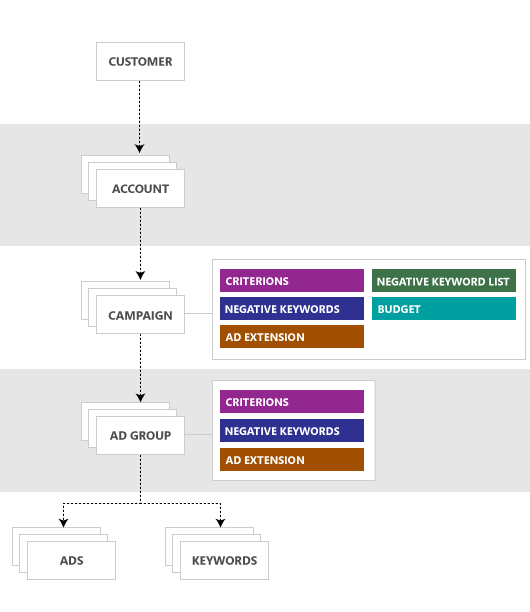

# Entity Hierarchy and Limits
The following figure shows the high level Bing Ads entity object model from the perspective of one customer that has one or more accounts. For information on services available to manage Bing Ads entities, see [Bing Ads API Overview](index.md).

  

A subset of entities with property limits (subject to change) are listed below. For a comprehensive list of entities and limits please see the [Bing Ads API reference](reference.md) documentation. For limits on request objects per service operation, see the [Ad Insight](../ad-insight-service/ad-insight-service-operations.md), [Bulk](../bulk-service/bulk-service-operations.md), [Campaign Management](../campaign-management-service/campaign-management-service-operations.md), [Customer Billing](../customer-billing-service/customer-billing-service-operations.md), [Customer Management](../customer-management-service/customer-management-service-operations.md), and [Reporting](../reporting-service/reporting-service-operations.md) reference documentation.  

> [!NOTE]
> The following are the standard limits. Please contact your account team if you have questions on limits that apply to your accounts.

## Accounts
Organizes campaigns and identifies the payment instrument used to settle the account.  Three accounts are allowed per credit card.

The following table defines limits for [AdvertiserAccount](../customer-management-service/advertiseraccount.md) properties.

|Property|Limit|
|------------|---------|
|Name|The string can contain between 3 and 100 characters and must be unique among all account names within the customer.|

## Ad Extensions
Ad extensions let you decorate expanded text ads with additional information that helps customers find relevant information about your products and services. Ad extensions are stored in a shared library at the account level. After adding the extension to your shared library, you must also explicitly associate it with the account or one or more campaigns or ad groups within the account for the extension to become eligible for delivery. For more information, see [Ad Extensions](ad-extensions.md).

An account can contain up to 200,000 sitelink ad extensions. Outside of that limit, each account can contain up to 150,000 ad extensions of all other types combined.  

The entity (account, campaign, or ad group) to ad extension association limit varies by ad extension type. 

> [!NOTE]
> Call ad extensions can only be associated at the campaign level. 
> 
> Location ad extensions can only be associated at the account and campaign level i.e., cannot be associated with ad groups.
> 
> You must associate between 2 and 20 callout ad extensions per entity. If you associate one or fewer callout extensions with your account, campaign, or ad group, then no callout text will serve with your ad. An ad may include between 2 to 4 callouts per impression.
> 
> For each account, only 1,000 campaigns and 1,000 ad groups can be associated with image ad extensions.  

|Ad Extension Type|Association Limit Per Entity|
|------------|---------|
|[App Ad Extension](#appadextension)|Up to the total number of app ad extensions in your account|
|[Call Ad Extension](#calladextension)|1|
|[Callout Ad Extension](#calloutadextension)|20|
|[Image Ad Extension](#imageadextension)|6|
|[Location Ad Extension](#locationadextension)|Up to the total number of location ad extensions in your account|
|[Price Ad Extension](#priceadextension)|20|
|[Review Ad Extension](#reviewadextension)|20|
|[Sitelink Ad Extension](#sitelinkadextension)|20|
|[Structured Snippet Ad Extension](#structuredsnippetadextension)|20|

### App Ad Extensions
You can manage app ad extensions using the Bulk service ([App Ad Extension Record](../bulk-service/app-ad-extension.md)) or Campaign Management service ([AppAdExtension](../campaign-management-service/appadextension.md)).

The following table defines limits for app ad extension properties.

|Property|Limit|
|------------|---------|
|Destination Url|The string can contain a maximum of 1,024 characters.|
|Display Text|The string can contain a maximum of 35 characters.|

### Call Ad Extensions
You can manage call ad extensions using the Bulk service ([Call Ad Extension Record](../bulk-service/call-ad-extension.md)) or Campaign Management service ([CallAdExtension](../campaign-management-service/calladextension.md)).

The following table defines limits for call ad extension properties.

|Property|Limit|
|------------|---------|
|Phone Number|The string can contain a maximum of 35 characters.|

### Callout Ad Extensions
You can manage callout ad extensions using the Bulk service ([Callout Ad Extension Record](../bulk-service/callout-ad-extension.md)) or Campaign Management service ([CalloutAdExtension](../campaign-management-service/calloutadextension.md)).

The following table defines limits for call ad extension properties.

|Property|Limit|
|------------|---------|
|Text|The string can contain a maximum of 25 characters. Note that for Traditional Chinese characters, the text is limited to 12 characters.|

### Image Ad Extensions
You can manage image ad extensions using the Bulk service ([Image Ad Extension Record](../bulk-service/image-ad-extension.md)) or Campaign Management service ([ImageAdExtension](../campaign-management-service/imageadextension.md)).

The following table defines limits for image ad extension properties.

|Property|Limit|
|------------|---------|
|Alternative Text|The string can contain a maximum of 35 characters.|
|Destination Url|The string can contain a maximum of 1,024 characters.|

### Location Ad Extensions
You can manage location ad extensions using the Bulk service ([Location Ad Extension Record](../bulk-service/location-ad-extension.md)) or Campaign Management service ([LocationAdExtension](../campaign-management-service/locationadextension.md)).

The following table defines limits for location ad extension properties.

|Property|Limit|
|------------|---------|
|Company Name|The string can contain a maximum of 80 characters.|
|Phone Number|The string can contain a maximum of 35 characters.|

### Price Ad Extensions
You can manage price ad extensions using the Bulk service ([Price Ad Extension Record](../bulk-service/price-ad-extension.md)) or Campaign Management service ([PriceAdExtension](../campaign-management-service/priceadextension.md)).

The following table defines limits for price ad extension properties.

|Property|Limit|
|------------|---------|
|Table Rows|You must have between 3 and 8 price table rows.|

### Review Ad Extensions
You can manage review ad extensions using the Bulk service ([Review Ad Extension Record](../bulk-service/review-ad-extension.md)) or Campaign Management service ([ReviewAdExtension](../campaign-management-service/reviewadextension.md)).

The following table defines limits for review ad extension properties.

|Property|Limit|
|------------|---------|
|Source|The combined length of the Source and Text strings must be less than 67 characters. Note that for Traditional Chinese characters, the combined length of the Source and Text strings is limited to 33 characters.| 
|Text|The combined length of the Source and Text strings must be less than 67 characters. Note that for Traditional Chinese characters, the combined length of the Source and Text strings is limited to 33 characters.|
|Url|The string can contain a maximum of 255 characters.|

### Sitelink Ad Extensions
You can manage sitelink ad extensions using the Bulk service ([Sitelink Ad Extension Record](../bulk-service/sitelink-ad-extension.md)) or Campaign Management service ([SiteLinkAdExtension](../campaign-management-service/sitelinkadextension.md)).

The following table defines limits for sitelink ad extension properties.

|Property|Limit|
|------------|---------|
|Description 1|If Traditional Chinese characters are included, the string can contain a maximum of 15 characters.  For English and all other languages, the limit is 35 characters.|
|Description 2|If Traditional Chinese characters are included, the string can contain a maximum of 15 characters.  For English and all other languages, the limit is 35 characters.|
|Destination Url|The URL can contain a maximum of 1,024 characters.|
|Display Text|For Traditional Chinese, if you set Description1 or Description2 then the string can contain a maximum of 11 characters; otherwise, the string can contain a maximum of 15 characters.  For English and all other languages, if you set Description1 or Description2 then the string can contain a maximum of 25 characters; otherwise, the string can contain a maximum of 35 characters.|
|Final Url|The string can contain a maximum of 2,048 characters.|
|Final Mobile Url|The string can contain a maximum of 2,048 characters.|
|Tracking Url Template|The string can contain a maximum of 2,048 characters.|

### Structured Snippet Ad Extensions
You can manage structured snippet ad extensions using the Bulk service ([Structured Snippet Ad Extension Record](../bulk-service/structured-snippet-ad-extension.md)) or Campaign Management service ([StructuredSnippetAdExtension](../campaign-management-service/structuredsnippetadextension.md)).

The following table defines limits for structured snippet ad extension properties.

|Property|Limit|
|------------|---------|
|Values|Each value can have a maximum length of 25 characters. Note that for Traditional Chinese characters, each value is limited to 12 characters.|

## Ad Groups
The ad group object specifies the default bid values for each match type, whether the group contains search ads, content ads, or both; whether to match on keywords or site placement; and the network and country in which the ads display.

Each campaign can have up to 20,000 ad groups. Each ad group may have multiple ads and keywords. You'll want to give these ad groups meaningful names and keep them tightly focused with related keywords and a small number of ads, for example 3 ads per ad group.

You can manage ad groups using the Bulk service ([Ad Group Record](../bulk-service/ad-group.md)) or Campaign Management service ([AdGroup](../campaign-management-service/adgroup.md)).

The following table defines limits for ad group properties.

|Property|Limit|
|------------|---------|
|Name|The string can contain a maximum of 256 characters, and must be unique among all active ad groups within the campaign.|
|Tracking Url Template|The string can contain a maximum of 2,048 characters.|

## Ads
Each ad group can contain between one and 100 ads combined, whether the type of ad is app install, dynamic search, expanded text, product, or responsive ad. 

Each account can have up to 4 million ads.

Each customer can have up to 20 million ads.

### App Install Ads
Create an app install ad if your intention is to drive app downloads, and not necessarily to direct leads to a web site. If you want to direct leads to a web site in addition to driving app downloads, then you should create an expanded text ad with app ad extensions.

> [!NOTE]
> Not everyone has this feature yet. If you don't, don't worry. It's coming soon.

You can manage dynamic search ads using the Bulk service ([App Install Ad Record](../bulk-service/app-install-ad.md)) or Campaign Management service ([AppInstallAd](../campaign-management-service/appinstallad.md)). The combination of the App Platform, App Store Id, Text, and Title elements make the app install ad unique.

The following table defines limits for app install ad properties.

|Property|Limit|
|------------|---------|
|Text|The maximum input length of the copy is 71 characters. Note that for ad groups that use Traditional Chinese, the text is limited to 38 characters.|
|Title|The maximum input length of the title is 25 characters. Note that for ad groups that use Traditional Chinese, the title is limited to 15 characters.|

### Dynamic Search Ads
With a dynamic search ads campaign, the ad title and display URL are generated automatically based on the website domain and language that you want to target.

> [!NOTE]
> Not everyone has this feature yet. If you don't, don't worry. It's coming soon.

You can manage dynamic search ads using the Bulk service ([Dynamic Search Ad Record](../bulk-service/dynamic-search-ad.md)) or Campaign Management service ([DynamicSearchAd](../campaign-management-service/dynamicsearchad.md)). The combination of the Path 1, Path 2, and Text elements make the dynamic search ad unique.

The following table defines limits for dynamic search ad properties.

|Property|Limit|
|------------|---------|
|Path 1|The maximum input length of the path is 15 characters. Note that for languages with double-width characters e.g. Traditional Chinese the maximum input length of the path is 7 characters. Although dynamic text substitution is supported for other ad types like Expanded Text ads, it is not supported for dynamic search ads.|
|Path 2|The maximum input length of the path is 15 characters. Note that for languages with double-width characters e.g. Traditional Chinese the maximum input length of the path is 7 characters. Although dynamic text substitution is supported for other ad types like Expanded Text ads, it is not supported for dynamic search ads.|
|Text|The maximum input length of the copy is 80 characters. Note that for ad groups that use Traditional Chinese the maximum input length of the copy is 40 characters. Although dynamic text substitution is supported for other ad types like Expanded Text ads, it is not supported for dynamic search ads.|
|Tracking Url Template|The string can contain a maximum of 2,048 characters.|

### Expanded Text Ads
An expanded text ad specifies the creative, such as the titles and text of the ad. 

You can manage expanded text ads using the Bulk service ([Expanded Text Ad Record](../bulk-service/expanded-text-ad.md)) or Campaign Management service ([ExpandedTextAd](../campaign-management-service/expandedtextad.md)). The combination of the Final Urls, Path 1, Path 2, Text, Title Part 1 and Title Part 2 elements make the expanded text ad unique. 

The following table defines limits for expanded text ad properties.

> [!NOTE]
> The double-width characters are determined by the characters you use instead of the character set of the campaign or ad group language settings. Double-width characters include Korean, Japanese and Chinese languages characters as well as Emojis. 

|Property|Limit|
|------------|---------|
|Domain|The domain portion of the URL in combination with the path 1 and path 2 strings cannot exceed 67 characters.|
|Final Url|The string can contain a maximum of 2,048 characters.|
|Path 1|The maximum input length is 50 characters including dynamic text strings, and of those 50 no more than 15 final characters are allowed after substitution. For languages with double-width characters e.g. Traditional Chinese the maximum input length is 25 characters including dynamic text strings, and of those 25 no more than 7 final characters are allowed after substitution.|
|Path 2|The maximum input length is 50 characters including dynamic text strings, and of those 50 no more than 15 final characters are allowed after substitution. For languages with double-width characters e.g. Traditional Chinese the maximum input length is 25 characters including dynamic text strings, and of those 25 no more than 7 final characters are allowed after substitution.|
|Text|The maximum input length is 1,000 characters including dynamic text strings, and of those 1,000 no more than 80 final characters are allowed after substitution. For languages with double-width characters e.g. Traditional Chinese the maximum input length is 500 characters including dynamic text strings, and of those 500 no more than 40 final characters are allowed after substitution.  **Note:** For customers in [pilot 510](../customer-management-service/getcustomerpilotfeatures.md#featurepilotflags), the maximum length is increased from 80 to 90, or from 40 to 45 for double-width characters.|
|Title Part 1|The maximum input length is 1,000 characters including dynamic text strings, and of those 1,000 no more than 30 final characters are allowed after substitution. For languages with double-width characters e.g. Traditional Chinese the maximum input length is 500 characters including dynamic text strings, and of those 500 no more than 15 final characters are allowed after substitution.|
|Title Part 2|The maximum input length is 1,000 characters including dynamic text strings, and of those 1,000 no more than 30 final characters are allowed after substitution. For languages with double-width characters e.g. Traditional Chinese the maximum input length is 500 characters including dynamic text strings, and of those 500 no more than 15 final characters are allowed after substitution.|
|Tracking Url Template|The string can contain a maximum of 2,048 characters.|

### Product Ads
A product ad specifies the creative, such as the promotional text of the ad.

You can manage product ads using the Bulk service ([Product Ad Record](../bulk-service/product-ad.md)) or Campaign Management service ([ProductAd](../campaign-management-service/productad.md)).

The following table defines limits for product ad properties.

|Property|Limit|
|------------|---------|
|Promotional Text|The string can contain a maximum of 45 characters.|

### Responsive Ads
A responsive ad format for Audience ads in the Microsoft Audience Network. Responsive ads automatically adjust to accommodate the sizes and shapes of native ad formats.

You can manage responsive ads using the Bulk service ([Responsive Ad Record](../bulk-service/responsive-ad.md)) or Campaign Management service ([ResponsiveAd](../campaign-management-service/responsivead.md)).

The following table defines limits for responsive ad properties.

|Property|Limit|
|------------|---------|
|Business Name|The string can contain a maximum of 25 characters.|
|Headline|The string can contain a maximum of 25 characters.|
|LongHeadline|The string can contain a maximum of 90 characters.|
|Text|The string can contain a maximum of 90 characters.|

## Audiences
The following table defines limits for audience properties.

|Property|Limit|
|------------|---------|
|Description|The description of the audience. The description can contain a maximum of 1,024 characters.|
|MembershipDuration|The mimimum duration is 1 day and the maximum duration allowed is 180 days.|
|Name|The name of the audience. The name can contain a maximum of 128 characters.|

You can have up to 1,000 custom audiences per customer. You can have up to 1,000 remarketing lists per account, or 5,000 per customer. The in-market audiences maximum is only limited by the number of in-market audiences provided by Bing Ads. 

There is a limit of 20,000,000 associations per account combined for custom audience, in-market audience, product audience, and remarketing list associations (whether the associations are used for inclusion or exclusion). Within the 20,000,000 limit across all audience types, there is a limit of 1,000 in-market audience exclusions per account.

## Budgets
Represents a budget that can be shared by any campaigns in an account. You can set a single daily budget that can be used by any campaign within the same account. This will enable you to efficiently distribute a single daily budget across all campaigns or across a defined group of campaigns within your Bing Ads account.

Each account can have up to 11,000 shared budgets. Each shared budget can be assigned to up to 10,000 campaigns; however, a campaign can only have one budget.

You can manage shared budgets using the Bulk service ([Budget Record](../bulk-service/budget.md)) or Campaign Management service ([Budget](../campaign-management-service/budget.md)).

The following table defines limits for budget properties.

|Property|Limit|
|------------|---------|
|Name|The name must be unique among all budgets within the account. The name can contain a maximum of 255 characters.|

## Campaigns
The campaign object is the top level object of an advertising campaign and is where you set the campaign's budget. Each account can have up to 10,000 campaigns.

You can manage campaigns using the Bulk service ([Campaign Record](../bulk-service/campaign.md)) or Campaign Management service ([Campaign](../campaign-management-service/campaign.md)).

The following table defines limits for campaign properties.

|Property|Limit|
|------------|---------|
|Description|The string can contain a maximum of 1,000 characters.|
|Name|The string can contain a maximum of 128 characters.|
|Tracking Url Template|The string can contain a maximum of 2,048 characters.|

## Customers
Defines a customer. All advertising activity is organized by customer. Each customer can have between one and six accounts, and be managed by up to 15 users.

The following table defines limits for [Customer](../customer-management-service/customer.md) properties.

|Property|Limit|
|------------|---------|
|Name|The string can contain a maximum of 90 characters.|

## Dynamic Search Ad Targets
Dynamic search ads automatically target relevant search queries based on the content of your website, and are dynamically created to respond to these search queries.

Each ad group can contain 20,000 dynamic search ad targets.

Each account can contain 5,000,000 dynamic search ad targets.

For more information, see the Bing Ads Help article [Target searches automatically with dynamic search ads](https://help.bingads.microsoft.com/#apex/3/en/56794/0).

## Images
Defines an image that can be uploaded to your account's image library. Each account can have up to 5,000 images.

## Keywords
The keyword object specifies the keyword phrase, bid values for one or more of the match types that override the default bid values specified at the ad group-level, and substitution parameters to use in the ad that gets displayed.

Each ad group can contain 20,000 keywords.

Each account can contain 5,000,000 keywords.

Each customer can contain 50,000,000 keywords.

You can manage keywords using the Bulk service ([Keyword Record](../bulk-service/keyword.md)) or Campaign Management service ([Keyword](../campaign-management-service/keyword.md)).

The following table defines limits for keyword properties.

|Property|Limit|
|------------|---------|
|Destination Url|The string can contain a maximum of 1,024 characters.|
|Final Url|The string can contain a maximum of 2,048 characters.|
|Final Mobile Url|The string can contain a maximum of 2,048 characters.|
|Param1|The string can contain a maximum of 1,022 characters.  The actual limit depends on the length of the element that references the substitution string. For example, the length of a text ad's title can contain a maximum of 25 characters.|
|Param2|The string can contain a maximum of 70 characters.  The actual limit depends on the length of the element that references the substitution string. For example, the length of a text ad's title can contain a maximum of 25 characters.|
|Param3|The string can contain a maximum of 70 characters.  The actual limit depends on the length of the element that references the substitution string. For example, the length of a text ad's title can contain a maximum of 25 characters.|
|Text|The string can contain a maximum of 100 characters.|
|Tracking Url Template|The string can contain a maximum of 2,048 characters.|

## Labels
Labels let you organize campaigns, ad groups, ads, and keywords into groups based on whatever is important to you. You can then filter and run reports on your labels to get the data that is most meaningful to you.

Each account can contain 100,000 labels.

Although not pictured above, labels can be associated with campaigns, ad groups, ads, and keywords. You can apply one label to multiple entities. The association count is only limited by the number of campaigns, ad groups, ads, and keywords in your account.

You can manage labels using the Bulk service ([Label Record](../bulk-service/label.md)) or Campaign Management service ([Label](../campaign-management-service/label.md)).

|Property|Limit|
|------------|---------|
|Description|The label description can be between 1 to 200 characters in length.|
|Name|The case-sensitive label name can be between 1 to 80 characters in length, and must be unique across all labels in the account.|

## Negative Keywords
To explicitly opt out of bidding for keyword match types, you can set negative keywords at the campaign and ad group level.

Each ad group or campaign can contain up to 20,000 negative keywords, and each negative keyword can contain a maximum of 100 characters.

> [!NOTE]
> The 20,000 negative keyword limit is allowed per campaign and ad group up to the account limit of 5,000,000 negative keywords. These limits are separate from the limits for negative keyword lists.

Additionally a campaign can be associated with any or all negative keyword lists within the account, and each list can contain up to 5,000 shared negative keywords. A maximum of 20 negative keyword lists are allowed per account and each list can be associated with any or all campaigns in the account. Thus one campaign could effectively have 120,000 negative keywords applied via the sum of the 20,000 negative keywords exclusively set for that campaign and the 100,000 shared negative keywords (20 lists multiplied by 5,000 negative keywords per list).

> [!NOTE]
> The maximum number associations between campaigns and negative keyword lists is 50,000 per account. For example if you have five negative keyword lists and associate all of them with each of your 10,000 campaigns, then you are not allowed to associate a sixth negative keyword list with any campaign.

If you set negative keywords at both levels, both lists will be used in comparison to the user's query. Thus an ad group could effectively have 140,000 negative keywords applied via the sum of the 20,000 negative keywords exclusively set for that ad group, the 20,000 negative keywords exclusively set for the ad group's parent campaign, and the 100,000 negative keywords in lists shared with the ad group's parent campaign.

For more information about managing negative keywords and negative keyword lists, please see the technical guide about [Negative Keywords](negative-keywords.md).

## Negative Site Placements
To prevent your ad from appearing on specific web sites within the search network you can configure website exclusions, also known as negative site placements. To explicitly opt out from having your search ads displayed on partner websites sites, you can set negative sites at the campaign and ad group level. For search ads, you can set only syndicated search websites. Ad-group-level website exclusions override campaign-level website exclusions.

You can manage negative site placements using the Campaign Management service ([AdGroupNegativeSites](../campaign-management-service/adgroupnegativesites.md)) and ([CampaignNegativeSites](../campaign-management-service/campaignnegativesites.md)).

Each ad group or campaign can contain up to 2,500 negative site placements. Each URL must specify the domain name e.g., *contoso.com* which can include up to three subdomains and two subdirectories. The subdomain count includes the *www* prefix. For example *one.two.three.contoso.com/1/2*, *www.two.three.contoso.com/1/2*, and *one.two.contoso.co.uk/1/2* are valid URLs, whereas *one.two.three.contoso.co.uk/1/2* (too many subdomains) and *one.two.three.contoso.com/1/2/3* (too many subdirectories) are not.

## Product Groups
Product groups are used to determine which products from your Bing Merchant Center catalog should be included in a particular ad group. In order to understand product groups, first make sure you are familiar with [Product Ads](product-ads.md).

After you create a shopping campaign, Bing Ads creates a default ad group. That ad group includes a product group containing all of the products in your Bing Merchant Center catalog feed. However, you don't typically want an ad group to contain all products. Instead, you likely want each ad group to contain only very closely related products in order more effectively manage which ads show, and when. With product groups you can narrow down that default group to a customized list of specific products.

There is a 1 to 1 relationship between ad groups and product groups. In other words, each ad group has one product group and vice versa.

You can manage product groups using the Bulk service ([Ad Group Product Partition](../bulk-service/ad-group-product-partition.md)) or Campaign Management service ([ProductPartition](../campaign-management-service/productpartition.md)).

For more information, see the Bing Ads Help article [Understand and use product groups](https://help.bingads.microsoft.com/#apex/3/en/50901/1).

## Targets
You can set criteria to show your ads based on age, day and time, device, gender, and location. Where necessary to distinguish from other criterion types the documentation may refer to these entities as *target criterions*. For more information about managing targets, see the [Show Ads to Your Target Audience](show-ads-target-audience.md) technical guide.

### Age Criterions
The maximum number of age criterions that you can set per campaign or ad group is five, i.e. one for each of the supported age ranges *EighteenToTwentyFour*, *TwentyFiveToThirtyFour*, *ThirtyFiveToFortyNine*, *FiftyToSixtyFour*, and *SixtyFiveAndAbove*.

### Company Name Criterions
The maximum number of company name criterions that you can set per ad group is 1,000.

### Day and Time Criterions
The maximum number of day and time criterions that you can set per campaign or ad group is 49. You may not set any overlapping day and time ranges, for example Monday from 3:00AM to 5:00AM and Monday 4:00AM to 6:00AM are not allowed for the same campaign or ad group. Also for a given campaign or ad group, the maximum number of day and time criterions per day that you can set is seven. For example you can set up to 7 day and time criterions where the *Day* is set to Monday. 

### Device Criterions
The maximum number of device criterions that you can set per campaign or ad group is three. You must either have three separate criterions for *Computers*, *Smartphones*, and *Tablets*, otherwise no device criterions can exist for the campaign or ad group.

### Gender Criterions
The maximum number of gender criterions that you can set per campaign or ad group is two i.e. one for *Male* and one for *Female*.

### Location Criterions
The maximum number of combined location and negative location criterions that you can set per campaign or ad group is 10,000. For example, you can set a maximum of 10,000 city location criteria or 1,000 state location criteria and 9,000 city location criteria. 

### Location Intent Criterions
The maximum number of location intent criterions that you can set per campaign or ad group is one.

### Radius Criterions
The maximum number of radius criterions that you can set per campaign or ad group is 2,000. 

> [!NOTE] 
> Each of these limits are independent of one another e.g., the radius criterions limit stands regardless of whether or not any location criterions exist for the campaign or ad group.

## See Also
[Bing Ads API Overview](index.md)  
[Bing Ads API Reference](reference.md)  

