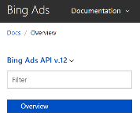

> [!IMPORTANT]
> This Bing Ads API Version 12 preview documentation is subject to change. To return to version 11 content, use the version selector near the table of contents at the top and left side of the page.

# Frequently Asked Questions
This article contains answers to some frequently asked questions about the Bing Ads API.

## Get Help

### Q. Where can I get help?
The [developer forum](https://social.msdn.microsoft.com/forums/en-us/home?forum=BingAds) provides a way for the developer community to ask and answer questions about developing solutions with Bing Ads APIs, to showcase innovations, and to generate and maintain content through community participation. Microsoft monitors the forums and replies to questions that the community has not yet answered.

If you are not finding the information you need to solve your problem in the developer forum, please contact [Bing Ads Support](https://advertise.bingads.microsoft.com/en-us/bing-ads-support). To resolve the issue efficiently, please provide support with the details requested in [Engaging Support](handle-service-errors-exceptions.md#contact-support).

### Q. How can I find out about changes?
The [Release Notes](release-notes.md) and [Migration Guide](migration-guide.md) are great resources to start with. 

You can sign up for the monthly newsletter via the [News](https://developers.bingads.microsoft.com/News) tab of the Developer Portal, and that's also where the latest [blog](https://blogs.msdn.microsoft.com/bing_ads_api/) announcments are aggregated.  

## Get Started

### Q. What are the requirements to use the Bing Ads API?
To [get started](get-started.md), you need to sign up for a [Bing Ads](https://secure.bingads.microsoft.com) account, and then get your developer token at via the [Account](https://developers.bingads.microsoft.com/Account) tab of the Developer Portal. 

### Q. Which programming languages and SDKs are supported?
You can develop Bing Ads applications with any programming language that supports web services. The [Bing Ads Software Development Kits (SDK)](client-libraries.md) enhance the experience of developing Bing Ads applications with .NET, Java, PHP, and Python languages.  Each SDK includes a proxy to all Bing Ads API web services and abstracts low level details of authentication with OAuth. You can use the high level BulkServiceManager and ReportingServiceManager interfaces to abstract and execute operations in the low level Bulk and Reporting services. 

We have heard requests for additional SDKs e.g. Perl and Ruby, although there is no plan to add support in the near term.

### Q. How can I view code samples in different programming languages?
In addition to the [Code Examples](code-examples.md) and services [Reference](reference.md) sections, you'll find code snippets in many of the technical guides e.g., the [Get Started](get-started.md) guide. You can use the language selector at the top or right of those pages to view examples in CSharp, Java, Php, or Python. When you choose a language, the setting is retained as you navigate other pages. The language selector will only include languages that have samples for that specific page, and will default to C# if the language you had previously set is not available for the page that you navigated to. 

### Q. Which API version should I use?
You should always use the latest version as soon as we announce support via the [blog](https://blogs.msdn.microsoft.com/bing_ads_api/) or [release notes](release-notes.md). 

### Q. How can I view documentation and code examples for different versions of the API?
To navigate between versions, use the version selector near the table of contents at the top and left side of the page. 

  

The ```view``` query string parameter will be updated and appended to the URL e.g., ```?view=bingads-11```. By default when you navigate to a page without any ```view``` query string parameter, the content for the latest generally available version will be shown even when a higher API version is available for preview. 

## Feature Availability

### Q. Should I use the Bulk or Campaign Management API?
The [Bulk service](../bulk-service/bulk-service-reference.md) is recommended, especially if you need to add or update ads and keywords across multiple ad groups or campaigns in an account. Some features are not available in Bulk e.g. [AddUetTags](../campaign-management-service/adduettags.md), [GetBMCStoresByCustomerId](../campaign-management-service/getbmcstoresbycustomerid.md), [GetGeoLocationsFileUrl](../campaign-management-service/getgeolocationsfileurl.md), and [GetMediaByIds](../campaign-management-service/getmediabyids.md). For these features of course you must use the [Campaign Management service](../campaign-management-service/campaign-management-service-reference.md). 

### Q. Which API performance reports are available and when will my data be available?
The Reporting service supports most of the same [report types](report-types.md) that you can find in the Bing Ads web application. Be sure to check out the [Report Attributes and Performance Statistics](report-attributes-performance-statistics.md) and [Reporting Data Retention Time Periods](report-data-retention-time-periods.md) guides for availability details.

When a user clicks an ad, it can take up to two hours for the system to process the click (3 hours for conversions) and make it available for reporting. When all data for the previous day have been processed and made available for reporting, this state is referred to as Books Closed. For more information about when the books are closed for reporting, see [Determining When the Books Close](reports.md#booksclose).

## OAuth 

### Q. I want to run my application without user interaction. How can I authenticate without getting prompted for permission to use Bing Ads credentials?
To programatically manage a Bing Ads account, you must provide consent at least once through the web application consent flow. For repeat or long term authentication, you should follow the [authorization code grant flow](authentication-oauth.md#authorizationcode) for obtaining an access token and refresh token. Thereafter you can use the latest refresh token to request new access and refresh tokens without any further user interaction. You may need to request user consent again for example, if the Microsoft Account password was changed or the Microsoft Account owner removed permissions for your application to authenticate on their behalf. 

### Q. When do the access and refresh tokens expire?
The access token typically expires after one hour, although you should always check the expiration time each time you request a new token. The refresh token does not have a published duration or expiration time, although you can expect it to last up to 1 year. As a best practice you should always securely store the latest refresh token each time you request new access and refresh tokens. 
