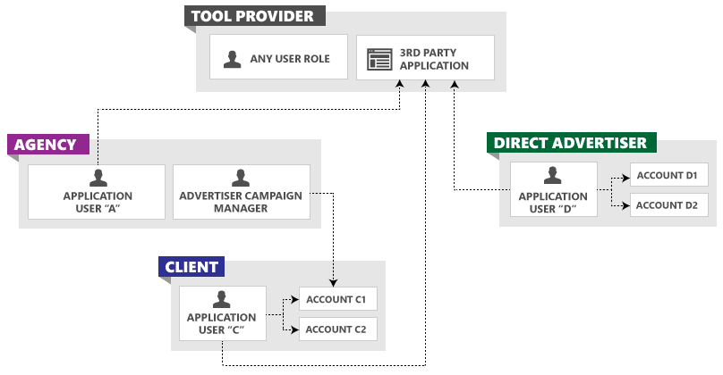

> [!IMPORTANT]
> This Bing Ads API Version 12 preview documentation is subject to change.

# Management Model for Tool Providers
A tool provider builds a Bing Ads application for other companies to manage their advertising campaigns, and is not necessarily billed by Bing Ads. The advertiser user owns the accounts, is billed directly by Microsoft for valid ad clicks, and may pay a fee to the tool provider. The following sections describe the entity model and credentials for tool providers.

## Tool Provider Entity Model
The following figure shows multiple customers using the same third-party tool.

Third-party tools may be used to manage some or all aspects of an advertiser account. Your users may also manage their respective account through the Bing Ads web application or another third-party tool. You should design your application to be flexible and robust considering that data may have changed state since the last time a client used your application.

## See Also
[Customer Accounts](customer-accounts.md)  
[Get Started With the Bing Ads API](get-started.md)  

