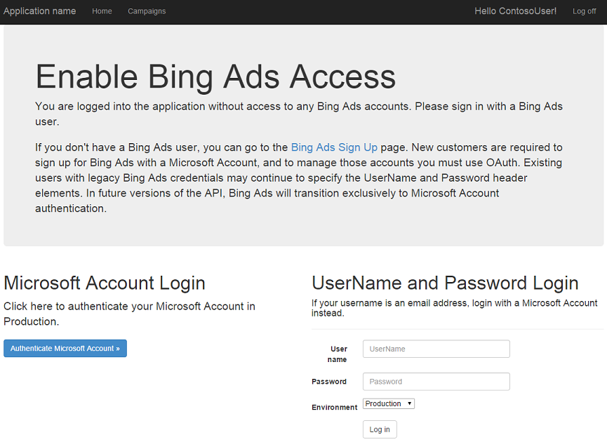
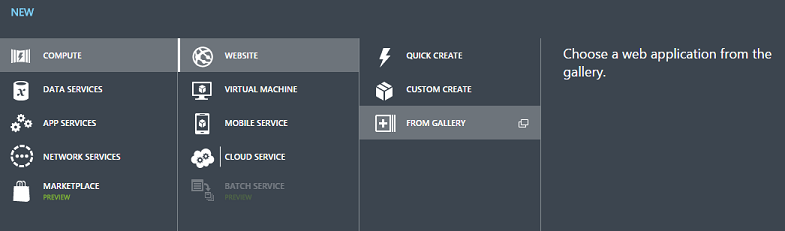
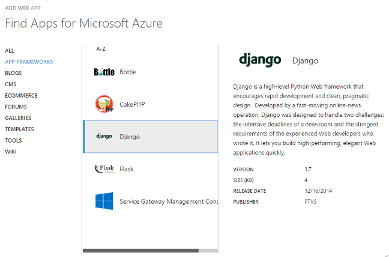
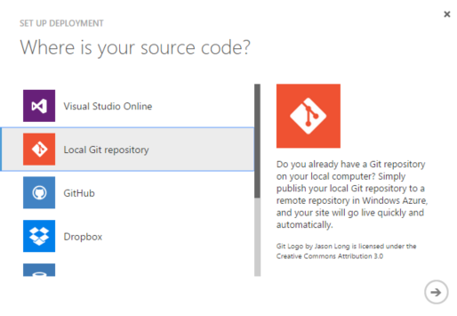
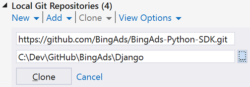
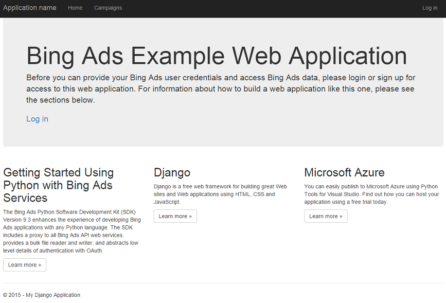
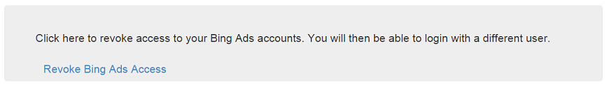

> [!IMPORTANT]
> This Bing Ads API Version 12 preview documentation is subject to change.

# Walkthrough: Bing Ads Web Application in Python
This tutorial describes how to get started running a Bing Ads web application using the Python and the Django web framework on the [Azure App Service](http://azure.microsoft.com/services/app-service/). You will create the [Web App](http://azure.microsoft.com/services/app-service/web/) from the Azure gallery, set up Git deployment, and clone the repository locally. Then you will run the application locally, make changes, commit and push them to Azure.

## <a name="webapp"></a>Example Web Application Overview
By the end of this tutorial you will have a web application running on Azure that will authenticate your Bing Ads user credentials and display your campaigns data. You can then add multiple web application users, who can enable access for your application to use their Bing Ads credentials. Your new web application provides a one to one mapping of a web application user e.g. ContosoUser to a Bing Ads user. For information about how to modify the data model, please see [Django documentation](https://docs.djangoproject.com/) for more information. If your web application user enables access to their Bing Ads accounts with a Microsoft account, a refresh token is stored in the SQL Lite database on your web server.



## <a name="requirements"></a>Prerequisites
To complete this tutorial, you need an Azure account. (You can [sign up for a free trial](http://azure.microsoft.com/pricing/free-trial/)). You can complete this tutorial and deploy locally without an Azure website, and the application will work with the deprecated *UserName* and *Password* credentials. To authenticate a Microsoft account for a web application using OAuth, you must deploy to a server with a publicly accessible DNS, for example an Azure website.

If you want to get started with [Azure App Service](http://azure.microsoft.com/services/app-service/) before signing up for an account, go to [https://tryappservice.azure.com/](https://tryappservice.azure.com/), where you can immediately create a short-lived starter site for free. Before kicking off the short-lived starter site, to maximize your time experiencing Azure you should first complete the tutorial steps to deploy on your local machine.

To follow this tutorial path, you will develop your application on Windows using [Python Tools for Visual Studio (PTVS)](https://microsoft.github.io/PTVS) on [Visual Studio Community](https://www.visualstudio.com/vs/community/). If you are using another operating system, web framework, or development environment, you can browse this guide for context and then see [Get Started Using Python with Bing Ads Services](get-started-python.md) for an overview of the Python SDK. For more information about deploying Azure websites using other environments and web frameworks, please see Microsoft Azure tutorials on [Django](http://azure.microsoft.com/documentation/articles/web-sites-python-create-deploy-django-app/), [Flask](http://azure.microsoft.com/documentation/articles/web-sites-python-create-deploy-flask-app), or [Bottle](http://azure.microsoft.com/documentation/articles/web-sites-python-create-deploy-bottle-app).

You will need to install either Python 2.7 or 3.4 in your development environment. Unless you have scaled up your Azure website to 64-bit, the default platform is 32-bit, so you should use a 32-bit Python installation.

You will need to [install](get-started-python.md#installation) the [Bing Ads Python SDK](client-libraries.md), and this tutorial will walk you through the installation.

You will need the [Django web framework](https://www.djangoproject.com/) installed to deploy the application locally, and this tutorial will walk you through the installation.

You will need at least one user with Bing Ads credentials including either a Microsoft account (recommended) or the Bing Ads legacy *UserName* and *Password* set, and a [developer token](get-started.md#get-developer-token). 

To use the OAuth 2.0 features of this web application, you will need to [register an application](authentication-oauth.md#registerapplication) and take note of the client ID and client secret. You'll need to register a web app (not native) for this example. You will be asked to register one or more redirect URLs. To deploy your application on Azure, choose a website name and corresponding URL that includes *azurewebsites.net*. This tutorial uses the */callback* URL relative to the website root, so to follow along you will want to register a redirect URL as follows: *https://YourAzureSiteNameGoesHere.azurewebsites.net/callback*.

## Website Creation on Azure Portal
Create a Django website from the Azure Websites gallery. Login to the [Microsoft Azure Portal](https://manage.windowsazure.com/) and click the **NEW** button in the bottom left corner. A window will appear. Click **COMPUTE**, **WEB SITE**, then **FROM GALLERY**.



A window will appear, listing apps available in the gallery. Click the **APP FRAMEWORKS** category on the left, and select **Django**.



In the next page, enter a *URL* and a *WEBSCALEGROUP* for your site, and press the complete (checkmark) button.

The site will be quickly set up. You can click the **BROWSE** button from the bottom toolbar, and your browser will open the default Django application that Azure provides out of the box.

## Integrate Source Control
Click on **Reset your deployment credentials**. Choose a username and password that you will use to deploy and sync updates with your site.

Next, you will add support for publishing via Git. This can be done by choosing **Set up deployment from source control**. From the **Set up deployment** dialog, scroll down and select the **Local Git repository** option. Click the right arrow to continue. After setting up Git publishing, you will momentarily see a page informing you the repository is being created. When it is ready, you will see instructions on how to connect.



## Clone the example repository
For this tutorial, instead of using the source of your default Django site from Azure, let's replace it with the Bing Ads with Django example that is provided on GitHub.

In Visual Studio, go to **Team** -&gt; **Connect to Team Foundation Server** -&gt; **Local Git Repositories** -&gt; **Clone**. To clone the Visual Studio solution from the Bing Ads with Django example repository, set the remote repository path to *https://github.com/BingAds/BingAds-Python-SDK.git*. Then browse to an empty directory where you want to sync locally, and press **Clone**. Then open the solution file (.sln) that is included in the web example directory.



## Edit your local files
Open */DjangoWebProject/settings.py* and edit these settings with your own credentials: *DEVELOPER_TOKEN*, *CLIENT_ID*, *CLIENT_SECRET*, and *REDIRECTION_URI*.

## Repository Contents
Here is an abridged overview of the files used by this web application. If you have been following steps above in this tutorial, this section is informational and no action is required. If you already have a Django project and don't want to replace it completely with the Bing Ads web example project, you can copy the required contents of these files manually to your project.

-   */requirements.txt* - Lists the packages required by the example web application. Django and the Bing Ads Python SDK packages are included in the example requirements.txt file, and will be installed when you create a virtual environment.

-   */DjangoWebProject/settings.py* - The project settings are defined here. You must edit *settings.py* with your own *CLIENT_ID*, *CLIENT_SECRET*, and *REDIRECTION_URI* that were provisioned when you [registered your application](authentication-oauth.md#registerapplication). You'll also need to edit the *DEVELOPER_TOKEN* with your own production [developer token](get-started.md#get-developer-token).

-   */DjangoWebProject/urls.py* - Defines which view and template context to invoke per URL.

-   */app/forms.py* - The BootstrapAuthenticationForm is used to validate web application user credentials against the backend database. The BingAdsPasswordAuthenticationForm is used to validate Bing Ads legacy *UserName* and *Password* credentials.

-   */app/models.py* - We defined the BingAdsUser model to extend the default Django user authentication model. One web application user (Django.contrib.auth.User) can be associated with up to one refresh token. For more information about how you can customize the authentication model, see the Django documentation.

-   */app/views.py* - The core application logic is defined here. Determines the template and context that is displayed for each URL or action.

-   */app/templates/app/*.html* - Defines the html structure for your web application.

## Create virtual environment
We'll create a virtual environment for local development. In your project right-click on **Python Environments** and select **Add Virtual Environment**.

-   Make sure the name of the environment is **env**.

-   Select the base Python interpreter e.g. **Python 2.7**

-   Make sure the option to **Download and install packages** is checked.

Django and the Bing Ads Python SDK packages are included in the example *requirements.txt* file, and will be installed in your virtual environment.


> [!NOTE]
> For more information about Python virtual environments, see [PEP 405 - Python Virtual Environments](https://www.python.org/dev/peps/pep-0405/).

## Create a superuser
The default sqlite3 database included with the project does not have any superuser defined. To use the login functionality in the application, or the Django admin interface (if you decide to enable it), you'll need to create a superuser.

Right click the project and select **Python** -&gt; **Django Sync DB**. When asked to create a superuser, type 'yes' and follow the remaining prompts to create a superuser.

## <a name="localdeploy"></a>Deploy locally
You can now deploy locally without an Azure website, and the application will work with Bing Ads legacy *UserName* and *Password* credentials. To authenticate a Microsoft account for Bing Ads access using OAuth, you'll want to [Deploy to Azure](#azuredeploy).

Go ahead and Press F5 to start debugging, and you can view the Django web application running locally in your default web browser.



## <a name="azuredeploy"></a>Deploy to Azure
To use all features of this web application, including authentication of a Microsoft account for Bing Ads access using OAuth, let's now deploy to Azure.

1.  Right click the project and select Publish.

2.  Select **Microsoft Azure Websites** as the publish target.

3.  Sign in with your Azure credentials and select your Django website. Once your publish profile settings have been downloaded, you can follow the remaining prompts and press **Publish**.

If publishing completed successfully your default browser should be launched and directed to your new web app on Azure!

You can now login with your superuser, press **Authenticate Microsoft Account**, and follow the authorization flow to grant your web application with permissions to manage Bing Ads accounts. When redirected back to the home page, you should see a message confirming that your user has access to Bing Ads with an option to revoke access. Without revoking access, try the Log off menu option, close your browser, and then log in again. Since your refresh token is stored in your web site's database, you should still be authenticated and see the option to revoke access.



Next, go ahead and press **Revoke Bing Ads Access**. Your refresh token will be deleted from the database, and you can enable access with a different Bing Ads user.

That's all there is to it! Go ahead and customize the application to meet your requirements.

## Create more users (Optional)
Currently the web application only supports a single user, and only one refresh token can be stored for your superuser. To create more web application users who can manage their own Bing Ads credentials separately, you can enable the admin console by editing these files and redeploying your application (locally or on Azure). Then you can browse to your sites admin URL e.g. *http://contoso.azurewebsites.net/admin*, login as superuser, and create more users.

-   */DjangoWebProject/urls.py*

    ```python
    # Uncomment the next lines to enable the admin:
    from django.conf.urls import include
    from django.contrib import admin

    admin.autodiscover()
    ```

    ```python
    # Uncomment the admin/doc line below to enable admin documentation:
    url(r'^admin/doc/', include('django.contrib.admindocs.urls')),
    
    # Uncomment the next line to enable the admin:
    url(r'^admin/', include(admin.site.urls)),
    ```

-   */DjangoWebProject/settings.py*

    ```python
    # Uncomment the next line to enable the admin:
    'django.contrib.admin',
    # Uncomment the next line to enable admin documentation:
    'django.contrib.admindocs',
    ```

## See Also
[Get Started Using Python with Bing Ads Services](get-started-python.md)  

