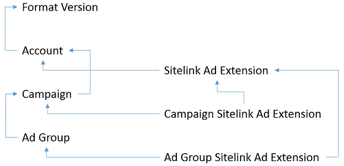

# Bulk File Schema
The bulk schema defines the contents of the file for download or upload with the Bing Ads Bulk service. For both download and upload, the Bulk service supports the file types and corresponding schemas in the [DownloadEntity](../bulk-service/downloadentity.md) value set.

For more information about using the Bulk service to manage your campaigns, see [Bulk Download and Upload](~/guides/bulk-download-upload.md). For more information about understanding the data file contents, see the sections below.

-   [File Schema](#fileschema)  
-   [Format Versions](#formatversions)  
-   [Record Types](#recordtypes)  
-   [Type Hierarchy](#typehierarchy)  
-   [Reference Keys](#referencekeys)  
-   [Client Identifiers](#clientid)  
-   [Errors](#errors)

## File Schema
You can choose to download either a tab or comma delimited set of records (rows) and fields (columns). The first column  header is named *Type*.  The rest of the column names map to properties within or associated with the corresponding record type.

> [!IMPORTANT]
> New record types (rows) and fields (columns) may be added anytime, and you should not depend on record or field order in the bulk download or bulk upload results file. Similarly during upload you may submit the fields in any order. The upload  record order is important when creating new entities, as described below within [Type Hierarchy](#typehierarchy).

## Format Versions
The bulk format version is separate from the Bing Ads API version.  Format version enables a flexible upgrade path to adopt the latest supported features without breaking your application. As a best practice you should always upgrade to the latest format version. Currently  Bing Ads API Version 11 only supports format version 5.0.

To specify the file format version using bulk download, set *FormatVersion* to 5.0 in either the [DownloadCampaignsByAccountIds](../bulk-service/downloadcampaignsbyaccountids.md) or [DownloadCampaignsByCampaignIds](../bulk-service/downloadcampaignsbycampaignids.md) request.

To specify the version using bulk upload, set the *Name* field of the [Format Version](../bulk-service/format-version.md) record to 5.0.

## Record Types
Records available for upload and download using [Format Version](#formatversions) 5.0 are detailed in the table below. 

> [!IMPORTANT]
> New record types (rows) and fields (columns) may be added anytime, and you should not depend on record or field order in the bulk download or bulk upload results file.

Record Type  |Supported Campaign Types  
---------|---------
[Account](../bulk-service/account.md)     |All         
[Account App Ad Extension](../bulk-service/account-app-ad-extension.md)     |SearchAndContent DynamicSearchAds         
[Account Callout Ad Extension](../bulk-service/account-callout-ad-extension.md)     |SearchAndContent DynamicSearchAds         
[Account Image Ad Extension](../bulk-service/account-image-ad-extension.md)     |SearchAndContent DynamicSearchAds         
[Account Location Ad Extension](../bulk-service/account-location-ad-extension.md)     |SearchAndContent DynamicSearchAds         
[Account Price Ad Extension](../bulk-service/account-price-ad-extension.md)     |SearchAndContent DynamicSearchAds         
|[Account Sitelink2 Ad Extension](../bulk-service/account-sitelink2-ad-extension.md)     |SearchAndContent DynamicSearchAds         
[Account Structured Snippet Ad Extension](../bulk-service/account-structured-snippet-ad-extension.md)     |SearchAndContent DynamicSearchAds         
[Ad Group App Ad Extension](../bulk-service/ad-group-app-ad-extension.md)     |SearchAndContent DynamicSearchAds         
[Ad Group](../bulk-service/ad-group.md)     |All         
[Ad Group Age Criterion](../bulk-service/ad-group-age-criterion.md)     |All         
[Ad Group App Ad Extension](../bulk-service/ad-group-app-ad-extension.md)     |SearchAndContent DynamicSearchAds         
[Ad Group Callout Ad Extension](../bulk-service/ad-group-callout-ad-extension.md)     |SearchAndContent DynamicSearchAds         
[Ad Group Custom Audience Association](../bulk-service/ad-group-custom-audience-association.md)     |All         
[Ad Group DayTime Criterion](../bulk-service/ad-group-daytime-criterion.md)     |All         
[Ad Group DeviceOS Criterion](../bulk-service/ad-group-deviceos-criterion.md)     |All         
[Ad Group Dynamic Search Ad Target](../bulk-service/ad-group-dynamic-search-ad-target.md)     |DynamicSearchAds         
[Ad Group Gender Criterion](../bulk-service/ad-group-gender-criterion.md)     |All         
[Ad Group Image Ad Extension](../bulk-service/ad-group-image-ad-extension.md)     |SearchAndContent DynamicSearchAds         
[Ad Group In Market Audience Association](../bulk-service/ad-group-in-market-audience-association.md)     |All         
[Ad Group Label](../bulk-service/ad-group-label.md)     |All         
[Ad Group Location Criterion](../bulk-service/ad-group-location-criterion.md)     |All         
[Ad Group Location Intent Criterion](../bulk-service/ad-group-location-intent-criterion.md)     |All         
[Ad Group Negative Custom Audience Association](../bulk-service/ad-group-negative-custom-audience-association.md)     |All         
[Ad Group Negative Dynamic Search Ad Target](../bulk-service/ad-group-negative-dynamic-search-ad-target.md)     |DynamicSearchAds         
[Ad Group Negative In Market Audience Association](../bulk-service/ad-group-negative-in-market-audience-association.md)     |All         
[Ad Group Negative Keyword](../bulk-service/ad-group-negative-keyword.md)     |All         
[Ad Group Negative Location Criterion](../bulk-service/ad-group-negative-location-criterion.md)     |All         
[Ad Group Negative Remarketing List Association](../bulk-service/ad-group-negative-remarketing-list-association.md)     |All         
[Ad Group Negative Site](../bulk-service/ad-group-negative-site.md)     |All         
[Ad Group Price Ad Extension](../bulk-service/ad-group-price-ad-extension.md)     |SearchAndContent DynamicSearchAds         
[Ad Group Product Partition](../bulk-service/ad-group-product-partition.md)     |Shopping         
[Ad Group Radius Criterion](../bulk-service/ad-group-radius-criterion.md)     |All         
[Ad Group Remarketing List Association](../bulk-service/ad-group-remarketing-list-association.md)     |All         
[Ad Group Review Ad Extension](../bulk-service/ad-group-review-ad-extension.md)     |SearchAndContent DynamicSearchAds         
[AdGroup Sitelink Ad Extension](../bulk-service/adgroup-sitelink-ad-extension.md)     |SearchAndContent DynamicSearchAds         
[Ad Group Sitelink2 Ad Extension](../bulk-service/ad-group-sitelink2-ad-extension.md)     |SearchAndContent DynamicSearchAds         
[Ad Group Structured Snippet Ad Extension](../bulk-service/ad-group-structured-snippet-ad-extension.md)     |SearchAndContent DynamicSearchAds         
[App Ad Extension](../bulk-service/app-ad-extension.md)     |SearchAndContent DynamicSearchAds         
[App Install Ad](../bulk-service/app-install-ad.md)     |SearchAndContent         
[App Install Ad Label](../bulk-service/app-install-ad-label.md)     |SearchAndContent         
[Budget](../bulk-service/budget.md)     |All         
[Call Ad Extension](../bulk-service/call-ad-extension.md)     |SearchAndContent DynamicSearchAds         
[Callout Ad Extension](../bulk-service/callout-ad-extension.md)     |SearchAndContent DynamicSearchAds         
[Campaign](../bulk-service/campaign.md)     |All         
[Campaign Age Criterion](../bulk-service/campaign-age-criterion.md)     |All         
[Campaign App Ad Extension](../bulk-service/campaign-app-ad-extension.md)     |SearchAndContent DynamicSearchAds         
[Campaign Call Ad Extension](../bulk-service/campaign-call-ad-extension.md)     |SearchAndContent DynamicSearchAds         
[Campaign Callout Ad Extension](../bulk-service/campaign-callout-ad-extension.md)     |SearchAndContent DynamicSearchAds         
[Campaign DayTime Criterion](../bulk-service/campaign-daytime-criterion.md)     |All         
[Campaign DeviceOS Criterion](../bulk-service/campaign-deviceos-criterion.md)     |All         
[Campaign Gender Criterion](../bulk-service/campaign-gender-criterion.md)     |All         
[Campaign Label](../bulk-service/campaign-label.md)     |All         
[Campaign Location Ad Extension](../bulk-service/campaign-location-ad-extension.md)     |SearchAndContent DynamicSearchAds         
[Campaign Location Criterion](../bulk-service/campaign-location-criterion.md)     |All         
[Campaign Location Intent Criterion](../bulk-service/campaign-location-intent-criterion.md)     |All         
[Campaign Negative Dynamic Search Ad Target](../bulk-service/campaign-negative-dynamic-search-ad-target.md)     |DynamicSearchAds         
[Campaign Negative Keyword](../bulk-service/campaign-negative-keyword.md)     |All         
[Campaign Negative Keyword List Association](../bulk-service/campaign-negative-keyword-list-association.md)     |All         
[Campaign Negative Location Criterion](../bulk-service/campaign-negative-location-criterion.md)     |All         
[Campaign Negative Site](../bulk-service/campaign-negative-site.md)     |All         
[Campaign Price Ad Extension](../bulk-service/campaign-price-ad-extension.md)     |SearchAndContent DynamicSearchAds         
[Campaign Product Scope](../bulk-service/campaign-product-scope.md)     |Shopping         
[Campaign Radius Criterion](../bulk-service/campaign-radius-criterion.md)     |All         
[Campaign Review Ad Extension](../bulk-service/campaign-review-ad-extension.md)     |SearchAndContent DynamicSearchAds         
[Campaign Sitelink Ad Extension](../bulk-service/campaign-sitelink-ad-extension.md)     |SearchAndContent DynamicSearchAds         
[Campaign Sitelink2 Ad Extension](../bulk-service/campaign-sitelink2-ad-extension.md)     |SearchAndContent DynamicSearchAds         
[Campaign Structured Snippet Ad Extension](../bulk-service/campaign-structured-snippet-ad-extension.md)     |SearchAndContent DynamicSearchAds         
[Custom Audience](../bulk-service/custom-audience.md)  **Note:** Only update is supported for upload. You cannot add or delete a custom audience using the Bing Ads API.     |All         
[Dynamic Search Ad](../bulk-service/dynamic-search-ad.md)     |DynamicSearchAds         
[Dynamic Search Ad Label](../bulk-service/dynamic-search-ad-label.md)     |DynamicSearchAds         
[Expanded Text Ad](../bulk-service/expanded-text-ad.md)     |SearchAndContent         
[Expanded Text Ad Label](../bulk-service/expanded-text-ad-label.md)     |SearchAndContent         
[Format Version](../bulk-service/format-version.md)     |All         
[Image Ad Extension](../bulk-service/image-ad-extension.md)     |SearchAndContent DynamicSearchAds         
[In Market Audience](../bulk-service/in-market-audience.md)  **Note:** Bulk upload is not supported. You cannot add, update, or delete an in-market audience using the Bing Ads API.     |All         
[Keyword](../bulk-service/keyword.md)     |SearchAndContent         
[Keyword Label](../bulk-service/keyword-label.md)     |SearchAndContent         
[Keyword Best Position Bid](../bulk-service/keyword-best-position-bid.md)     |SearchAndContent         
[Keyword First Page Bid](../bulk-service/keyword-first-page-bid.md)     |SearchAndContent         
[Keyword Main Line Bid](../bulk-service/keyword-main-line-bid.md)     |SearchAndContent         
[Label](../bulk-service/label.md)     |All         
[Location Ad Extension](../bulk-service/location-ad-extension.md)     |SearchAndContent DynamicSearchAds         
[Negative Keyword List](../bulk-service/negative-keyword-list.md)     |All         
[Offline Conversion](../bulk-service/offline-conversion.md)  **Note:** Bulk upload only supports adding new offline conversion data. Bulk download, bulk upload update, and bulk upload delete  operations are not supported.      |All         
[Price Ad Extension](../bulk-service/price-ad-extension.md)     |SearchAndContent DynamicSearchAds         
[Product Ad](../bulk-service/product-ad.md)     |Shopping         
[Product Ad Label](../bulk-service/product-ad-label.md)     |Shopping         
[Remarketing List](../bulk-service/remarketing-list.md)     |All         
[Review Ad Extension](../bulk-service/review-ad-extension.md)     |SearchAndContent DynamicSearchAds         
[Shared Negative Keyword](../bulk-service/shared-negative-keyword.md)     |All         
[Sitelink Ad Extension](../bulk-service/sitelink-ad-extension.md)     |SearchAndContent DynamicSearchAds         
[Sitelink2 Ad Extension](../bulk-service/sitelink2-ad-extension.md)     |SearchAndContent DynamicSearchAds         
[Structured Snippet Ad Extension](../bulk-service/structured-snippet-ad-extension.md)     |SearchAndContent DynamicSearchAds         
[Text Ad](../bulk-service/text-ad.md)     |SearchAndContent         
[Text Ad Label](../bulk-service/text-ad-label.md)     |SearchAndContent         

## Type Hierarchy
The download file will always include a record for the [Format Version](../bulk-service/format-version.md) and [Account](../bulk-service/account.md) record types. For upload, the [Format Version](../bulk-service/format-version.md) is required and must precede all other record types in the bulk file.  

-  If a parent entity is created in the same file, it should precede any dependent child records in the bulk file. For example as shown in the diagram below, when associating a site link ad extension with a campaign, the [Campaign Sitelink Ad Extension](../bulk-service/campaign-sitelink-ad-extension.md) record must be included in the file after both the [Campaign](../bulk-service/campaign.md) and [Sitelink Ad Extension](../bulk-service/sitelink-ad-extension.md) records. The *Id* and *Parent Id* fields of the [Campaign Sitelink Ad Extension](../bulk-service/campaign-sitelink-ad-extension.md) record should be set to the identifier of the [Sitelink Ad Extension](../bulk-service/sitelink-ad-extension.md) and [Campaign](../bulk-service/campaign.md) records respectively. If the [Sitelink Ad Extension](../bulk-service/sitelink-ad-extension.md) and [Campaign](../bulk-service/campaign.md) records are also new and do not yet have assigned Bing Ads identifiers, then you should use [Reference Keys](#referencekeys).  

  

-  It is not required to include the record for a parent entity that already has been assigned a valid Bing Ads identifier.

-  Partial success is supported when adding, updating, and deleting bulk file records. For example if you try to add three campaigns and only two are correctly specified in the file, then two will be added. The results file will include details for both successful [Campaign](../bulk-service/campaign.md) records, one attempted [Campaign](../bulk-service/campaign.md) record, and one *Campaign Error* record.

-  If the new campaign identifier is not yet known, for example when adding a campaign, ad group, text ad, and keyword in the same file, specify the *Campaign* name as the [Logical Reference Key](#logicalkey) for any child records. It is not necessary to specify an existing parent in the upload.

-  Partial updates are supported for bulk records including negative keywords, negative sites, and target criterions. For example you can update the bid of a single location criterion, and you do not need to download and upload the entire set of target criterions for the campaign or ad group. 
-  When updating a record, the *Id* field for the updated record is required. The *Parent Id* or [Reference Keys](#referencekeys) to the parent record is also required.

-  When updating the campaign or ad group name, it is optional to specify the new name for the child records if the correct *Parent Id* is provided.

-  Use the reserved *delete_value* string to delete or empty the existing value of an optional field. If you use *delete_value* in required fields, please note the following.

-  If you use the reserved *delete_value* string in place of a required string value, *delete_value* will be ignored and the results file will show *delete_value* in that field. For example if you set  the *Budget* field of the [Campaign](../bulk-service/campaign.md) record to *delete_value*, then the *Budget* field would be set to *delete_value* in the results file. In this example the campaign's budget would not be updated.

-  If you use the reserved *delete_value* string in place of a required value set, the results file will return the default value. For example if you set the *Network Distribution* field of the [Ad Group](../bulk-service/ad-group.md) record to *delete_value*, then the *Network Distribution* field would be set to *OwnedAndOperatedAndSyndicatedSearch* in the results file.  In this example the ad group's network distribution would be set to *OwnedAndOperatedAndSyndicatedSearch*.

-  If you are replacing one set of records with another set then you must specify the deleted records prior to the new set. For example to replace all existing [Campaign Negative Keyword](../bulk-service/campaign-negative-keyword.md) for a given campaign, first include a [Campaign Negative Keyword](../bulk-service/campaign-negative-keyword.md) with *Status* set to Deleted and *Parent Id* set to the campaign ID. If you do not specify any *Id* i.e., do not attempt to delete a specific camapaign negative keyword, this will effectively delete all [Campaign Negative Keyword](../bulk-service/campaign-negative-keyword.md) for that campaign. Below the "delete all" record, you can include one or more new [Campaign Negative Keyword](../bulk-service/campaign-negative-keyword.md) records with all of the required properties for the upload add operation. **Note:** Target criterion records do not support "delete all" for bulk upload; however, you might observe a null *Id* field because Bing Ads API version 10 supported "delete all" for targets.

-  If you are replacing an existing record with a new record that has the same unique properties, then you must specify the deleted record prior to the new record. For example to replace an existing [Ad Group Dynamic Search Ad Target](../bulk-service/ad-group-dynamic-search-ad-target.md) for a given ad group, first include an [Ad Group Dynamic Search Ad Target](../bulk-service/ad-group-dynamic-search-ad-target.md) with *Status* set to Deleted, *Id* set to the existing dynamic ad target (webpage criterion) ID, and *Parent Id* set to the ad group ID. Below the deleted record, you can include a new [Ad Group Dynamic Search Ad Target](../bulk-service/ad-group-dynamic-search-ad-target.md) record (presumably with new webpage conditions). **Note:** In most cases you can update the existing record instead of submitting separate delete and add records, for example you can update the *Bid Adjustment* field of an existing [Campaign Gender Criterion](../bulk-service/campaign-gender-criterion.md). 

-  When deleting a record the *Id* field is required. A reference to the parent entity, whether the value is a Bing Ads assigned system identifier or  a [Reference Keys](#referencekeys) for the parent record, is also required. For example when deleting an ad group, either the *Parent Id* field of the  [Ad Group](../bulk-service/ad-group.md) record should match the *Id* field in the [Campaign](../bulk-service/campaign.md) record or the *Campaign* field of the  [Ad Group](../bulk-service/ad-group.md) record should match the *Campaign* field in the [Campaign](../bulk-service/campaign.md) record. If both are provided then the *Parent Id* field of the  [Ad Group](../bulk-service/ad-group.md) record ([Reference Keys](#referencekeys)) is ignored.

-  With a few exceptions the result file will only include the columns that you uploaded. For example if you upload a new [Ad Group Negative Keyword](../bulk-service/ad-group-negative-keyword.md) without the *Id* column header, then the result file will not include the assigned identifier for the new negative keyword. The bulk file should contain the *Id* column; however, you should leave the *Id* empty for each new [Ad Group Negative Keyword](../bulk-service/ad-group-negative-keyword.md). The exceptions to this rule are campaigns, ad groups, ads, and keywords in which case the result file will contain all columns regardless of the uploaded columns.  

## Reference Keys
When referring to a preceding record in the bulk file that does not yet have an assigned Bing Ads identifier, you may use either a logical reference key or negative reference key depending on the record type.

> [!NOTE]
> If the parent entity is created in the same file, it should precede any dependent child records in the bulk file.

### Negative Reference Key
When referring to a preceding record in the bulk file that does not yet have an assigned Bing Ads identifier, you can set the extension's *Id* field to a negative number of your choice. This custom Id is known as a negative reference key. Then you may use the negative reference key within the *Id* field of a dependent record.

The first example shows how to create an [Ad Group](../bulk-service/ad-group.md) for a new [Campaign](../bulk-service/campaign.md). Set the *Parent Id* field in the [Ad Group](../bulk-service/ad-group.md) record to the negative reference key of the [Campaign](../bulk-service/campaign.md) (-111). If you will add additional records in the same file that should have the [Ad Group](../bulk-service/ad-group.md) as their parent (e.g. [Keyword](../bulk-service/keyword.md) or [Ad Group Callout Ad Extension](../bulk-service/ad-group-callout-ad-extension.md)), then you should also set the *Id* field in the [Ad Group](../bulk-service/ad-group.md) to a negative value e.g. *-1111* which can be referenced from the child records.

|Type|Id|Parent Id|
|--------|------|-------------|
|Campaign|-111||
|Ad Group|-1111|-111|

The second example shows how to create a [Campaign Callout Ad Extension](../bulk-service/campaign-callout-ad-extension.md) for a new [Campaign](../bulk-service/campaign.md) and a new [Callout Ad Extension](../bulk-service/callout-ad-extension.md). The example also shows how to create an [Ad Group Callout Ad Extension](../bulk-service/ad-group-callout-ad-extension.md) for a new [Ad Group](../bulk-service/ad-group.md) and another new [Callout Ad Extension](../bulk-service/callout-ad-extension.md). 
-  Set the *Parent Id* field in the [Campaign Callout Ad Extension](../bulk-service/campaign-callout-ad-extension.md) record to the negative reference key of the [Campaign](../bulk-service/campaign.md) (-111), and set the *Id* field in the [Campaign Callout Ad Extension](../bulk-service/campaign-callout-ad-extension.md) record to the negative reference key of the [Callout Ad Extension](../bulk-service/callout-ad-extension.md) (-11).
-  Set the *Parent Id* field in the [Ad Group Callout Ad Extension](../bulk-service/ad-group-callout-ad-extension.md) record to the negative reference key of the [Ad Group](../bulk-service/ad-group.md) (-1111), and set the *Id* field in the [Ad Group Callout Ad Extension](../bulk-service/ad-group-callout-ad-extension.md) record to the negative reference key of the [Callout Ad Extension](../bulk-service/callout-ad-extension.md) (-12).

|Type|Id|Parent Id|
|--------|------|-------------|
|Callout Ad Extension|-11||
|Callout Ad Extension|-12||
|Campaign|-111||
|Ad Group|-1111|-111|
|Campaign Callout Ad Extension|-11|-111|
|Ad Group Callout Ad Extension|-12|-1111|

### Logical Reference Key
When referring to a new [Campaign](../bulk-service/campaign.md) or [Ad Group](../bulk-service/ad-group.md) record you can use the campaign and ad group name instead of setting the *Parent Id* field to a [Negative Reference Key](#negativekey) within the child record. For example to add a new ad group to a new campaign, and add a new keyword to the new ad group, set the *Campaign* and *Ad Group* fields in the child records as shown in the following example.

|Type|Campaign|Ad Group|
|--------|------------|------------|
|Campaign|Women's Shoes||
|Ad Group|Women's Shoes|Women's Red Shoe Sale|

## Client Identifiers
Client identifiers may be used to associate input records in the bulk upload file with output records in the results file. For example when adding new records you may set the *Client Id* field to a string value of your choosing. The Bing Ads system makes no modifications to your client identifiers and passes them through to the results file for the corresponding record.

## Errors
The bulk download file or the bulk upload results file may contain records where the corresponding *Type* field includes the Error suffix. For example a product ad error record would have *Product Ad Error* as the *Type* field. The *Error* and *Error Number* columns will contain details about the error.

> [!NOTE]
> The upload results file may include multiple error records corresponding to the same uploaded record.

Errors related to new features such as Final URLs will include additional details about where the error occurred in the *Field Path* column. Each field path name corresponds to an element of one of the [Campaign Management Service](~/campaign-management-service/campaign-management-service-reference.md) data objects. For example if the *Tracking Template* field of a [Campaign](../bulk-service/campaign.md) record does not begin with http:// or https://, {lpurl}, or {unescapedlpurl}, the value of this *Field Path* value is TrackingTemplate. The  *TrackingUrlTemplate* is an element of the [Campaign](~/campaign-management-service/campaign.md) data object available with the [Campaign Management Service](~/campaign-management-service/campaign-management-service-reference.md).

|Type|Tracking Template|Error|Error Number|Field Path|
|--------|---------------------|---------|----------------|--------------|
|Campaign Error|tracker.example.com/?season={_season}&amp;promocode={_promocode}&amp;u={lpurl}|InvalidUrlScheme|4600|TrackingTemplate|
|Campaign Error|tracker.example.com/?season={_season}&amp;promocode={_promocode}&amp;u={lpurl}|CampaignServiceInvalidUrl|2611|TrackingTemplate|
> [!IMPORTANT]
> The  *Field Path* value is subject to change, so you should not take a dependency on the current string format.
> The *Field Path* is not supported for all errors. It is supported for *Mobile Final Url*, *Final Url*, *Tracking Template*, and *Custom Parameter* fields of the respective [Campaign](../bulk-service/campaign.md), [Ad Group](../bulk-service/ad-group.md), [Expanded Text Ad](../bulk-service/expanded-text-ad.md), [Product Ad](../bulk-service/product-ad.md), [Ad Group Product Partition](../bulk-service/ad-group-product-partition.md), [Keyword](../bulk-service/keyword.md), and [Sitelink Ad Extension](../bulk-service/sitelink-ad-extension.md) records. It is also supported for errors related to all fields of the [Callout Ad Extension](../bulk-service/callout-ad-extension.md) and [Review Ad Extension](../bulk-service/review-ad-extension.md) records.

If the issue is related to an editorial error, then the *Editorial Location*, *Editorial Term*, *Editorial Reason Code*, and *Publisher Countries* columns may also contain more information about the error.

For example if you attempt to set the *Promotion* for *Product Ad* to www.bing.com, the file returned will include the following columns with corresponding values for the record.

|Type|Promotion|Editorial Location|Editorial Term|Editorial Reason Code|Error|Error Number|
|--------|-------------|----------------------|------------------|-------------------------|---------|----------------|
|Product Ad Error|www.bing.com|AdDescription|bing|17|CampaignServiceEditorialValidationError|1042|
For more information, see [Bing Ads Operation Error Codes](~/guides/operation-error-codes.md) and [Bing Ads Editorial Failure Reason Codes](~/guides/editorial-failure-reason-codes.md).

