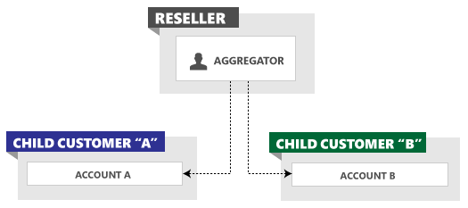

# Management Model for Resellers
The reseller role is offered to a limited set of partners that offer search-marketing tools and services to a large number of advertisers. The reseller role allows partners to programmatically create new customer accounts. The reseller is billed by invoice for all advertising costs incurred by their customers. The advertiser does not sign up for Bing Ads credentials, and may pay a fee to the reseller. The following sections describe the entity model and credentials for resellers.

## Reseller Entity Model
As described in [Entity Hierarchy and Limits](../guides/entity-hierarchy-limits.md) all advertising activity is organized by customer, which can have one or more accounts. Two or more customer entities play a role in the reseller model. The reseller customer is required, and then the reseller's aggregator user may programmatically create one or more managed customers with the [SignupCustomer](~/customer-management-service/signupcustomer.md) service operation. The aggregator user role is required for [SignupCustomer](~/customer-management-service/signupcustomer.md), and is provided solely to resellers.

Upon initial provisioning the reseller customer does not have any accounts to manage. There is an empty customer shell and an Aggregator user. Every time [SignupCustomer](~/customer-management-service/signupcustomer.md) is called, the following entities are created outside of the reseller customer.
-   A managed customer is created  
-   An account is created within the managed customer  

For more information about creating reseller managed customers, see [Adding Customers](../guides/customer-accounts.md#createcustomer).

The following figure shows two child customers created and managed by a reseller. These are referred to as child customers because the billing rolls up to the reseller's payment instrument. The aggregator user can programmatically manage all accounts across multiple reseller-managed child customers.

## How to Get Reseller API Credentials
To request reseller API credentials, please contact your designated account management team for details about getting the API Reseller role. If you are not currently a reseller but would like to become one, go to the [The Bing Partner Program](https://advertise.bingads.microsoft.com/en-us/bing-partners/welcome) welcome page.

## See Also
[Customer Accounts](../guides/customer-accounts.md)  
[Get Started With the Bing Ads API](../guides/get-started.md)  

