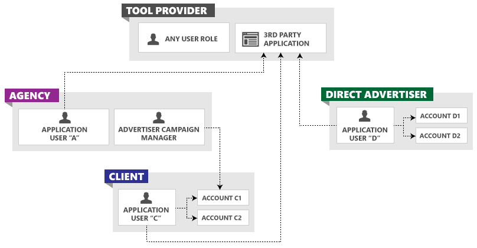

# Management Model for Tool Providers
A tool provider builds a Bing Ads application for other companies to manage their advertising campaigns, and is not necessarily billed by Bing Ads. The advertiser user owns the accounts, is billed directly by Microsoft for valid ad clicks, and may pay a fee to the tool provider. The following sections describe the entity model and credentials for tool providers.

## Tool Provider Entity Model
The following figure shows multiple customers using the same third-party tool.

Third-party tools may be used to manage some or all aspects of an advertiser account. Your users may also manage their respective account through the Bing Ads web application or another third-party tool. You should design your application to be flexible and robust considering that data may have changed state since the last time a client used your application.

## Credentials and Account Access
The following are the header elements and the corresponding identifiers that a tool provider would use.

> [!NOTE]
> If you use the *AuthenticationToken*, the *UserName* and *Password* elements are ignored. For more information, see [Authentication with OAuth](../guides/authentication-oauth.md).

|Header Element|Owner|
|------------------|---------|
|AuthenticationToken|The OAuth access token corresponding to the tool user's linked Microsoft Account.|
|UserName|The sign-in user name.  **Note:** The user of a tool may have any role. For more information see [Account Permissions and the Developer Token](../guides/customer-accounts.md#accountpermissions) and [User Roles and Available Service Operations](../guides/customer-accounts.md#userroles) within [Managing Customer Accounts](../guides/customer-accounts.md).|
|Password|The sign-in password of the user specified in UserName.|
|DeveloperToken|The tool provider's token.  **Note:** A tool provider should use the multi-user developer token to authenticate with users of their application. A tool provider needs only one such token. You should not ask clients to provide their own single-user token. For more information about token types, see [Account Permissions and the Developer Token](../guides/customer-accounts.md#accountpermissions).|
|CustomerId|The identifier of the customer that contains and owns the account. If you manage an account of another customer, you should use that customer ID instead of your own customer ID.  **Note:** The customer ID may vary for each user of a given tool.|
|CustomerAccountId|A customer's account ID.|
For more information about customer and account identifiers, see [Get Started With the Bing Ads API](../guides/get-started.md).

## See Also
[Customer Accounts](../guides/customer-accounts.md)  
[Get Started With the Bing Ads API](../guides/get-started.md)  

