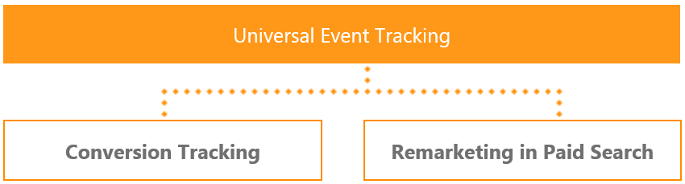

# Universal Event Tracking
UET is a powerful Bing Ads tool. You just need to create one single UET tag and then add it to your website once. This tag records what customers do on your website then Bing Ads starts collecting that data allowing you to track conversions (like purchases or leads) or target audiences using remarketing lists. UET is a prerequisite for conversion tracking and remarketing in paid search.

There are a few steps to get this set up. You will need to:
* Create a [UET tag](#uet) once in Bing Ads
* Add the UET tag tracking code to every page of your website
* Depending on what you want to do, either set up [conversion tracking](#conversiongoals) or [remarketing in paid search](#remarketing).

For details please see these API overview sections below:
-   [Universal Event Tracking APIs](#uet)
-   [Conversion Goal APIs](#conversiongoals)
-   [Remarketing APIs](#remarketing)

## Universal Event Tracking APIs

Before you can track conversions or target audiences using a remarketing list, you need to create a UET tag in Bing Ads (web application or API) and then add the UET tag tracking code to every page of your website. This section describes how you can setup UET tags using the Bing Ads API. For information about setting up UET tags using the Bing Ads web application, see [How do I create a UET tag?](http://help.bingads.microsoft.com/#apex/3/en/56682/2-500) and [FAQ: Universal Event Tracking](https://help.bingads.microsoft.com/#apex/3/en/53056/2). 

> [!NOTE]
> For each of the operations described in this section, you must specify the customer identifier in the *CustomerId* header element. 

1. First you should call the [GetUetTagsByIds](~/campaign-management-service/getuettagsbyids.md) operation to check whether a tag has already been created. You can leave the *TagIds* element null or empty to request all UET tags available for the customer.
2. You can use one UET tag with all of your conversion goals and remarketing lists. Before you create multiple UET tags, see [Reasons for creating more than one UET tag](https://help.bingads.microsoft.com/#apex/3/en/56685/2). If you do not already have a UET tag that can be used, or if you need another UET tag, call the [AddUetTags](~/campaign-management-service/adduettags.md) service operation to create a new UET tag. If the call is successful, the tracking script that you should add to your website is included in a corresponding [UetTag](~/campaign-management-service/uettag.md) within the response message. Later as needed you can update the name and description of a [UetTag](~/campaign-management-service/uettag.md) with the [UpdateUetTags](~/campaign-management-service/updateuettags.md) operation.

After you retreive the tracking script from the [AddUetTags](~/campaign-management-service/adduettags.md) or [GetUetTagsByIds](~/campaign-management-service/getuettagsbyids.md) operation, the next step is to add the UET tag tracking code to your website. We recommend that you, or your website administrator, add it to your entire website in either the head or body sections. If your website has a master page, then that is the best place to add it because you add it once and it is included on all pages. For more information, see [How do I add the UET tag to my website?](http://help.bingads.microsoft.com/#apex/3/en/56688/2-500) 

Depending on what you want to do, either set up [conversion tracking](#conversiongoals) or [remarketing in paid search](#remarketing).

## Conversion Goal APIs

One of the biggest value propositions of UET is that it lets you install one tag on your website to track multiple types of conversions. Once the UET tag tracking code is added to your website, Bing Ads can log page visits and any custom events (such as downloading a white paper, subscribing to a newsletter etc). 

However, not all actions are created equal. You probably have a subset of actions that you consider more important to a successful advertising campaigns. These may include making purchases, filling out a lead form or watching a video. This is where conversion goals can help. Conversion goals allow you to specify which actions (recorded by UET) to count as conversions. For more information about Conversion Goals, see [What are conversion goals and goal types?](http://help.bingads.microsoft.com/#apex/3/en/56709/2-500).

### Conversion Goal Campaign Management APIs

There are five types of conversion goals. The [ConversionGoal](~/campaign-management-service/conversiongoal.md) is the base class from which all goals are derived. 
* [AppInstallGoal](~/campaign-management-service/appinstallgoal.md)
* [DurationGoal](~/campaign-management-service/durationgoal.md)
* [EventGoal](~/campaign-management-service/eventgoal.md)
* [PagesViewedPerVisitGoal](~/campaign-management-service/pagesviewedpervisitgoal.md)
* [UrlGoal](~/campaign-management-service/urlgoal.md)

The following operations are added for managing conversion goals.

* [AddConversionGoals](~/campaign-management-service/addconversiongoals.md)
* [GetConversionGoalsByIds](~/campaign-management-service/getconversiongoalsbyids.md)
* [GetConversionGoalsByTagIds](~/campaign-management-service/getconversiongoalsbytagids.md)
* [UpdateConversionGoals](~/campaign-management-service/updateconversiongoals.md)

## Remarketing APIs
Remarketing in Paid Search lets you improve your return on investment by optimizing your campaigns for specific audiences, which are the people who have visited your website before. When you create remarketing lists, you specify what user actions on your website qualify them to be part of the remarketing lists. 

When users perform qualifying actions, they are added to the remarketing lists within minutes. If the remarketing list minimum size of 1,000 (minimum cookie pool) is met and you have associated the remarketing list with an ad group and set a specific bid amount, the ad delivery engine will start serving remarketed ads to those users on the Bing Network. For more information about Remarketing in Paid Search, see [Reach your audience](http://help.bingads.microsoft.com/#apex/3/en/n5022/1) and [FAQ: Remarketing in Paid Search](https://help.bingads.microsoft.com/#apex/3/en/56727/1).   

After you have set up [Universal Event Tracking (UET)](#uet), you can use the Bing Ads API to create remarketing lists and associate them with ad groups in your search advertising campaigns. 

### Remarketing Bulk APIs
With the Bulk service you can use the following record types to download and upload remarketing lists and associate them with an ad group:
- [Remarketing List](~/bulk-service/remarketing-list.md) 
- [Ad Group Remarketing List Association](~/bulk-service/ad-group-remarketing-list-association.md)  
- [Ad Group Negative Remarketing List Association](~/bulk-service/ad-group-negative-remarketing-list-association.md)  

You can use the *Remarketing Targeting Setting* field in the [Ad Group](~/bulk-service/ad-group.md) record to determine the targeting setting that is applicable for all remarketing lists that are associated with this ad group. 

### Remarketing Campaign Management APIs
The [RemarketingList](~/campaign-management-service/remarketinglist.md) derives from the [Audience](~/campaign-management-service/audience.md) base class. If you are using the Campaign Management service you can add, get, update, or delete the [RemarketingList](~/campaign-management-service/remarketinglist.md), with the respective [AddAudiences](~/campaign-management-service/addaudiences.md), [GetAudiencesByIds](~/campaign-management-service/getaudiencesbyids.md), [UpdateAudiences](~/campaign-management-service/updateaudiences.md), and [DeleteAudiences](~/campaign-management-service/deleteaudiences.md) operations.

To add, get, update, or delete the ad group remarketing list association between your remarketing list and ad group (whether associations or exclusions), use the [BiddableAdGroupCriterion](~/campaign-management-service/biddableadgroupcriterion.md) object with the respective [AddAdGroupCriterions](~/campaign-management-service/addadgroupcriterions.md), [GetAdGroupCriterionsByIds](~/campaign-management-service/getadgroupcriterionsbyids.md), [UpdateAdGroupCriterions](~/campaign-management-service/updateadgroupcriterions.md), and [DeleteAdGroupCriterions](~/campaign-management-service/deleteadgroupcriterions.md) operations. You can use the [NegativeAdGroupCriterion](~/campaign-management-service/negativeadgroupcriterion.md) object with the same operations to set remarketing list exclusions. 

## See Also

[Bing Ads Web Service Addresses](../guides/web-service-addresses.md)  
[FAQ: Universal Event Tracking](https://help.bingads.microsoft.com/#apex/3/en/53056/2)  
[FAQ: Remarketing in Paid Search](https://help.bingads.microsoft.com/#apex/3/en/56727/1)  
