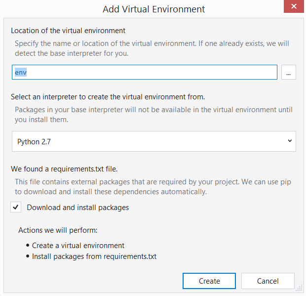

# Walkthrough: Bing Ads Desktop Application in Python
This tutorial describes how to get started running a Bing Ads desktop console application using Python. You will create a new project in Visual Studio, set up a virtual environment, and run the application in a console.

## Desktop Console Application Goal
By the end of this tutorial you will have a desktop console application that will authenticate your Microsoft account user credentials and add a new campaign to your Bing Ads account. Using a Microsoft account requires that you interact with a web browser control (UI) at least once to give initial consent. If you modify the example (described below) you may choose to [Save and use the refresh token](#saverefreshtoken) and use it repetitively without user input in your console application.

## <a name="requirements"></a>Prerequisites
To follow this tutorial path, you will develop your application on Windows using [Python Tools for Visual Studio (PTVS)](http://pytools.codeplex.com/) on [Visual Studio Community](https://www.visualstudio.com/vs/community/). If you are using another operating system or development environment, you can browse this guide for context and then see [Get Started Using Python with Bing Ads Services](../guides/get-started-python.md) for an overview of the Python SDK.

You will need to install either Python 2.7 or 3.4 in your development environment.

You will need the [Bing Ads Python SDK](https://github.com/BingAds/BingAds-Python-SDK), and this tutorial will walk you through the installation.

You will need at least one user with Bing Ads credentials including either a Microsoft account (recommended) or the Bing Ads legacy *UserName* and *Password* set, and a developer token. For more information see [Get Started With the Bing Ads API](../guides/get-started.md).

To use the OAuth 2.0 features of this web application, you will need to register an application at the [Microsoft account Developer Center](https://account.live.com/developers/applications). The Microsoft account user who registers your application is not required to have Bing Ads access. Please consider the following during app registration:

-   Since this is a desktop console application, choose **Yes** when asked if you are registering a mobile or desktop client app.

-   You should not register any redirect URLs. For any desktop or mobile application, use *https://login.live.com/oauth20_desktop.srf* as the redirect URI.

-   Take note of the Client ID as you will use it later in this tutorial.

## Create new Python Application
After you have installed [Python Tools for Visual Studio (PTVS)](http://pytools.codeplex.com/), go to **File** -&gt; **New** -&gt; **Project** -&gt; **Templates** -&gt; **Other Languages** -&gt; **Python**, and select **Python Application** from the list of Python templates.

Name your application **ConsoleGettingStarted** and click **OK**.

## Create virtual environment
We'll create a virtual environment for local development. In your project right-click on **Python Environments** and select **Add Virtual Environment**.

-   Make sure the name of the environment is **env**.

-   Select the base Python interpreter e.g. **Python 2.7**

-   Make sure the option to **Download and install packages** is checked.



> [!NOTE]
> For more information about Python virtual environments, see [PEP 405 - Python Virtual Environments](https://www.python.org/dev/peps/pep-0405/).

## Install the Bing Ads Python SDK
Under **Python Environments** right-click your virtual environment, for example **Python 2.7** and select **Install Python Package**. Using **pip**, specify **bingads** as the name of the package to install, and then click **OK**.

## Add example code
Edit the Python file that was provided when you created the project, for example **ConsoleGettingStarted.py**. Replace its contents with the following example. You'll need to edit the values of CLIENT_ID and DEVELOPER_TOKEN with your own. For more information, see [Prerequisites](#requirements).

```python
from bingads.service_client import ServiceClient
from bingads.authorization import *
from bingads.v10.bulk import *

import sys
import webbrowser
from time import gmtime, strftime
from suds import WebFault

# Optionally you can include logging to output traffic, for example the SOAP request and response.

#import logging
#logging.basicConfig(level=logging.INFO)
#logging.getLogger('suds.client').setLevel(logging.DEBUG)

if __name__ == '__main__':
    print("Python loads the web service proxies at runtime, so you will observe " \
          "a performance delay between program launch and main execution...\n")

    ENVIRONMENT = 'production'
    CLIENT_ID = 'ClientIdGoesHere'
    DEVELOPER_TOKEN = 'DeveloperTokenGoesHere'
    DEVELOPER_TOKEN_SANDBOX = 'BBD37VB98'

    authorization_data=AuthorizationData(
        account_id=None,
        customer_id=None,
        developer_token=DEVELOPER_TOKEN,
        authentication=None,
    )

    # It is recommended that you specify a non guessable 'state' request parameter to help prevent
    # cross site request forgery (CSRF). 
    CLIENT_STATE="ClientStateGoesHere"

    # The directory for the bulk files.
    FILE_DIRECTORY='c:/bulk/'

    # The name of the bulk upload result file.
    RESULT_FILE_NAME='result.csv'
    
    bulk_service_manager=BulkServiceManager(
        authorization_data=authorization_data, 
        poll_interval_in_milliseconds=5000, 
        environment=ENVIRONMENT,
    )

    campaign_service=ServiceClient(
        service='CampaignManagementService', 
        authorization_data=authorization_data, 
        environment=ENVIRONMENT,
        version=11,
    )

    customer_service=ServiceClient(
        'CustomerManagementService', 
        authorization_data=authorization_data, 
        environment=ENVIRONMENT,
        version=11,
    )

def authenticate_with_username():
    ''' 
    Sets the authentication property of the global AuthorizationData instance with PasswordAuthentication.
    '''
    global authorization_data
    authentication=PasswordAuthentication(
        user_name='UserNameGoesHere',
        password='PasswordGoesHere'
    )

    # Assign this authentication instance to the global authorization_data. 
    authorization_data.authentication=authentication

    
def authenticate_with_oauth():
    ''' 
    Sets the authentication property of the global AuthorizationData instance with OAuthDesktopMobileAuthCodeGrant.
    '''
    global authorization_data

    # If you already have both an access token and refresh token,
    # then you can construct OAuthDesktopMobileAuthCodeGrant with OAuthTokens.
    authentication=OAuthDesktopMobileAuthCodeGrant(
        client_id=CLIENT_ID,
        oauth_tokens=OAuthTokens(access_token=None,access_token_expires_in_seconds=0,refresh_token=None)
    )

    # It is recommended that you specify a non guessable 'state' request parameter to help prevent
    # cross site request forgery (CSRF). 
    authentication.state=CLIENT_STATE

    # Assign this authentication instance to the global authorization_data. 
    authorization_data.authentication=authentication   

    # Register the callback function to automatically save the refresh token anytime it is refreshed.
    # Uncomment this line if you want to store your refresh token. Be sure to save your refresh token securely.
    authorization_data.authentication.token_refreshed_callback=save_refresh_token
    
    refresh_token=get_refresh_token()
    
    try:
        # If we have a refresh token let's refresh it
        if refresh_token is not None:
            authorization_data.authentication.request_oauth_tokens_by_refresh_token(refresh_token)
        else:
            request_user_consent()
    except OAuthTokenRequestException:
        # The user could not be authenticated or the grant is expired. 
        # The user must first sign in and if needed grant the client application access to the requested scope.
        request_user_consent()
    
def request_user_consent():
    global authorization_data

    webbrowser.open(authorization_data.authentication.get_authorization_endpoint(), new=1)
    # For Python 3.x use 'input' instead of 'raw_input'
    if(sys.version_info.major >= 3):
        response_uri=input(
            "You need to provide consent for the application to access your Bing Ads accounts. " \
            "After you have granted consent in the web browser for the application to access your Bing Ads accounts, " \
            "please enter the response URI that includes the authorization 'code' parameter: \n"
        )
    else:
        response_uri=raw_input(
            "You need to provide consent for the application to access your Bing Ads accounts. " \
            "After you have granted consent in the web browser for the application to access your Bing Ads accounts, " \
            "please enter the response URI that includes the authorization 'code' parameter: \n"
        )

    if authorization_data.authentication.state != CLIENT_STATE:
       raise Exception("The OAuth response state does not match the client request state.")

    # Request access and refresh tokens using the URI that you provided manually during program execution.
    authorization_data.authentication.request_oauth_tokens_by_response_uri(response_uri=response_uri) 

def get_refresh_token():
    ''' 
    Returns a refresh token if stored locally.
    '''
    file=None
    try:
        file=open("refresh.txt")
        line=file.readline()
        file.close()
        return line if line else None
    except IOError:
        if file:
            file.close()
        return None

def save_refresh_token(oauth_tokens):
    ''' 
    Stores a refresh token locally. Be sure to save your refresh token securely.
    '''
    with open("refresh.txt","w+") as file:
        file.write(oauth_tokens.refresh_token)
        file.close()
    return None

def search_accounts_by_user_id(user_id):
    ''' 
    Search for account details by UserId.
    
    :param user_id: The Bing Ads user identifier.
    :type user_id: long
    :return: List of accounts that the user can manage.
    :rtype: ArrayOfAccount
    '''
    global customer_service
   
    paging={
        'Index': 0,
        'Size': 10
    }

    predicates={
        'Predicate': [
            {
                'Field': 'UserId',
                'Operator': 'Equals',
                'Value': user_id,
            },
        ]
    }

    search_accounts_request={
        'PageInfo': paging,
        'Predicates': predicates
    }
        
    return customer_service.SearchAccounts(
        PageInfo = paging,
        Predicates = predicates
    )

def output_status_message(message):
    print(message)

def output_bing_ads_webfault_error(error):
    if hasattr(error, 'ErrorCode'):
        output_status_message("ErrorCode: {0}".format(error.ErrorCode))
    if hasattr(error, 'Code'):
        output_status_message("Code: {0}".format(error.Code))
    if hasattr(error, 'Message'):
        output_status_message("Message: {0}".format(error.Message))
    output_status_message('')

def output_webfault_errors(ex):
    if hasattr(ex.fault, 'detail') \
        and hasattr(ex.fault.detail, 'ApiFault') \
        and hasattr(ex.fault.detail.ApiFault, 'OperationErrors') \
        and hasattr(ex.fault.detail.ApiFault.OperationErrors, 'OperationError'):
        api_errors=ex.fault.detail.ApiFault.OperationErrors.OperationError
        if type(api_errors) == list:
            for api_error in api_errors:
                output_bing_ads_webfault_error(api_error)
        else:
            output_bing_ads_webfault_error(api_errors)
    elif hasattr(ex.fault, 'detail') \
        and hasattr(ex.fault.detail, 'AdApiFaultDetail') \
        and hasattr(ex.fault.detail.AdApiFaultDetail, 'Errors') \
        and hasattr(ex.fault.detail.AdApiFaultDetail.Errors, 'AdApiError'):
        api_errors=ex.fault.detail.AdApiFaultDetail.Errors.AdApiError
        if type(api_errors) == list:
            for api_error in api_errors:
                output_bing_ads_webfault_error(api_error)
        else:
            output_bing_ads_webfault_error(api_errors)
    elif hasattr(ex.fault, 'detail') \
        and hasattr(ex.fault.detail, 'ApiFaultDetail') \
        and hasattr(ex.fault.detail.ApiFaultDetail, 'BatchErrors') \
        and hasattr(ex.fault.detail.ApiFaultDetail.BatchErrors, 'BatchError'):
        api_errors=ex.fault.detail.ApiFaultDetail.BatchErrors.BatchError
        if type(api_errors) == list:
            for api_error in api_errors:
                output_bing_ads_webfault_error(api_error)
        else:
            output_bing_ads_webfault_error(api_errors)
    elif hasattr(ex.fault, 'detail') \
        and hasattr(ex.fault.detail, 'ApiFaultDetail') \
        and hasattr(ex.fault.detail.ApiFaultDetail, 'OperationErrors') \
        and hasattr(ex.fault.detail.ApiFaultDetail.OperationErrors, 'OperationError'):
        api_errors=ex.fault.detail.ApiFaultDetail.OperationErrors.OperationError
        if type(api_errors) == list:
            for api_error in api_errors:
                output_bing_ads_webfault_error(api_error)
        else:
            output_bing_ads_webfault_error(api_errors)
    elif hasattr(ex.fault, 'detail') \
        and hasattr(ex.fault.detail, 'EditorialApiFaultDetail') \
        and hasattr(ex.fault.detail.EditorialApiFaultDetail, 'BatchErrors') \
        and hasattr(ex.fault.detail.EditorialApiFaultDetail.BatchErrors, 'BatchError'):
        api_errors=ex.fault.detail.EditorialApiFaultDetail.BatchErrors.BatchError
        if type(api_errors) == list:
            for api_error in api_errors:
                output_bing_ads_webfault_error(api_error)
        else:
            output_bing_ads_webfault_error(api_errors)
    elif hasattr(ex.fault, 'detail') \
        and hasattr(ex.fault.detail, 'EditorialApiFaultDetail') \
        and hasattr(ex.fault.detail.EditorialApiFaultDetail, 'EditorialErrors') \
        and hasattr(ex.fault.detail.EditorialApiFaultDetail.EditorialErrors, 'EditorialError'):
        api_errors=ex.fault.detail.EditorialApiFaultDetail.EditorialErrors.EditorialError
        if type(api_errors) == list:
            for api_error in api_errors:
                output_bing_ads_webfault_error(api_error)
        else:
            output_bing_ads_webfault_error(api_errors)
    elif hasattr(ex.fault, 'detail') \
        and hasattr(ex.fault.detail, 'EditorialApiFaultDetail') \
        and hasattr(ex.fault.detail.EditorialApiFaultDetail, 'OperationErrors') \
        and hasattr(ex.fault.detail.EditorialApiFaultDetail.OperationErrors, 'OperationError'):
        api_errors=ex.fault.detail.EditorialApiFaultDetail.OperationErrors.OperationError
        if type(api_errors) == list:
            for api_error in api_errors:
                output_bing_ads_webfault_error(api_error)
        else:
            output_bing_ads_webfault_error(api_errors)
    # Handle serialization errors e.g. The formatter threw an exception while trying to deserialize the message: 
    # There was an error while trying to deserialize parameter https://bingads.microsoft.com/CampaignManagement/v10:Entities.
    elif hasattr(ex.fault, 'detail') \
        and hasattr(ex.fault.detail, 'ExceptionDetail'):
        api_errors=ex.fault.detail.ExceptionDetail
        if type(api_errors) == list:
            for api_error in api_errors:
                output_status_message(api_error.Message)
        else:
            output_status_message(api_errors.Message)
    else:
        raise Exception('Unknown WebFault')

def output_bulk_campaigns(bulk_entities):
    for entity in bulk_entities:
        output_status_message("BulkCampaign: \n")
        output_status_message("Campaign Name: {0}".format(entity.campaign.Name))
        output_status_message("Campaign Id: {0}".format(entity.campaign.Id))

        if entity.has_errors:
            output_bulk_errors(entity.errors)

        output_status_message('')

def output_bulk_errors(errors):
    for error in errors:
        if error.error is not None:
            output_status_message("Number: {0}".format(error.error))
        output_status_message("Error: {0}".format(error.number))
        if error.editorial_reason_code is not None:
            output_status_message("EditorialTerm: {0}".format(error.editorial_term))
            output_status_message("EditorialReasonCode: {0}".format(error.editorial_reason_code))
            output_status_message("EditorialLocation: {0}".format(error.editorial_location))
            output_status_message("PublisherCountries: {0}".format(error.publisher_countries))
        output_status_message('')

# Main execution
if __name__ == '__main__':

    try:
        # You should authenticate for Bing Ads production services with a Microsoft Account, 
        # instead of providing the Bing Ads username and password set. 
        # Authentication with a Microsoft Account is currently not supported in Sandbox.
        authenticate_with_oauth()

        # Uncomment to run with Bing Ads legacy UserName and Password credentials.
        # For example you would use this method to authenticate in sandbox.
        #authenticate_with_username()
        
        # Set to an empty user identifier to get the current authenticated Bing Ads user,
        # and then search for all accounts the user may access.
        user=customer_service.GetUser(None).User
        accounts=search_accounts_by_user_id(user.Id)

        # For this example we'll use the first account.
        authorization_data.account_id=accounts['Account'][0].Id
        authorization_data.customer_id=accounts['Account'][0].ParentCustomerId
    
        
        #To discover all SOAP elements accessible for each service, you can print the soap client.
        #For example, print(campaign_service.soap_client) will return Campaign, AdGroup, TextAd, Keyword, etc. 

        #You could use the Campaign Management ServiceClient to add a Campaign as follows:
        #add_campaigns_response=campaign_service.AddCampaigns(
        #    AccountId=authorization_data.account_id,
        #    Campaigns=campaigns
        #)

        #bulkEntity-derived classes can also contain the SOAP objects, for example BulkCampaign can contain a Campaign.
        #As shown below, you can use the BulkServiceManager to upload a BulkCampaign. 
        #You should take advantage of the Bulk service to efficiently manage ads and keywords for all campaigns in an account.
        
        CAMPAIGN_ID_KEY=-123

        bulk_campaign=BulkCampaign()
        
        #The client_id may be used to associate records in the bulk upload file with records in the results file. The value of this field  
        #is not used or stored by the server; it is simply copied from the uploaded record to the corresponding result record. 
        #Note: This bulk file Client Id is not related to an application Client Id for OAuth. 

        bulk_campaign.client_id='YourClientIdGoesHere'
        campaign=campaign_service.factory.create('Campaign')
        
        #When using the Campaign Management service, the Id cannot be set. In the context of a BulkCampaign, the Id is optional  
        #and may be used as a negative reference key during bulk upload. For example the same negative reference key for the campaign Id  
        #will be used when adding new ad groups to this new campaign, or when associating ad extensions with the campaign. 

        campaign.Id=CAMPAIGN_ID_KEY
        campaign.Name="Summer Shoes " + strftime("%a, %d %b %Y %H:%M:%S +0000", gmtime())
        campaign.Description="Summer shoes line."
        campaign.BudgetType='DailyBudgetStandard'
        campaign.DailyBudget=50
        campaign.TimeZone='PacificTimeUSCanadaTijuana'
        campaign.Status='Paused'
        bulk_campaign.campaign=campaign

        bulk_campaigns=[ bulk_campaign ]
    
        entity_upload_parameters=EntityUploadParameters(
            result_file_directory=FILE_DIRECTORY,
            result_file_name=RESULT_FILE_NAME,
            entities=bulk_campaigns,
            overwrite_result_file=True,
            response_mode='ErrorsAndResults'
        )
    
        output_status_message("Adding a BulkCampaign...\n")
        bulk_entities=list(bulk_service_manager.upload_entities(entity_upload_parameters))
    
        # Output the upload result entities
        for entity in bulk_entities:
            if isinstance(entity, BulkCampaign):
                output_bulk_campaigns([entity])
    
        output_status_message("Program execution completed")

    except WebFault as ex:
        output_webfault_errors(ex)
    except Exception as ex:
        output_status_message(ex)
```

## <a name="saverefreshtoken"></a>Save and use the refresh token
Using a Microsoft account requires that you interact with a web browser control (UI) at least once to give initial consent. You can enable this line in the example above to store the refresh token and use it repetitively without user input.

> [!IMPORTANT]
> Be sure you are running this application from a secure location and store the refresh token securely.

```
authorization_data.authentication.token_refreshed_callback=save_refresh_token
```

## See Also
[Get Started Using Python with Bing Ads Services](../guides/get-started-python.md)  

